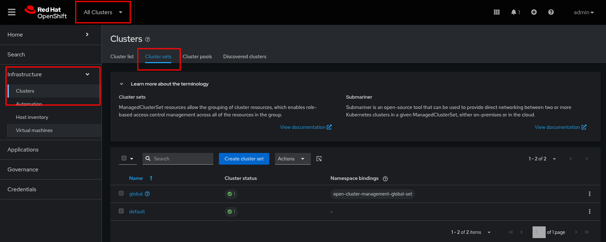

# AutoShiftv2

## What is AutoShift?

AutoShiftv2 is an [Infrastructure-as-Code (IaC)](https://martinfowler.com/bliki/InfrastructureAsCode.html) framework designed to manage infrastructure components after an OpenShift installation using Advanced Cluster Management (ACM). It provides a modular, extensible model to support all infrastructure elements deployed on OpenShift — including those in OpenShift Platform Plus. AutoShiftv2 emphasizes easy adoption, configurable features (toggle on/off), and production-ready capabilities for upgrades and maintenance.

## Architecture 

**TODO** What is a hub?

### Hub Architecture


### Hub of Hubs Architecture


## Installation Instructions

### Assumptions / Prerequisites

* A Red Hat OpenShift cluster at 4.18+ to act as the **hub** cluster
* Fork or clone this repo on the machine from which you will be executing this repo
* [helm](https://helm.sh/docs/intro/install/) installed locally on the machine from which you will be executing this repo
* The OpenShift CLI [oc](https://docs.redhat.com/en/documentation/openshift_container_platform/latest/html/cli_tools/openshift-cli-oc#installing-openshift-cli) client utility installed locally on the machine from which you will be executing this repo

### Prepping for Installation

1.  Login to the **hub** cluster via the [`oc` utility](https://docs.redhat.com/en/documentation/openshift_container_platform/latest/html/cli_tools/openshift-cli-oc#cli-logging-in_cli-developer-commands).

    ```console
    $ oc login -u $MY_USER
    ```

2.  If installing in a disconnected or internet-disadvantaged environment, update the values in `policies/openshift-gitops/values.yaml` and `policies/advanced-cluster-management/values.yaml` with the source mirror registry, otherwise leave these values as is.

    **TODO** Flesh this out

3.  If your clone of AutoShiftv2 requires credentials or you would like to add credentials to any other git repos you can do this in the `openshift-gitops/values` file before installing. This can also be done in the OpenShift GitOps GUI after install.

### Installing OpenShift GitOps

1.  Using helm, install OpenShift GitOps

    ```console
    $ helm upgrade --install openshift-gitops openshift-gitops -f policies/openshift-gitops/values.yaml
    ```

    > [!NOTE]  
    > If OpenShift GitOps is already installed manually on cluster and the default argo instance exists this step can be skipped. Make sure that argocd controller has cluster-admin

2.  After the installation is complete, verify that all the pods in the `openshift-gitops` namespace are running. This can take a few minutes depending on your network to even return anything.

    ```console
    $ oc get pods -n openshift-gitops
    NAME                                                      	      READY   STATUS    RESTARTS   AGE
    cluster-b5798d6f9-zr576                                   	      1/1 	  Running   0          65m
    kam-69866d7c48-8nsjv                                      	      1/1 	  Running   0          65m
    openshift-gitops-application-controller-0                 	      1/1 	  Running   0          53m
    openshift-gitops-applicationset-controller-6447b8dfdd-5ckgh       1/1 	  Running   0          65m
    openshift-gitops-dex-server-569b498bd9-vf6mr                      1/1     Running   0          65m
    openshift-gitops-redis-74bd8d7d96-49bjf                   	      1/1 	  Running   0          65m
    openshift-gitops-repo-server-c999f75d5-l4rsg              	      1/1 	  Running   0          65m
    openshift-gitops-server-5785f7668b-wj57t                  	      1/1 	  Running   0          53m
    ```

3.  Verify that the pod/s in the `openshift-gitops-operator` namespace are running.

    ```console
    $ oc get pods -n openshift-gitops-operator
    NAME                                                            READY   STATUS    RESTARTS   AGE
    openshift-gitops-operator-controller-manager-664966d547-vr4vb   2/2     Running   0          65m
    ```

4.  Now test if OpenShift GitOps was installed correctly, this may take some time

    ```console
    oc get argocd -A
    ```
    
    This command should return something like this:
    
    ```console
    NAMESPACE          NAME               AGE
    openshift-gitops   infra-gitops       29s
    ```

    If this is not the case you may need to run `helm upgrade ...` command again.

### Install Advanced Cluster Management

1.  Using helm, install OpenShift Advanced Cluster Management on the hub cluster

    ```console
    helm upgrade --install advanced-cluster-management advanced-cluster-management -f policies/advanced-cluster-management/values.yaml
    ```

2.  Test if Red Hat Advanced Cluster Management has installed correctly, this may take some time

    ```console
    oc get mch -A -w
    ```

    This command should return something like this:

    ```
    NAMESPACE                 NAME              STATUS       AGE     CURRENTVERSION   DESIREDVERSION
    open-cluster-management   multiclusterhub   Installing   2m35s                    2.13.2
    open-cluster-management   multiclusterhub   Installing   2m39s                    2.13.2
    open-cluster-management   multiclusterhub   Installing   3m12s                    2.13.2
    open-cluster-management   multiclusterhub   Installing   3m41s                    2.13.2
    open-cluster-management   multiclusterhub   Installing   4m11s                    2.13.2
    open-cluster-management   multiclusterhub   Installing   4m57s                    2.13.2
    open-cluster-management   multiclusterhub   Installing   5m15s                    2.13.2
    open-cluster-management   multiclusterhub   Installing   5m51s                    2.13.2
    open-cluster-management   multiclusterhub   Running      6m28s   2.13.2           2.13.2
    ```
    > [!NOTE]  
    > This does take roughly 6 min to install. You can proceed to installing AutoShift while this is installing but you will not be able to verify AutoShift or select a `clusterset` until this is finished.


Both ACM and GitOps will be controlled by autoshift after it is installed for version upgrading

Update autoshift/values.yaml with desired feature flags and repo url

Install AutoShiftv2

example using the hub values file
```
helm template autoshift autoshift -f autoshift/values.hub.yaml | oc apply -f -
```

Given the labels and cluster sets provided in the values file, ACM cluster sets will be created.

Go to cluster sets in the acm console


Manually select which cluster will belong to each cluster set, or when provisioning a new cluster from ACM you can select the desired cluster set from ACM at time of creation.


That's it. Welcome to OpenShift Platform Plus!

## Cluster Labels
#### values can be set on a per cluster and clusterset level to decide what features of autoshift will be applied to each cluster. If a value is defined in helm values, a clusterset label and a cluster 
#### label precedence will be cluster -> clusterset -> helm values where helm values is the least. Helm values are meant to be defaults.
##

## Autoshift Cluster Labels Values Reference

Values can be set on a per cluster and clusterset level to decide what features of autoshift will be applied to each cluster. If a value is defined in helm values, a clusterset label and a cluster 

label precedence will be cluster -> clusterset -> helm values where helm values is the least. Helm values, `values.yaml` are meant to be defaults.


### Advanced Cluster Manager

> [!WARNING]  
> Hub Clusters Only

| Variable                    | Type      | Default Value             | 
|-----------------------------|-----------|---------------------------|
| `self-managed`              | bool      | `true` or `false`         |
| `acm-channel`               | string    | `release-2.13`            |
| `acm-install-plan-approval` | string    | `Automatic`               |
| `acm-source`                | string    | `redhat-operators`        |
| `acm-source-namespace`      | string    | `openshift-marketplace`   |
| `acm-availability-config`   | string    | `basic` or `high`         |

### OpenShift Gitops

| Variable                        | Type      | Default Value             | 
|---------------------------------|-----------|---------------------------|
| `gitops-channel`                | string    | `latest`                  |
| `gitops-install-plan-approval`  | string    | `Manual` or `Automatic`   |
| `gitops-source`                 | string    | `redhat-operators`        |
| `gitops-source-namespace`       | string    | `openshift-marketplace`   |

### Infra Nodes

| Variable                            | Type              | Default Value             | Notes |
|-------------------------------------|-------------------|---------------------------|-------|
| `infra-nodes`                       | int               |                           | Number of infra nodes min if autoscale. If not set infra nodes are not managed, if blank infra nodes will be deleted |
| `infra-nodes-numcpu`                | int               |                           | Number of cpu per infra node |
| `infra-nodes-memory-mib`            | int               |                           | Memory mib per infra node |
| `infra-nodes-numcores-per-socket`   | int               |                           | Number of CPU Cores per socket |
| `infra-nodes-zones`                 | <list<String>>    |                           | List of availability zones |

### Worker Nodes

| Variable                            | Type              | Default Value             | Notes |
|-------------------------------------|-------------------|---------------------------|-------|
| `worker-nodes`                      | int               |                           | Number of worker nodes min if autoscale. If not set worker nodes are not managed, if blank worker nodes will be deleted |
| `worker-nodes-numcpu`               | int               |                           | Number of cpu per worker node |
| `worker-nodes-memory-mib`           | int               |                           | Memory mib per worker node |
| `worker-nodes-numcores-per-socket`  | int               |                           | Number of CPU Cores per socket |
| `worker-nodes-zones`                | <list<String>>    |                           | list of availability zones

### Storage Nodes

| Variable                              | Type              | Default Value             | Notes |
|---------------------------------------|-------------------|---------------------------|-------|
| `storage-nodes`                       | int               |                           | Number of storage nodes min if autoscale. If not set storage nodes are not managed, if blank storage nodes will be deleted. Local Storage Operator will be installed if Storage Nodes are enabled |
| `storage-nodes-numcpu`                | int               |                           | Number of cpu per storage node |
| `storage-nodes-memory-mib`            | int               |                           | Memory mib per storage node |
| `storage-nodes-numcores-per-socket`   | int               |                           | Number of CPU Cores per socket |
| `storage-nodes-zones`                 | <list<String>>    |                           | list of availability zones |

### Advanced Cluster Security

| Variable                          | Type              | Default Value             | Notes |
|-----------------------------------|-------------------|---------------------------|-------|
| `acs`                             | bool              |                           | If not set Advanced Cluster Security will not be managed |
| `acs-channel`                     | String            | `stable`                  |       |
| `acs-install-plan-approval`       | String            | `Automatic`               |       |
| `acs-source`                      | String            | `redhat-operators`        |       |
| `acs-source-namespace`            | String            | `openshift-marketplace`   |       |

### Developer Spaces

| Variable                              | Type              | Default Value             | Notes |
|---------------------------------------|-------------------|---------------------------|-------|
| `dev-spaces`                          | bool              |                           | If not set Developer Spaces will not be managed |
| `dev-spaces-channel`                  | String            | `stable`                  |       |
| `dev-spaces-install-plan-approval`    | String            | `Automatic`               |       |
| `dev-spaces-source`                   | String            | `redhat-operators`        |       |
| `dev-spaces-source-namespace`         | String            | `openshift-marketplace`   |       |

### Developer Hub

| Variable                          | Type              | Default Value             | Notes |
|-----------------------------------|-------------------|---------------------------|-------|
| `dev-hub`                         | bool              |                           | If not set Developer Hub will not be managed |
| `dev-hub-channel`                 | String            | `fast`                    |       |
| `dev-hub-install-plan-approval`   | String            | `Automatic`               |       |
| `dev-hub-source`                  | String            | `redhat-operators`        |       |
| `dev-hub-source-namespace`        | String            | `openshift-marketplace`   |       |

### OpenShift Pipelines

| Variable                          | Type              | Default Value             | Notes |
|-----------------------------------|-------------------|---------------------------|-------|
| `pipelines`                       | bool              |                           | If not set OpenShift Pipelines will not be managed |
| `pipelines-channel`               | String            | `latest`                  |       |
| `pipelines-install-plan-approval` | String            | `Automatic`               |       |
| `pipelines-source`                | String            | `redhat-operators`        |       |
| `pipelines-source-namespace`      | String            | `openshift-marketplace`   |       |

### Trusted Artifact Signer
tas<bool>: If not set Trusted Artifact Signer will not be managed

tas-channel<String>: default latest

tas-install-plan-approval<String>: default Automatic

tas-source<String>: default redhat-operators

tas-source-namespace<String>: default openshift-marketplace

### Quay
quay<bool>: If not set Quay will not be managed

quay-channel<String>: default stable-3.13

quay-install-plan-approval<String>: default Automatic

quay-source<String>: default redhat-operators

quay-source-namespace<String>: default openshift-marketplace

### Developer OpenShift Gitops
gitops-dev<bool>: If not set Developer OpenShift Gitops intances will not be managed

gitops-dev-team-{INSERT_TEAM_NAME}<String>: Team that can deploy onto cluster from dev team gitops. Must match a team in the gitops-dev helm chart values file.

### Loki
loki<bool>: If not set Loki will not be managed. Dependent on ODF Multi Object Gateway

loki-channel<String>: default stable-6.2

loki-install-plan-approval<String>: default Automatic

loki-source<String>: default redhat-operators

loki-source-namespace<String>: default openshift-marketplace

loki-size<String>: default 1x.extra-small

loki-storageclass<String>: default gp3-csi

loki-lokistack-name<String>: default logging-lokistack

### OpenShift Logging
logging<bool>: If not set OpenShift Logging will not be managed, Dependent on Loki and COO

logging-channel<String>: default stable-6.2

logging-install-plan-approval<String>: default Automatic

logging-source<String>: default redhat-operators

logging-source-namespace<String>: default openshift-marketplace

### Cluster Observability Operator
coo<bool>: If not set Cluster Observability Operator will not be managed

coo-channel<String>: default stable

coo-install-plan-approval<String>: default Automatic

coo-source<String>: default redhat-operators

coo-source-namespace<String>: default openshift-marketplace

### Compliance Operator Stig Apply
compliance<bool>: If not set Compliance Operator will not be managed. Helm chart config map must be set with profiles and remediations

compliance-name<String>: default compliance-operator

compliance-install-plan-approval<String>: default Automatic

compliance-source<String>: default redhat-operators

compliance-source-namespace<String>: default openshift-marketplace

compliance-channel<String>: default stable

### Local Storage Operator

local-storage<bool>: if not set to true, local storage will not be managed or deployed.

local-storage-channel<String>: 

local-storage-source<String>: 

local-storage-source-namespace<String>: 

local-storage-install-plan-approval<String>: 

### OpenShift Data Foundation
odf<bool>: If not set OpenShift Data Foundation will not be managed. if Storage Nodes are enable will deploy ODF on local storage/ storage nodes

odf-multi-cloud-gateway<String>: values standalone or standard. Install ODF with only nooba object gateway or full odf

odf-nooba-pvpool<bool>: if not set nooba will be deployed with default settings. Recomended don't set for cloud providers. Use pv pool for storage

odf-nooba-store-size<String>: example 500Gi. if pvpool set. Size of nooba backing store

odf-nooba-store-num-volumes<String>: example 1. if pvpool set. number of volumes

odf-ocs-storage-class-name<String>: if not using local-storage, storage class to use for ocs

odf-ocs-storage-size<String>: storage size per nvme

odf-ocs-storage-count<String>: number of replica sets of nvme drives, note total amount will count * replicas

odf-ocs-storage-replicas<String>: replicas, 3 is recommended

odf-resource-profile<String>: default balanced. lean: suitable for clusters with limited resources, balanced: suitable for most use cases, performance: suitable for clusters with high amount of resources.

odf-channel<String>: default stable-4.17

odf-install-plan-approval<String>: default Automatic

odf-source<String>: default redhat-operators

odf-source-namespace<String>: default openshift-marketplace

## References

* [Martin Fowler Blog: Infrastructure As Code](https://martinfowler.com/bliki/InfrastructureAsCode.html)
* [helm Utility Installation Instructions](https://helm.sh/docs/intro/install/)
* [OpenShift CLI Client `oc` Installation Instructions](https://docs.redhat.com/en/documentation/openshift_container_platform/latest/html/cli_tools/openshift-cli-oc#installing-openshift-cli)
