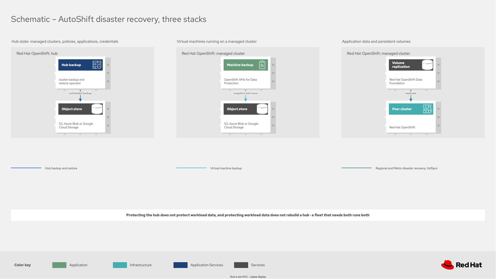
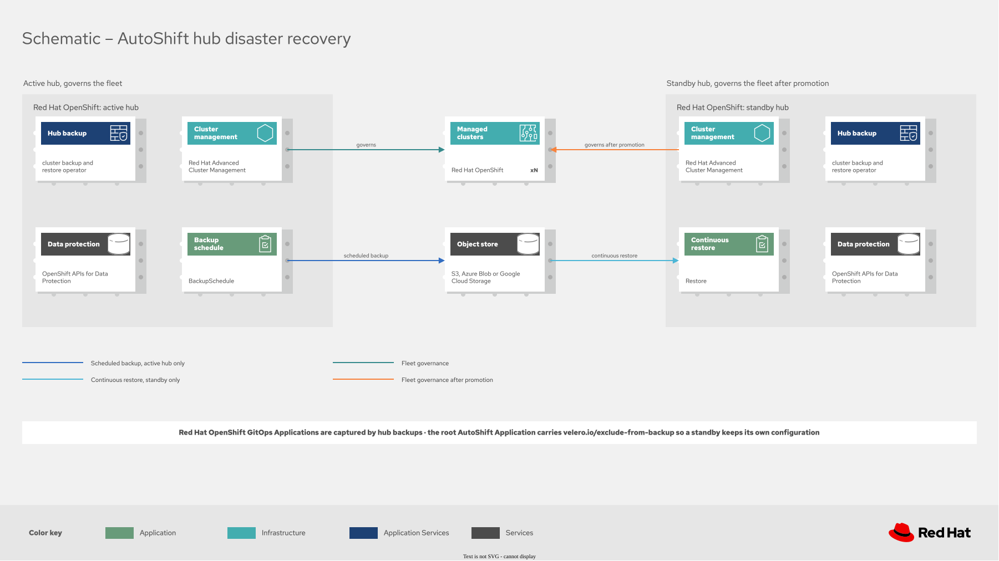
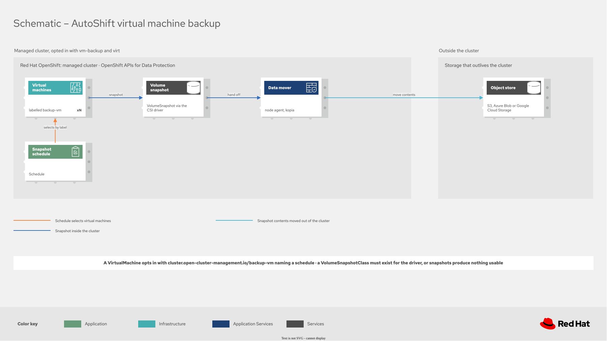

# Disaster recovery

Disaster recovery in Red Hat Advanced Cluster Management covers two unrelated failures, and they
need different tools:

* **Hub loss.** The hub cluster is gone. Managed clusters keep running, but you cannot see or
  govern them. Recovery means standing up a hub that knows about the same fleet. This is what the
  `acm-failover` policy does, and it is the subject of this page.
* **Workload loss.** An application, a virtual machine, or its data needs to come back. That is a
  storage problem, handled by the `oadp` policy for data protection on a managed cluster, the
  `vm-backup` policy for Red Hat OpenShift Virtualization virtual machines, Red Hat OpenShift Data
  Foundation Regional or Metro disaster recovery for orchestrated failover, and VolSync for
  individual persistent volumes.

Protecting the hub does not protect workload data, and protecting workload data does not help you
rebuild a hub. Most fleets need both.



## Hub backup and restore

The cluster backup and restore operator runs on the hub and depends on OpenShift APIs for Data
Protection, which installs Velero and connects the hub to an object store. On a cron schedule it
writes the hub's managed clusters, applications, policies and credentials to that store as four
Velero backups.



AutoShift models this as a mode on the `autoshift.io/acm-failover` label, with the settings for each
mode under the matching key in `config.acm-failover`:

| Label value | Role |
|---|---|
| `active` | This hub writes the backups |
| `passive` | This hub is a standby, continuously restoring from the same object store |
| `false` | No hub disaster recovery on this cluster |

Both modes configure the object store and the `DataProtectionApplication`, because the standby
restores from the same bucket the active hub writes.

### Choosing where the backups live

`config.acm-failover.storage.type` selects the backend.

Use `s3` for anything real. The bucket must outlive the hub it protects, so it has to sit outside
the fleet: Amazon Simple Storage Service, or an S3-compatible store such as MinIO or Ceph RADOS
Gateway reached through `storage.endpoint`. Credentials never appear in values files. An
administrator creates the Secret on the hub and AutoShift references it:

```bash
oc create secret generic cloud-credentials -n open-cluster-management-backup \
  --from-file=cloud=./credentials-velero
```

Use `obc` only in a laboratory or sandbox. It provisions an `ObjectBucketClaim` against the local
Red Hat OpenShift Data Foundation NooBaa instance and wires Velero to it automatically, which is
convenient for rehearsing the workflow. It is not disaster recovery: a bucket that lives on the hub
disappears with the hub.

### A minimal active and passive pair

On the active hub's clusterset:

```yaml
hubClusterSets:
  hub:
    labels:
      acm-failover: 'active'
    config:
      acm-failover:
        storage:
          type: s3
          bucket: acme-hub-backups
          region: us-east-2
          configSecretRef:
            name: cloud-credentials
            key: cloud
        active:
          veleroSchedule: '0 */2 * * *'
          veleroTtl: 720h
```

On the standby hub's clusterset, the same storage block with a different mode:

```yaml
hubClusterSets:
  dr-hub:
    labels:
      acm-failover: 'passive'
    config:
      acm-failover:
        storage:
          type: s3
          bucket: acme-hub-backups
          region: us-east-2
          configSecretRef:
            name: cloud-credentials
            key: cloud
        passive:
          restoreSyncInterval: 30m
```

Quote the cron expression. A value beginning with an asterisk is a YAML alias when it is unquoted,
and the policy then fails to render.

### Only one hub may hold the schedule

Two hubs writing to one storage location put both `BackupSchedule` resources into
`BackupCollision`, and backups stop on **both**, including the healthy one. AutoShift enforces this
at the placement rather than inside a template, so a standby cannot receive a `BackupSchedule` at
all.

The reason it is a placement and not a template condition matters: a template that renders nothing
leaves an empty `ConfigurationPolicy`, and an empty `ConfigurationPolicy` reports Compliant. A
backup policy that reports Compliant while backing up nothing is worse than no policy.

### Argo CD Applications must be excluded from the backup

This is the one configuration step that is easy to miss and expensive to get wrong.

Red Hat Advanced Cluster Management backs up the whole `argoproj.io` API group, and excludes only two
namespaces: the hub's own managed cluster namespace and `open-cluster-management-backup`. Living in
`openshift-gitops` is therefore no protection. That behaviour is deliberate, because restoring a hub
is meant to bring its Argo CD Applications back, and the product cannot tell an Application that
describes a workload from one that describes the hub's own configuration.

The root AutoShift Application is the second kind. It carries the hub's configuration in
`spec.source.helm`, so a standby that restores it adopts the active hub's configuration. Its
`acm-failover` mode flips to `active`, it starts a second `BackupSchedule` against the same storage
location, and both hubs collapse into `BackupCollision`.

Everything AutoShift creates for itself already carries the exclusion label. The root Application is
created by an administrator, so it has to be set there:

```yaml
apiVersion: argoproj.io/v1alpha1
kind: Application
metadata:
  name: autoshift
  namespace: openshift-gitops
  labels:
    velero.io/exclude-from-backup: "true"
```

`policy-acm-failover-exclusions-test` reports a root Application that is missing it. A deployment
installed directly with Helm is unaffected: there is no root Application, and the Helm release Secret
is not captured either.

### Recovering from a collision

The operator does not resume a collided schedule on its own, so recovery is deliberate:

1. Decide which hub should own the storage location. Give the other one its own bucket, or its own
   `storage.prefix`.
2. Correct whatever caused the second writer. If a standby flipped to `active`, check the exclusion
   label above and re-apply the standby's own Application.
3. Delete the `BackupSchedule` on both hubs. The policy on the active hub recreates a fresh one,
   which is what the operator requires.
4. If the standby's `Restore` shows `FinishedWithErrors` complaining that a `BackupSchedule` is
   active, delete the `Restore` as well; its policy recreates it. A hub cannot back up and restore at
   the same time.

```bash
oc delete backupschedule acm-failover-schedule -n open-cluster-management-backup
oc delete restore acm-failover-restore-passive-sync -n open-cluster-management-backup
```

### Promotion is deliberate

The standby's `Restore` sets `veleroManagedClustersBackupName: skip`. It stays warm by restoring
credentials and hub resources, but it never restores the managed cluster activation data, so it
never takes the fleet from a hub that is still healthy.

Promoting a standby after losing the active hub:

1. Confirm the failed hub is down and will not return with its schedule running.
2. Set `acm-failover` to `false` on the failed hub's clusterset and to `active` on the standby's.
3. Let GitOps reconcile. The standby loses its sync `Restore` and gains a `BackupSchedule`.
4. Activate the managed clusters by creating a `Restore` with
   `veleroManagedClustersBackupName: latest`, `veleroCredentialsBackupName: skip` and
   `veleroResourcesBackupName: skip`.

Step 4 is irreversible, which is why AutoShift does not trigger it from a label flip.

### AutoShift rebuilds itself from Git

AutoShift labels its own Argo CD `ApplicationSet` and `Application` resources
`velero.io/exclude-from-backup: "true"`, so a restored hub reconstructs them from the repository
rather than from a snapshot of the old hub. Keep that label on any Argo CD object you add.

### Checking that it works

```bash
oc get schedules -A | grep acm
oc get backupschedule -n open-cluster-management-backup
oc get restore -n open-cluster-management-backup
oc get backupstoragelocation -n open-cluster-management-backup
```

A healthy active hub shows four `schedule.velero.io` resources and a `BackupSchedule` in phase
`Enabled`. A healthy standby shows a `Restore` in phase `Enabled`. The inform policies
`policy-acm-failover-storage-test`, `policy-acm-failover-schedule-test` and
`policy-acm-failover-restore-test` report the same conditions through the governance dashboard.

## Data protection on a managed cluster

The `oadp` policy installs OpenShift APIs for Data Protection on a managed cluster and configures it:
the operator, one `DataProtectionApplication` and one `BackupStorageLocation`, in `openshift-adp`.

It creates no backup and no schedule. Enabling it makes a cluster able to be backed up, and what to
back up is a separate decision. That is useful on its own: an administrator protecting applications
AutoShift does not manage gets Velero installed and pointed at an object store, then drives `Backup`
and `Schedule` resources from wherever those applications are defined.

Enable it with `autoshift.io/oadp: 'true'` and set the object store in `config.oadp.storage`.

### Why one policy owns it

OpenShift APIs for Data Protection supports the `OwnNamespace` install mode only, and permits exactly
one `DataProtectionApplication` per installation namespace. A second one reports
`only one DPA CR can exist per OADP installation namespace` and is never reconciled.

A managed cluster therefore has one Velero installation, shared by everything that backs anything up
there, and it needs an owner. Consumers such as `vm-backup` add schedules against it and depend on
`policy-oadp-storage-test`, so a schedule is never created against a storage location Velero cannot
reach.

The namespace is fixed at `openshift-adp` rather than configurable. Because the install mode is
`OwnNamespace`, a `DataProtectionApplication` in the wrong namespace is not watched by any operator:
it reports nothing and creates no storage location.

### Hubs are separate, and a hub can have both

Hub backup uses a **different** installation: the one the `cluster-backup` MultiClusterHub component
creates in `open-cluster-management-backup`, with its own `OperatorGroup` scoped to that namespace.
`acm-failover` configures that one; `config.oadp` has no effect on it.

Neither installation can reconcile anything belonging to the other, so they are not alternatives and
they do not conflict. A self-managed hub that also runs virtual machines carries both, in both
namespaces, which is supported.

| Namespace | Installed by | Configured by | Protects |
|---|---|---|---|
| `open-cluster-management-backup` | `cluster-backup` MultiClusterHub component | `acm-failover` | Hub state: managed clusters, policies, applications, credentials |
| `openshift-adp` | `policy-oadp-operator-install` | `config.oadp` | Whatever runs on this cluster |

### One Secret for the fleet

Set `config.oadp.storage.credentialsFrom` to a Secret on the hub and the policy copies it to every
selected cluster. The alternative, `configSecretRef`, expects a Secret created separately on each
cluster, which does not scale: every new cluster is another manual step, and a missing Secret is a
backup that silently never succeeds.

Credentials are still created out of band and never appear in values files.

## Virtual machine backup

The `vm-backup` policy protects Red Hat OpenShift Virtualization virtual machines on managed
clusters. It is a different job from hub backup and runs in a different place: on the managed clusters
rather than the hub.

It is the Velero schedules only. The operator and the object store come from the `oadp` policy
described above, and enabling `autoshift.io/vm-backup` places that policy too, so there is no second
label to set.



Enable it with `autoshift.io/vm-backup: 'true'` alongside `autoshift.io/virt: 'true'`, and define
schedules in `config.vm-backup.schedules`. A virtual machine opts in by naming one of them:

```yaml
metadata:
  labels:
    cluster.open-cluster-management.io/backup-vm: daily
```

An unlabelled virtual machine is never backed up. The fleet operator owns the schedules and
retention; the virtual machine owner chooses which applies.

### The two things that decide whether it works

**A `VolumeSnapshotClass` must exist.** A CSI-provisioned StorageClass is not sufficient on its own:
the driver must support snapshots and a `VolumeSnapshotClass` must reference it. Without one, backups
appear to run and produce nothing usable, which is why `policy-vm-backup-snapshotclass-test` reports
it.

```bash
oc get volumesnapshotclass
```

**Leave the node agent enabled.** `config.oadp.storage.nodeAgent` defaults to `true`. A bare CSI
snapshot normally lives in the same storage system as the volume it came from, so it is lost with
that storage. The node agent is what moves the contents into the object store, which is the
difference between disaster recovery and a local convenience. A schedule setting `snapshotMoveData`
needs that agent running, so the switch and the schedules have to agree.

File system backup and `VolumeSnapshotLocation` backups are not used. Those are backup *methods*
rather than descriptions of storage, so the choice has nothing to do with whether a StorageClass is
CSI-provisioned.

### Restoring is a runbook

Restore is deliberately not automated, for the same reason promotion is not: it is
per-virtual-machine and operational, and a policy that restored on reconcile would overwrite a
running virtual machine. Stop the virtual machine, then create a Velero `Restore` naming the backup.
The [policy README](https://github.com/auto-shift/autoshiftv2/tree/main/policies/stable/vm-backup)
has a worked example.

## Related pages

* [Values reference](values-reference.md) for every `acm-failover` label and configuration key.
* [Policy behavior](policy-behavior.md) for why an empty `ConfigurationPolicy` reports Compliant.
* [Hub-of-hubs topology](hub-of-hubs.md) for fleets with more than one hub.
