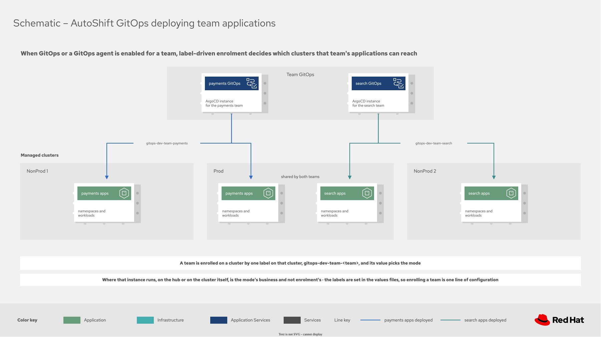
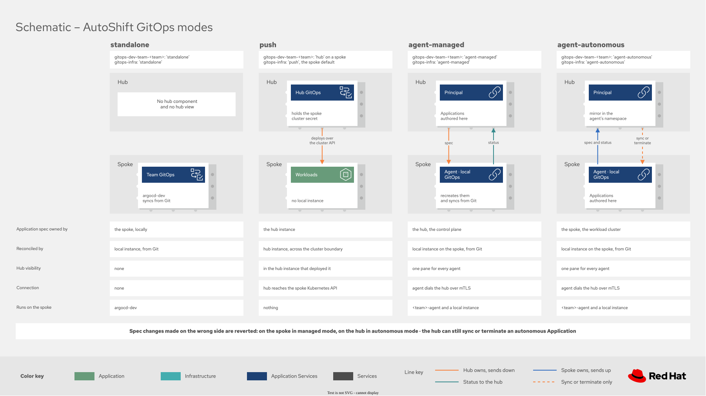

# Argo CD agent

AutoShift runs the Argo CD agent in two tiers. They solve different problems and a cluster can run
both at once.

| Tier | What it solves | Agents for each cluster |
|---|---|---|
| Infrastructure | The cluster's own Argo CD reports to, or is driven by, a principal on the hub | One |
| Team | Application teams share a cluster without seeing each other's namespaces | One for each enrolled team |

The infrastructure tier has **two implementations, and a cluster runs one or the other**. The team
tier is unaffected by that choice and is always built from AutoShift policies.

> [!NOTE]
> The Red Hat Advanced Cluster Management for Kubernetes side of this feature is Technology Preview.
> The team tier is built from AutoShift policies and does not depend on the add-on.

## Choosing an infrastructure implementation

|  | AutoShift agent | Red Hat Advanced Cluster Management GitOps add-on |
|---|---|---|
| Selected with | `gitops-infra` set to an agent mode | `gitops-agent-enroll: 'true'` |
| Principal namespace | `openshift-gitops-infra-agent` | `openshift-gitops-agent` |
| Agent name | `<cluster>-infra` | The cluster name |
| Public key infrastructure | cert-manager, under your own root | Created and automated by the add-on |
| Agents for each cluster | Several, so team agents can run alongside | One, because every object it creates is fixed |
| Requires cert-manager | Yes | No |
| Installs GitOps on the spoke | No, the operator policy does | Yes, it brings its own installer |
| Choose it when | The mesh must chain to an organization authority, or teams need agents on the same cluster | The cluster has no cert-manager and one agent is enough |

Both put the same thing on the cluster in the end: an Argo CD agent talking to a principal on the
hub. They differ in who builds the plumbing.

## Infrastructure with the AutoShift agent

This is the default path. AutoShift creates the principal, issues every certificate with
cert-manager, and enrolls each cluster.

### Enable

On the hub clusterset:

```yaml
labels:
  gitops-agent: 'true'      # run the infrastructure principal on this hub
```

Then enroll each cluster with the mode label, which also selects the shape of the instance:

```yaml
labels:
  gitops-infra: 'agent-autonomous'   # a local instance, reporting to the hub principal
```

### Public key infrastructure

Everything derives from one secret in the principal namespace, `gitops-agent-ca`: the principal
serving certificate, the resource proxy certificate, the trust bundle each spoke receives, and every
agent client certificate. Every name is set on the `ArgoCD` CR, so AutoShift chooses them.

The `gitops-agent-ca` label drives the cert-manager `Certificate`. Team principals each get an
intermediate under the same root, set by `config.gitops.teams.<team>.agent.caIssuer`.

To integrate an external certificate authority instead, set the `gitops-agent-ca` label to
`external`. AutoShift then monitors the secret without issuing it, so an organization can deliver
that key by its own means.

## Infrastructure with the GitOps add-on

The opt-in alternative. The `GitOpsCluster` controller
[creates and automates the public key infrastructure](https://docs.redhat.com/en/documentation/red_hat_advanced_cluster_management_for_kubernetes/2.17/html/gitops/gitops-overview),
deploys the agent, and propagates the hub certificate authority to each managed cluster. It also
brings its own GitOps installer, which is what makes it useful on a cluster with no cert-manager.

### Enable

On the hub clusterset, the same principal label as the other implementation:

```yaml
labels:
  gitops-agent: 'true'      # run the infrastructure principal on this hub
```

On each cluster that should run the add-on agent instead:

```yaml
labels:
  gitops-agent-enroll: 'true'   # deploy the add-on agent here
  gitops-agent-ca: 'true'       # issue the add-on signing authority with cert-manager
```

### Public key infrastructure

The add-on derives everything from one secret in its principal namespace, `argocd-agent-ca`. That
name is fixed by the `GitOpsCluster` controller, as are the agent instance name and its client
secrets, which is why the add-on allows only one agent for each cluster.

The add-on adopts that secret rather than replacing it. Create it with cert-manager before enabling
the add-on and the whole mesh chains to an existing authority. Leave it absent and the add-on
generates a self-signed authority of its own.

> [!WARNING]
> `renewBefore` must stay above `duration` divided by five. The add-on re-generates any signing
> certificate past eighty percent of its lifetime, and does so without reporting an error, which
> silently replaces an adopted authority with one of its own. The default of `8760h0m0s` with
> `2160h0m0s` leaves a margin of several days.
>
> This renewal behavior is observed, not documented by Red Hat. Red Hat documents that the
> controller automates the public key infrastructure, but not how it renews it.

## Team agents

Application teams share clusters. Each team gets its own principal, its own signing certificate
authority, and a scoped `AppProject`, so one team cannot see or deploy into another team's
namespaces. A cluster runs the infrastructure agent alongside one agent for each enrolled team.

### Enable

The hub needs the policy placed, and each team needs its principal enabled in configuration:

```yaml
config:
  gitops:
    teams:
      test:
        agent:
          enabled: true
          caIssuer: 'autoshift-ca'
labels:
  gitops-agent-teams: 'true'     # place the team principal policy on this hub
  gitops-dev-team-test: 'hub'    # the team instance, and therefore its principal, runs here
```

Each cluster that joins a team's agent needs two labels:

```yaml
labels:
  gitops-agent-enrolled: 'true'        # this cluster runs at least one team agent
  gitops-dev-team-test: 'agent'        # which team, and in which mode
```

> [!IMPORTANT]
> Those two labels must move together. A placement selector cannot match a label prefix, so
> `gitops-agent-enrolled` is what places the spoke policy, while the per-team labels only decide
> which teams. Set one without the other and the hub still builds the namespace, the client
> certificate, the mapping secret, and the source namespace entry, no agent is ever deployed, and
> every policy reports `Compliant`.

Enrollment decides reach, and nothing else: a team's applications land only on the clusters whose
labels name that team. Two teams share a cluster by both being enrolled on it, and each keeps its
own instance, project and namespaces.

[](diagrams/autoshift-gitops-team-clusters.drawio.svg)

## Modes

Mode is a per-agent setting, so one team can run some clusters managed and others autonomous at the
same time.

| Label value | Mode | Who owns the `Application` resources |
|---|---|---|
| `agent` | Whatever `config.gitops.teams.<team>.agent.mode` says, default autonomous | Follows the team default |
| `agent-autonomous` | Autonomous | The spoke. The agent mirrors each one up to the hub |
| `agent-managed` | Managed | The hub. The agent pulls them down |

The same label also carries the two values that are not agent modes, `standalone` and `push`, so all
four sit on one scale: where the instance runs, and which side owns the `Application`.

[](diagrams/autoshift-gitops-modes.drawio.svg)

Neither mode conflicts with AutoShift. AutoShift builds the instance, its RBAC and its
`AppProject`, and never creates an `Application`, so the applications themselves belong to whoever
the mode says. Pick on where the team wants to work: autonomous keeps authoring on the cluster and
gives the hub a live view of what is already running there, while managed makes the hub the place
applications are declared and pushes them down.

One place the two would otherwise contend is handled for you. `policy-managed-autoshift` writes
the AutoShift `Application` into a managed hub's own Argo CD, and in `agent-managed` mode the hub
above owns that same object through the principal. Its placement excludes `agent-managed`, so
AutoShift steps back and the principal is the only writer. Setting a managed hub to `agent-managed`
therefore means the hub above supplies its AutoShift `Application`.

`destinationBasedMapping` decides how the principal maps an `Application` to an agent. It defaults
to `false` on both paths, which means mapping by namespace, and it is worth leaving alone. The
setting is not symmetric, and the asymmetry appears only in managed mode. For the detail, see
[Status never returns to the hub](#status-never-returns-to-the-hub).

Autonomous mode is unaffected by it, because the agent mirrors into the hub namespace that already
matches its own agent name, so nothing needs rewriting on the way back.

## Privilege

Team GitOps is meant for application teams and is least privileged. The team instance gets no
cluster-scoped access unless `gitops-dev-team-<team>-cluster-scoped` asks for it, and the agent
receives a narrow `ClusterRole` that grants `get`, `list`, and `watch` on namespaces rather than
membership of `ARGOCD_CLUSTER_CONFIG_NAMESPACES`.

The team principal is the exception, and it is forced rather than chosen. Red Hat OpenShift GitOps
reconciles `sourceNamespaces` only for a cluster-scoped instance, so AutoShift adds
`openshift-gitops-<team>-agent` to `ARGOCD_CLUSTER_CONFIG_NAMESPACES` whenever a team enables an
agent. That instance runs with the application controller disabled and reconciles nothing. It is a
separate instance from the team's own Argo CD, whose scope is unaffected.

## Verify

Each path ships an inform policy that asserts the result rather than the intent:

| Policy | What it asserts |
|---|---|
| `policy-gitops-addon-ready` | The infrastructure principal is serving, and the trust bundle reached the spokes |
| `policy-gitops-agent-hub-ready` | For each team: namespace, signing authority, token key, principal, and rollout. For each enrolled cluster: agent namespace, client certificate, mapping secret, and the `AppProject` permit list |
| `policy-gitops-agent-spoke-ready` | For each team on this cluster: namespace, client certificate, instance, and that the agent rollout completed |

A useful manual check is the principal log, which names each agent as it authenticates:

```text
Mapped cluster fedtest-test to agent fedtest-test
client authentication successful  agent_version=0.9.0  authmethod=mtls  client=fedtest-test
An agent connected to the subscription stream
```

## Troubleshoot

These failures all report `Compliant`, because the policies that carry them hold nothing that can
fail. Work through them in order, because each one hides the one that follows it. Start by reading
the compliance message, which distinguishes a policy that had nothing to do from one that should
have done something.

### No agent appears on a cluster

Read the compliance message on the policy before anything else. Rendering nothing is a legitimate
result, so both agent policies state what a Compliant verdict covered:

```bash
oc get policy -n <cluster> policies-autoshift.policy-gitops-agent-spoke \
  -o jsonpath='{.status.details[0].history[0].message}'
```

`Compliant with nothing to show means no team runs an agent here yet` is the expected message on a
cluster that runs no team agent. If that is the message and you expected an agent, the cluster is
missing one of the two labels: `gitops-agent-enrolled` places the policy, and the per-team
`gitops-dev-team-<team>` label decides which teams. Both are needed.

If the per-team label does say an agent value and the message still reports nothing enrolled, the
two disagree, which is a defect rather than a configuration error. Confirm it by counting the
objects the hub distributed:

```bash
oc get policy -n <cluster> policies-autoshift.policy-gitops-agent-spoke \
  -o jsonpath='{.spec.policy-templates[0].objectDefinition.spec.object-templates-raw}' \
  | grep -c 'complianceType'
```

A count of zero against a label that asks for an agent is worth reporting. It reaches a cluster when
that cluster changes role or mode, because the condition deciding whether each object is emitted is
then evaluated against a state it was never tested against. Promoting a spoke to a managed hub is
the case that has produced it.

### One cluster silently leaves a team

The hub keeps every object it already created, because `musthave` never removes anything, so a
running agent survives long after its policy stopped rendering. Check that the per-team label still
matches what the enrollment loop expects. A label that carries a mode, such as `agent-managed`, does
not equal `agent`.

### Applications flow in neither direction

A namespace carries only one `argocd.argoproj.io/managed-by-cluster-argocd` claim. Two principals
with `sourceNamespaces: ['*']` contest every namespace on the cluster, and the loser is denied
access to its own agent namespaces with nothing logged above debug level. List the claims and
confirm they are disjoint:

```bash
oc get ns -L argocd.argoproj.io/managed-by-cluster-argocd
```

### The principal skips its source namespaces

Red Hat OpenShift GitOps logs the following at information level, sets no status condition, and
continues:

```text
Skipping sourceNamespaces reconciliation for namespace openshift-gitops-test-agent
```

That namespace is missing from `ARGOCD_CLUSTER_CONFIG_NAMESPACES`.

### Status never returns to the hub

Applications reach the spoke, and the hub shows empty sync and health values forever. In managed
mode, `destinationBasedMapping` is `true`. The principal rewrites an incoming status update's
namespace to the agent name only when that setting is `false`, so with it enabled the update names
the spoke namespace and is looked up under that name on the hub, where nothing of that name exists.

This affects managed mode alone. In autonomous mode the agent mirrors into the hub namespace that
already carries its agent name, so the value makes no difference and status returns either way.

### A configuration change appears to apply and does not

Read the agent pod rather than the `Deployment`. The agent announces its mode in its authentication
token, so the principal reports whatever the running pod says. At one replica a rolling update needs
a surge of one, so on a node at its pod limit the new pod never schedules, the old pod keeps
serving, and the `Deployment` reports minimum availability. The readiness policies assert the
`Progressing` condition for this reason.

## Related pages

- [Config and labels](config-and-labels.md) for how values become labels
- [Values reference](values-reference.md) for every label
- [Policy behavior](policy-behavior.md) for the `musthave` merge and create semantics
- [Hub-of-hubs topology](hub-of-hubs.md) for where hub templates resolve
