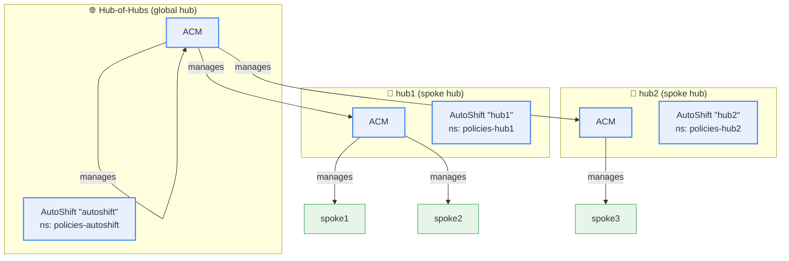
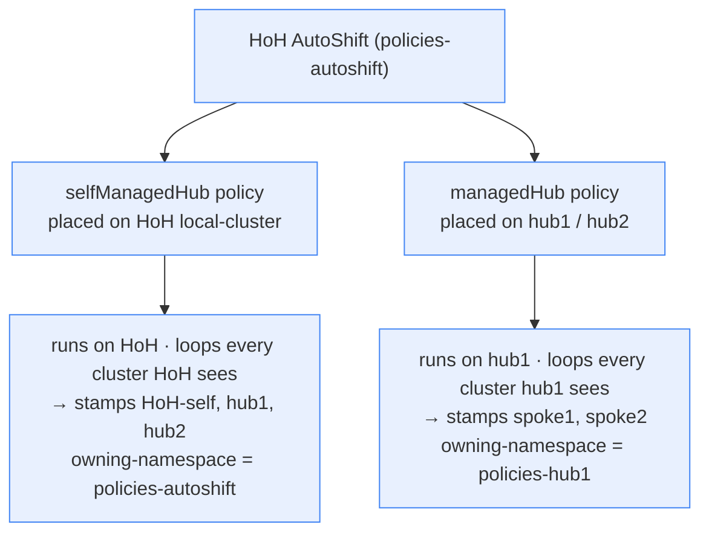
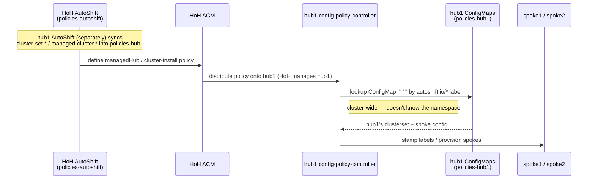

# Hub-of-Hubs Topology

This document explains how AutoShift works in a **hub-of-hubs** (a.k.a. *global hub*)
topology: one top-level hub that manages other hubs, each of which in turn manages its own
spoke clusters.

If you only run a single hub you don't need any of this — see
[quickstart.md](quickstart.md). This document is for the multi-tier case, which trips
people up because of one non-obvious ACM rule that reshapes everything.

---

## The rule everything follows from

> **A cluster can be managed by exactly one ACM.**

A managed cluster runs a single agent (klusterlet) registered to a single hub. That means a
spoke hub like `hub1`, which is imported into the **hub-of-hubs (HoH)** ACM, **cannot also
manage itself**. `hub1` has *no* `local-cluster` entry in its own ACM. Its own ACM manages
only *its* spokes (`spoke1`, `spoke2`) — never `hub1` itself.

Two consequences flow from this, and they are the whole reason the architecture looks the
way it does:

1. **Anything that must land *on* `hub1` — operators, configuration, upgrades, and even the
   policies that label or provision clusters from `hub1` — has to be deployed by the
   *hub-of-hubs* AutoShift.** Only the HoH's ACM manages `hub1`, so only the HoH can place
   a policy onto it. `hub1`'s own AutoShift physically cannot target `hub1`.
2. **`hub1`'s own AutoShift is limited to two things:** (a) configuring `hub1`'s *spokes*
   (policies that `hub1`'s ACM distributes down to `spoke1`/`spoke2`), and (b) producing
   `hub1`-local **config resources** — the `cluster-set.*` / `managed-cluster.*` /
   rendered-config ConfigMaps — which ArgoCD applies directly to `hub1` (no ACM required).

So the top hub manages itself and the hubs below it; every lower hub is managed *from above*
and only reaches *downward* to its own spokes.

---

## ACM management topology



- The HoH ACM manages **itself** (top hub — it is self-managed) plus **hub1** and **hub2**.
- hub1's ACM manages **spoke1/spoke2** but **not hub1** (hub1 is managed from above).
- hub2's ACM manages **spoke3** but **not hub2**.
- The HoH **cannot see** spoke1/spoke2/spoke3 at all — those are two boundaries away.

```
hub-of-hubs   ── manages ──►  itself, hub1, hub2
hub1          ── manages ──►  spoke1, spoke2        (HoH cannot see these)
hub2          ── manages ──►  spoke3                (HoH cannot see this)
```

---

## Who can place a policy where

This is the crux. An AutoShift instance can only place an ACM policy onto a cluster that
*its* ACM manages. Map that onto the topology and you get a strict division of labor:

| Target cluster | Managed by | So policies on it are deployed by | hub1's own AutoShift can target it? |
|---|---|---|---|
| hub-of-hubs (self) | HoH ACM | HoH AutoShift | n/a |
| **hub1** (the hub itself) | **HoH ACM** | **HoH AutoShift** | ❌ **no** — hub1's ACM doesn't manage hub1 |
| spoke1 / spoke2 | hub1 ACM | hub1 AutoShift | ✅ yes (these are hub1's managed clusters) |

What each AutoShift instance is responsible for:

- **HoH AutoShift** (`policies-autoshift`):
  - Configures the HoH itself.
  - Configures **hub1/hub2 themselves** — their operators, day-2 config, upgrades. The
    feature labels in `hub1.yaml` (e.g. `odf`, `acs`) are consumed *here*, because the HoH
    is what places those operator policies onto hub1.
  - Deploys the **cluster-labels** and **cluster-install** policies that need to *execute on*
    hub1 (placed there via the `managedHub` target — see below).
- **hub1 AutoShift** (`policies-hub1`):
  - Configures hub1's **spokes** — operator/config policies that hub1's ACM distributes down
    to spoke1/spoke2.
  - Produces hub1-local **config ConfigMaps** (via ArgoCD sync) describing hub1's clusterset
    and its spokes. These are what the HoH-deployed policies read at runtime.
  - **Does not, and cannot, configure hub1 itself.**

---

## `cluster-labels` targets across the tiers

The `cluster-labels` policy (`policies/stable/cluster-labels/templates/policy-cluster-labels.yaml`)
reads each hub clusterset's `self-managed` label and generates two kinds of targets:

| `self-managed` | Target generated | Placement | Where it runs |
|---|---|---|---|
| `'true'`  | `selfManagedHub` | the instance's own `local-cluster` | on the hub running this AutoShift |
| `'false'` | `managedHub`     | the spoke hubs in this instance's values | distributed down onto those spoke hubs |

In the HoH instance, `hubofhubs` is `self-managed: 'true'` and `hub1`/`hub2` are
`self-managed: 'false'`, so the HoH generates **both** targets:



- The **`selfManagedHub`** policy runs on the HoH and labels everything the HoH's ACM sees —
  including **hub1** and **hub2** (they get `owning-namespace: policies-autoshift`).
- The **`managedHub`** policy is **deployed by the HoH but executes on hub1** (HoH's ACM
  distributes it there). Running on hub1, it sees hub1's managed clusters (spoke1/spoke2) and
  labels them. It reads the per-spoke config from **hub1's own** ConfigMaps.

> Leaf spokes are never a separate placement target — they get labeled simply because they
> are visible to whichever hub the policy is executing on.

---

## Why the lookups are not namespace-bound

This falls straight out of the rule above and is the single most important implementation
detail to understand.

The `managedHub` cluster-labels policy and the cluster-install policies **execute on hub1**
but are **authored and deployed by the HoH AutoShift**. To do their job they must read the
config that **hub1's own AutoShift** produced (which spokes exist, their site config, their
labels). But the HoH-authored policy has **no idea which namespace** hub1's AutoShift uses —
that's a decision made by a *different* AutoShift instance on a *different* cluster.

So the policies never hard-code a namespace. They do a **cluster-wide lookup filtered by a
well-known label**:

```go
// not: lookup "v1" "ConfigMap" "policies-hub1" "..."   ← HoH can't know "policies-hub1"
lookup "v1" "ConfigMap" "" "" "autoshift.io/cluster-labels"      // cluster-labels reads these
lookup "v1" "ConfigMap" "" "" "autoshift.io/rendered-config-map" // cluster-install reads these
```



The flow:

1. **hub1's own AutoShift** syncs the config ConfigMaps (`cluster-set.*`,
   `managed-cluster.*`, rendered-config) into `policies-hub1` via ArgoCD — plain ConfigMaps,
   no ACM involved, so this works even though hub1's ACM doesn't manage hub1.
2. **The HoH's AutoShift** defines the cluster-labels/cluster-install policy and, because the
   HoH's ACM manages hub1, distributes it onto hub1.
3. **On hub1**, the policy does a cluster-wide, label-selected lookup to find those
   ConfigMaps wherever they happen to live, reads the config, and acts on hub1's managed
   clusters (labeling spoke1/spoke2, provisioning new clusters, etc.).

If those lookups were namespace-bound, the HoH-deployed policy would have to know the spoke
hub's AutoShift namespace ahead of time — which it can't. The label-selected, cluster-wide
lookup is what lets a policy authored on one hub consume config produced by an independent
AutoShift instance on another.

---

## Standing up each tier (deployment)

Tier 1 (HoH) and tier 2 (hub1) are **two separate AutoShift bootstraps**. The second is not
a side effect of the first.

```mermaid
sequenceDiagram
    participant Admin
    participant HoH as Hub-of-Hubs AutoShift
    participant H1 as hub1 cluster
    participant H1AS as hub1 AutoShift

    Note over Admin,HoH: Tier 1 — stand up the global hub
    Admin->>HoH: Bootstrap GitOps + ACM, create app "autoshift"
    Note right of HoH: values: global.yaml + hubofhubs.yaml + hub1.yaml

    Note over HoH,H1: HoH prepares AND configures hub1 (it manages it)
    HoH->>H1: provision/import hub1; install GitOps + ACM on it
    HoH->>H1: place hub1's operator/day-2/upgrade policies on it

    Note over Admin,H1AS: Tier 2 — a SEPARATE bootstrap on hub1
    Admin->>H1AS: create app "hub1" targeting the hub1 cluster
    Note right of H1AS: values: global.yaml + hub1.yaml + managed.yaml + spoke values
    H1AS->>H1: sync hub1-local config ConfigMaps (via ArgoCD)
    H1AS->>H1: deploy policies for hub1's SPOKES only
```

1. **Bootstrap the HoH** like any single hub (GitOps + ACM), then create its AutoShift
   Application (`autoshift`). Its policies live in `policies-autoshift`.
2. The HoH's values include its own clusterset (`hubofhubs.yaml`, `self-managed: 'true'`)
   **and** an entry per spoke hub (`hub1.yaml`, `self-managed: 'false'`). The HoH uses the
   latter to manage and configure hub1.
3. The HoH provisions/imports hub1 and installs **GitOps + ACM** on it, then places hub1's
   own operator/config/upgrade policies onto it.
4. **Separately bootstrap AutoShift on hub1** — a *second* Application (`hub1`) whose
   destination is the hub1 cluster, policies in `policies-hub1`. There is **no policy in this
   repo that auto-creates it**; it's a deliberate step (re-run the bootstrap, or commit a
   second Application in GitOps).
5. hub1's AutoShift syncs its config ConfigMaps and deploys policies for **its spokes**.
6. The HoH-deployed cluster-labels/cluster-install policies (executing on hub1) read those
   ConfigMaps and manage hub1's spokes.

---

## Naming and namespaces per tier

Each AutoShift instance is identified by its ArgoCD Application name (`Release.Name`); its
policy namespace is `policies-{Release.Name}`.

| Tier | App (`Release.Name`) | Policy namespace | Destination | Typical valueFiles |
|---|---|---|---|---|
| Hub-of-Hubs | `autoshift` | `policies-autoshift` | the HoH (local-cluster) | `global.yaml`, `hubofhubs.yaml`, `hub1.yaml`, `hub2.yaml` |
| Spoke hub 1 | `hub1` | `policies-hub1` | hub1 | `global.yaml`, `hub1.yaml`, `managed.yaml`, `clusters/spoke1.yaml` |
| Spoke hub 2 | `hub2` | `policies-hub2` | hub2 | `global.yaml`, `hub2.yaml`, `managed.yaml`, `clusters/spoke3.yaml` |

> Keep `policies-{Release.Name}` ≤ 20 characters (so `Release.Name` ≤ 11): the namespace
> prefixes ACM-generated object names that have a 62-character ceiling.

`hub1.yaml` appears in two instances with two meanings — and this is what makes the
relationship feel complicated:

- On the **HoH**, the `hub1` clusterset is `self-managed: 'false'`: "a spoke hub I manage and
  configure." Its operator labels drive what the HoH installs *onto* hub1.
- On **hub1's own instance**, hub1 is the cluster it runs on, but its ACM doesn't manage it —
  so hub1's instance can't act on hub1. Its useful work is the spoke config and the local
  ConfigMaps the HoH-deployed policies consume.

---

## Labeling and ownership across tiers

`owning-namespace` / `owning-deployment` are auto-stamped by cluster-labels and identify
which AutoShift instance owns a cluster:

- The HoH's `selfManagedHub` policy stamps **hub1** with
  `autoshift.io/owning-namespace: policies-autoshift` (the HoH owns hub1).
- The HoH's `managedHub` policy, running on hub1, stamps **spoke1/spoke2** with
  `autoshift.io/owning-namespace: policies-hub1` (read from hub1's own ConfigMaps).
- These are different namespaces on different clusters; there's no conflict, because each
  instance only owns clusters its own ACM sees.

`cluster-install` uses `owning-namespace` (matched against the namespace of the
rendered-config ConfigMap it found via the cross-namespace lookup) to decide whether it
should manage a given cluster — the basis for migrating a cluster between instances.

---

## Worked example: following one config change

Set `acs: 'true'` for **spoke1**:

1. Put it in spoke1's values (`clusters/spoke1.yaml` or the `managed` clusterset) loaded by
   the **hub1** AutoShift app — *not* the HoH app. The HoH has never heard of spoke1.
2. hub1's AutoShift syncs a `managed-cluster.spoke1` ConfigMap into `policies-hub1`.
3. The HoH-deployed `managedHub` cluster-labels policy, executing on hub1, reads that
   ConfigMap (cross-namespace lookup) and stamps `autoshift.io/acs: 'true'` onto spoke1.
4. hub1's ACS policy (deployed by hub1's AutoShift, since hub1's ACM manages spoke1) matches
   the label and installs ACS on spoke1.

Now set `acs: 'true'` for **hub1**:

1. Put it in the `hub1` clusterset in the **HoH's** values — because the HoH is what manages
   and configures hub1. Putting it in hub1's own instance would do nothing, since hub1's ACM
   can't place a policy on hub1.

---

## Common pitfalls

- **Expecting hub1's own AutoShift to configure hub1.** It can't — hub1's ACM doesn't manage
  hub1. Configure hub1 from the HoH (the `hub1` clusterset in the HoH's values).
- **Expecting the HoH to configure leaf spokes.** It can't see them. Configure them on the
  spoke hub's AutoShift instance.
- **Forgetting to bootstrap AutoShift on the spoke hub.** Installing ACM on hub1 via the HoH
  does not give hub1 an AutoShift instance — that's a separate bootstrap.
- **Assuming lookups are namespace-scoped.** They're cluster-wide and label-selected on
  purpose, so a HoH-deployed policy can find a spoke hub's config without knowing its
  namespace. Don't "fix" them to a fixed namespace.
- **Reusing a `Release.Name`/namespace across instances on one cluster.** Keep them distinct
  and ≤ 20 chars (`policies-{Release.Name}`).

---

## See also

- [CLAUDE.md](../CLAUDE.md) — label flow, cluster-labels mechanics, ApplicationSet value flow
- [cluster-install.md](cluster-install.md) — provisioning and `owning-namespace` ownership filtering
- [values-reference.md](values-reference.md) — full label/values reference
- Example value files: `autoshift/values/clustersets/hubofhubs.yaml`, `hub1.yaml`, `hub2.yaml`, `managed.yaml`
