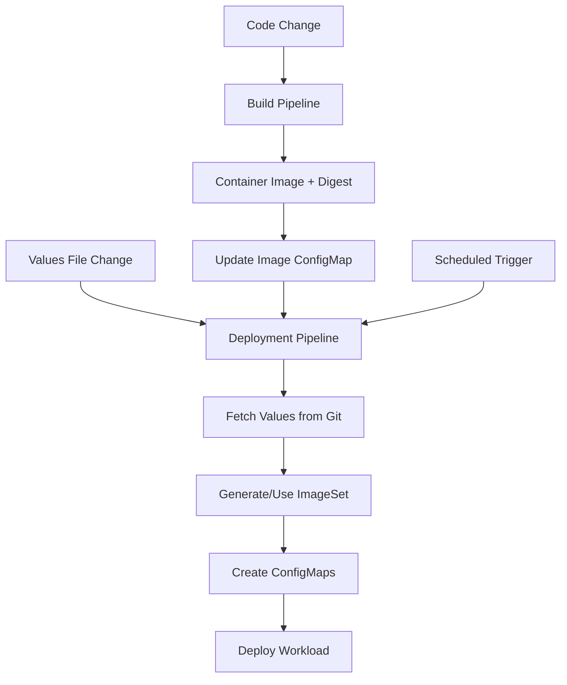

# New oc-mirror Pipeline Architecture

This document describes the new separated build and deployment pipeline architecture for oc-mirror with AutoShift integration.

## 🏗️ Architecture Overview

The new architecture separates concerns into two distinct pipelines:

### **1. Build Pipeline** (`oc-mirror-build-pipeline`)
- **Purpose**: Builds and publishes container images
- **Triggers**: Code changes, manual builds
- **Outputs**: Container image with digest, updated image ConfigMap
- **Frequency**: As needed when code changes

### **2. Deployment Pipeline** (`oc-mirror-deployment-pipeline`)
- **Purpose**: Deploys oc-mirror workloads with dynamic configuration
- **Triggers**: Configuration changes, scheduled operations
- **Inputs**: Values files from Git, image from build pipeline
- **Frequency**: As needed for deployments, scheduled for regular mirroring

## 🔄 Pipeline Flow



## 📋 Pipeline Components

### Build Pipeline Files
- `build-pipeline.yaml` - Main build pipeline
- `task-update-image-configmap.yaml` - Updates image ConfigMap
- `build-pipelinerun.yaml` - Example build runs

### Deployment Pipeline Files
- `deployment-pipeline.yaml` - Main deployment pipeline
- `task-get-current-image.yaml` - Retrieves current image info
- `task-generate-or-use-imageset.yaml` - Dynamic ImageSet handling
- `task-create-deployment-configmaps.yaml` - ConfigMap management
- `task-deploy-oc-mirror-workload.yaml` - Workload deployment
- `deployment-pipelinerun.yaml` - Example deployment runs

## ✨ Key Features

### 🔄 **Incremental Mirroring Support**
Both `--incremental` (auto-detection) and `--since DATE` (manual) options:

```yaml
params:
  - name: incremental-mode
    value: "true"  # Auto-detect from .history files
  # - name: since-date
  #   value: "2025-09-20"  # Override auto-detection
```

### 🎯 **GitOps Integration**
Values files pulled from Git repositories:

```yaml
params:
  - name: values-git-url
    value: "https://github.com/auto-shift/autoshiftv2.git"
  - name: values-file-path
    value: "autoshift/values.hub.yaml"
```

### 📦 **Dynamic ImageSet Generation**
Generate from values files OR use existing ConfigMaps:

```yaml
# Generate from values
params:
  - name: operators-only
    value: "true"
  - name: openshift-version
    value: "4.18.22"

# OR use existing ImageSet
params:
  - name: imageset-configmap
    value: "production-imageset"
```

### 🔧 **Flexible Deployment Modes**
- **Job**: One-time execution
- **CronJob**: Scheduled execution
- **Deployment**: Persistent service

### 🎨 **Multiple Workflow Support**
- `workflow-to-disk`: Air-gapped mirroring
- `workflow-direct`: Direct registry-to-registry
- `workflow-from-disk`: Upload from disk to registry

## 🚀 Usage Examples

### 1. Initial Setup

```bash
# Apply all pipeline resources
oc apply -f oc-mirror/pipeline/

# Create required secrets (same as before)
oc create secret generic oc-mirror-pull-secret \
  --from-file=.dockerconfigjson=/path/to/pull-secret.json \
  --type=kubernetes.io/dockerconfigjson \
  --namespace=oc-mirror-pipeline
```

### 2. Build Container Image

```bash
# Trigger build pipeline
oc create -f oc-mirror/pipeline/build-pipelinerun.yaml

# Monitor build
tkn pipelinerun logs -f oc-mirror-build-run-<timestamp> -n oc-mirror-pipeline
```

### 3. Deploy with Incremental Mirroring

```bash
# Incremental air-gapped workflow
cat << EOF | oc apply -f -
apiVersion: tekton.dev/v1
kind: PipelineRun
metadata:
  generateName: oc-mirror-incremental-
  namespace: oc-mirror-pipeline
spec:
  serviceAccountName: oc-mirror-pipeline
  pipelineRef:
    name: oc-mirror-deployment-pipeline
  params:
    - name: values-file-path
      value: "autoshift/values.hub.yaml"
    - name: deploy-mode
      value: "cronjob"
    - name: schedule
      value: "0 2 * * *"  # Daily incremental updates
    - name: workflow
      value: "workflow-to-disk"
    - name: incremental-mode
      value: "true"
    - name: operators-only
      value: "false"
  workspaces:
    - name: shared-workspace
      persistentVolumeClaim:
        claimName: oc-mirror-shared-workspace
    - name: mirror-data
      persistentVolumeClaim:
        claimName: oc-mirror-workspace
EOF
```

### 4. Direct Registry Workflow

```bash
# Direct registry mirroring
cat << EOF | oc apply -f -
apiVersion: tekton.dev/v1
kind: PipelineRun
metadata:
  generateName: oc-mirror-direct-
  namespace: oc-mirror-pipeline
spec:
  serviceAccountName: oc-mirror-pipeline
  pipelineRef:
    name: oc-mirror-deployment-pipeline
  params:
    - name: workflow
      value: "workflow-direct"
    - name: target-registry
      value: "registry.example.com:443/mirror"
    - name: incremental-mode
      value: "true"
    - name: operators-only
      value: "true"
    - name: dry-run
      value: "true"  # Test first
  workspaces:
    - name: shared-workspace
      persistentVolumeClaim:
        claimName: oc-mirror-shared-workspace
    - name: mirror-data
      persistentVolumeClaim:
        claimName: oc-mirror-workspace
EOF
```

### 5. Use Custom ImageSet ConfigMap

```bash
# First, create custom ImageSet ConfigMap
oc create configmap production-imageset \
  --from-file=imageset.yaml=/path/to/custom-imageset.yaml \
  --namespace=oc-mirror

# Then deploy using it
cat << EOF | oc apply -f -
apiVersion: tekton.dev/v1
kind: PipelineRun
metadata:
  generateName: oc-mirror-custom-
  namespace: oc-mirror-pipeline
spec:
  serviceAccountName: oc-mirror-pipeline
  pipelineRef:
    name: oc-mirror-deployment-pipeline
  params:
    - name: imageset-configmap
      value: "production-imageset"  # Use custom ImageSet
    - name: incremental-mode
      value: "true"
EOF
```

## 📊 ConfigMap Management

The new architecture uses several ConfigMaps for configuration management:

### **Image ConfigMap** (Created by Build Pipeline)
```yaml
apiVersion: v1
kind: ConfigMap
metadata:
  name: oc-mirror-images
  namespace: oc-mirror-pipeline
data:
  image-name: "oc-mirror-autoshift"
  image-url: "quay.io/autoshift/oc-mirror-autoshift:latest"
  image-digest: "sha256:abc123..."
  git-revision: "main"
  build-timestamp: "2025-09-23T15:30:44Z"
```

### **Deployment ConfigMaps** (Created by Deployment Pipeline)
```yaml
# Main configuration (values + imageset)
apiVersion: v1
kind: ConfigMap
metadata:
  name: oc-mirror-config
  namespace: oc-mirror
data:
  values.yaml: |
    # AutoShift values content
  imageset.yaml: |
    # Generated or provided ImageSet

# Separate ConfigMaps for different use cases
- oc-mirror-imageset (ImageSet only)
- oc-mirror-values (values only)
```

### **Custom ImageSet ConfigMaps** (User-Created)
```yaml
apiVersion: v1
kind: ConfigMap
metadata:
  name: production-imageset
  namespace: oc-mirror
data:
  imageset.yaml: |
    kind: ImageSetConfiguration
    # Custom ImageSet content
```

## 🔧 Advanced Configuration

### Incremental Mirroring Options

```yaml
# Auto-detect from .history files
params:
  - name: incremental-mode
    value: "true"

# Custom since date (overrides auto-detection)
params:
  - name: incremental-mode
    value: "true"
  - name: since-date
    value: "2025-09-20"

# Full mirror (disable incremental)
params:
  - name: incremental-mode
    value: "false"
```

### ImageSet Generation Options

```yaml
# Generate from values file
params:
  - name: values-file-path
    value: "autoshift/values.hub.yaml"
  - name: operators-only
    value: "true"
  - name: openshift-version
    value: "4.18.22"

# Use existing ConfigMap
params:
  - name: imageset-configmap
    value: "my-custom-imageset"
```

### Deployment Modes

```yaml
# One-time job
params:
  - name: deploy-mode
    value: "job"

# Scheduled CronJob
params:
  - name: deploy-mode
    value: "cronjob"
  - name: schedule
    value: "0 2 * * 0"  # Weekly

# Persistent deployment
params:
  - name: deploy-mode
    value: "deployment"
```

## 🔍 Monitoring and Troubleshooting

### Check Pipeline Status
```bash
# List pipeline runs
tkn pipelinerun list -n oc-mirror-pipeline

# View logs
tkn pipelinerun logs -f <pipelinerun-name> -n oc-mirror-pipeline

# Check specific task
tkn taskrun logs -f <taskrun-name> -n oc-mirror-pipeline
```

### Check Deployments
```bash
# Check workloads in oc-mirror namespace
oc get jobs,cronjobs,deployments -n oc-mirror

# Check ConfigMaps
oc get configmaps -n oc-mirror -l "app.kubernetes.io/name=oc-mirror"

# Check PVCs and storage
oc get pvc -n oc-mirror
```

### Debug Common Issues

#### Build Pipeline Issues
```bash
# Check image ConfigMap
oc get configmap oc-mirror-images -n oc-mirror-pipeline -o yaml

# Verify registry authentication
oc get secret quay-registry-auth -n oc-mirror-pipeline
```

#### Deployment Pipeline Issues
```bash
# Check values file retrieval
tkn taskrun logs -f <get-values-taskrun> -n oc-mirror-pipeline

# Check ImageSet generation
tkn taskrun logs -f <generate-imageset-taskrun> -n oc-mirror-pipeline

# Check workload deployment
oc get events -n oc-mirror --sort-by='.lastTimestamp'
```

## 🎯 Benefits of New Architecture

### **Separation of Concerns**
- Build pipeline focuses on code → image
- Deployment pipeline focuses on configuration → workload

### **GitOps Integration**
- Values files managed in Git
- Configuration changes trigger deployments
- Version-controlled infrastructure

### **Incremental Mirroring**
- 83% faster mirror operations
- Automatic .history detection
- Manual override capabilities

### **Flexible Configuration**
- Generate ImageSets dynamically
- Use pre-configured ImageSets
- Multiple deployment modes

### **Scalability**
- Build once, deploy many
- Independent pipeline triggers
- Efficient resource utilization

## 🚀 Migration from Old Pipeline

1. **Keep existing pipeline** during transition
2. **Deploy new pipelines** alongside existing
3. **Test new workflows** with dry-run mode
4. **Migrate configurations** to new ConfigMap structure
5. **Switch triggers** to new pipelines
6. **Remove old pipeline** when confident

The new architecture provides a robust, scalable foundation for oc-mirror operations with enhanced GitOps integration and incremental mirroring capabilities.