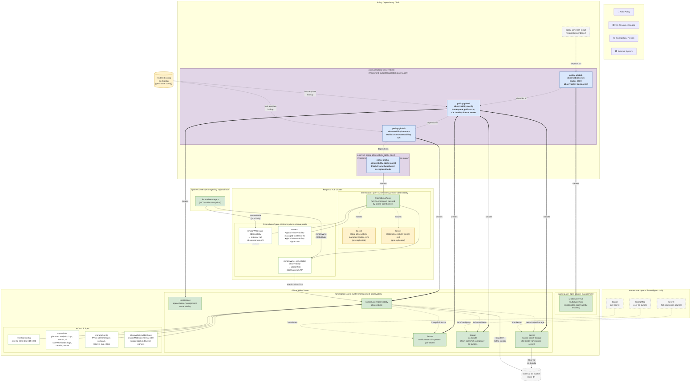

```mermaid
graph TB
    subgraph legend [" "]
        direction LR
        l1["🔵 ACM Policy"]
        l2["🟢 K8s Resource Created"]
        l3["🟡 ConfigMap / Pre-req"]
        l4["⬜ External System"]
    end

    %% ================================================================
    %% POLICY LAYER — dependency chain
    %% ================================================================
    subgraph policies ["Policy Dependency Chain"]
        direction TB
        ext_acm["policy-acm-mch-install\n(external dependency)"]

        subgraph ps_main ["policyset-global-observability\n(Placement: autoshift.io/global-observability)"]
            pol_mch["policy-global-observability-mch\nEnable MCH observability component"]
            pol_config["policy-global-observability-config\nNamespace, pull-secret, CA bundle, thanos secret"]
            pol_instance["policy-global-observability-instance\nMultiClusterObservability CR"]
        end

        subgraph ps_spoke ["policyset-global-observability-spoke-agent\n(Placement: autoshift.io/global-observability-spoke-agent)"]
            pol_spoke["policy-global-observability-spoke-agent\nPatch PrometheusAgent on regional hubs"]
        end

        ext_acm -.->|"depends on"| pol_mch
        pol_mch -.->|"depends on"| pol_config
        pol_config -.->|"depends on"| pol_instance
        pol_instance -.->|"depends on"| pol_spoke
    end

    rendered_config[("rendered-config\nConfigMap\n(per-cluster config)")]
    rendered_config -.->|"hub template\nlookup"| pol_config
    rendered_config -.->|"hub template\nlookup"| pol_instance

    %% ================================================================
    %% GLOBAL HUB — resources created by policies
    %% ================================================================
    subgraph global_hub ["Global Hub Cluster"]
        subgraph ns_ocm ["namespace: open-cluster-management"]
            mch["MultiClusterHub\nmulticlusterhub\n(multicluster-observability: enabled)"]
        end

        subgraph ns_mco ["namespace: open-cluster-management-observability"]
            ns_res["Namespace\nopen-cluster-management-observability"]
            pull_secret["Secret\nmulticlusterhub-operator-pull-secret"]
            ca_bundle["Secret\nca-bundle\n(from openshift-config/user-ca-bundle)"]
            thanos_secret["Secret\nthanos-object-storage\n(S3 creds from source secret)"]
            mco_cr["MultiClusterObservability\nobservability"]
        end

        subgraph mco_spec ["MCO CR Spec"]
            retention["retentionConfig\nraw: 5d | 5m: 14d | 1h: 30d"]
            capabilities["capabilities\nplatform: analytics, logs, metrics, ui\nuserWorkloads: logs, metrics, traces"]
            storage["storageConfig\nPVCs: alertmanager, compact,\nreceive, rule, store"]
            addon["observabilityAddonSpec\nenableMetrics | interval: 300\nscrapeSizeLimitBytes | workers"]
        end
    end

    %% Policy -> Resource creation edges
    pol_mch ==>|"creates"| mch
    pol_config ==>|"creates"| ns_res
    pol_config ==>|"creates"| pull_secret
    pol_config ==>|"creates"| ca_bundle
    pol_config ==>|"creates"| thanos_secret
    pol_instance ==>|"creates"| mco_cr

    mco_cr --- retention
    mco_cr --- capabilities
    mco_cr --- storage
    mco_cr --- addon

    %% MCO CR references
    mco_cr -.->|"imagePullSecret"| pull_secret
    mco_cr -.->|"tlsSecretName"| ca_bundle
    mco_cr -.->|"metricObjectStorage"| thanos_secret

    %% ================================================================
    %% EXTERNAL S3
    %% ================================================================
    s3[("External S3 Bucket\n(acm-dr)")]
    thanos_secret -->|"TLS via\nca-bundle"| s3
    mco_cr -->|"long-term\nmetric storage"| s3

    %% ================================================================
    %% OPENSHIFT-CONFIG (source secrets)
    %% ================================================================
    subgraph oc_config ["namespace: openshift-config (on hub)"]
        oc_pull["Secret\npull-secret"]
        oc_ca["ConfigMap\nuser-ca-bundle"]
        oc_s3["Secret\n(S3 credentials source)"]
    end

    oc_pull -.->|"fromSecret"| pull_secret
    oc_ca -.->|"fromConfigMap"| ca_bundle
    oc_s3 -.->|"fromSecret"| thanos_secret

    %% ================================================================
    %% REGIONAL HUB — spoke agent target
    %% ================================================================
    subgraph regional_hub ["Regional Hub Cluster"]
        subgraph ns_mco_reg ["namespace: open-cluster-management-observability"]
            prom_agent["PrometheusAgent\n(MCOA-managed, patched by spoke-agent policy)"]
            sec_certs["Secret\nglobal-observability-managed-cluster-certs\n(pre-replicated)"]
            sec_signer["Secret\nglobal-observability-signer-cert\n(pre-replicated)"]
        end

        subgraph prom_spec ["PrometheusAgent Additions (via musthave patch)"]
            rw_local["remoteWrite: acm-observability\n→ regional hub observatorium API"]
            rw_global["remoteWrite: acm-global-observability\n→ global hub observatorium API"]
            mounted_secrets["secrets:\n• global-observability-managed-cluster-certs\n• global-observability-signer-cert"]
        end
    end

    pol_spoke ==>|"patches"| prom_agent

    prom_agent --- rw_local
    prom_agent --- rw_global
    prom_agent --- mounted_secrets

    prom_agent -.->|"mounts"| sec_certs
    prom_agent -.->|"mounts"| sec_signer

    %% ================================================================
    %% METRIC FLOW
    %% ================================================================
    subgraph spoke_clusters ["Spoke Clusters (managed by regional hub)"]
        spoke_prom["Prometheus Agent\n(MCO addon on spokes)"]
    end

    spoke_prom -->|"remoteWrite\n(local hub)"| rw_local
    spoke_prom -->|"remoteWrite\n(global hub)"| rw_global
    rw_local -->|"metrics"| regional_hub
    rw_global -->|"metrics via mTLS"| mco_cr

    %% ================================================================
    %% STYLES
    %% ================================================================
    classDef policy fill:#dae8fc,stroke:#6c8ebf,stroke-width:2px,font-weight:bold
    classDef resource fill:#d5e8d4,stroke:#82b366,stroke-width:2px
    classDef configmap fill:#fff2cc,stroke:#d6b656,stroke-width:2px
    classDef external fill:#f5f5f5,stroke:#666666,stroke-width:1px,stroke-dasharray: 5 5
    classDef policySet fill:#e1d5e7,stroke:#9673a6,stroke-width:2px
    classDef specBlock fill:#ffffff,stroke:#82b366,stroke-width:1px
    classDef sourceNs fill:#f5f5f5,stroke:#cccccc,stroke-width:1px

    class pol_mch,pol_config,pol_instance,pol_spoke policy
    class ext_acm external
    class mch,ns_res,pull_secret,ca_bundle,thanos_secret,mco_cr,prom_agent resource
    class rendered_config,sec_certs,sec_signer configmap
    class s3,oc_pull,oc_ca,oc_s3 external
    class retention,capabilities,storage,addon,rw_local,rw_global,mounted_secrets specBlock
    class spoke_prom resource
    class ps_main,ps_spoke policySet
```
