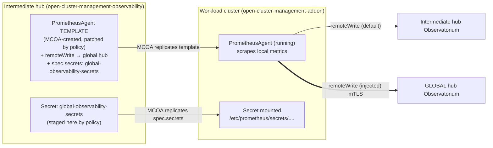
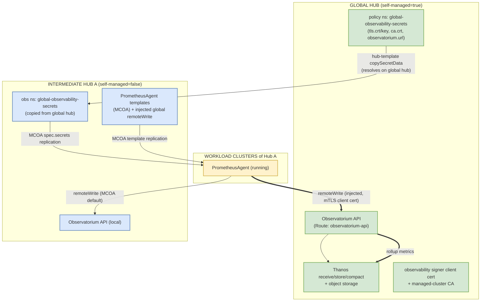
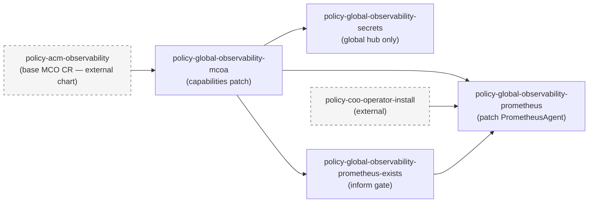
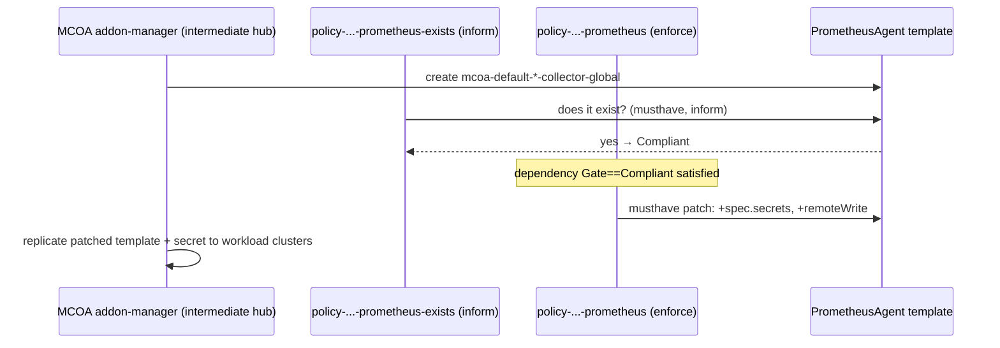

# Global Observability — Design & Architecture Reference

> **Audience:** ACM/MCO engineering review. This document describes how AutoShift
> achieves a three-tier metrics rollup —
> **global hub → intermediate (regional) hubs → workload clusters** — using only
> ACM Policy, the MultiCluster Observability Addon (MCOA), and the
> `PrometheusAgent` template-replication mechanism, with **no** native
> hub-of-hubs observability feature in the product.
>
> The goal of the review is to confirm whether this is the best available
> approach given that limitation. The "Discussion points for review" section at
> the end lists the specific places we'd like a second opinion.

---

## 1. The problem

ACM MultiCluster Observability (MCO) is a **single-tier** design:

- One hub runs the MCO stack (Thanos receive/store/compact/rule, Observatorium
  API, Alertmanager, object storage).
- Each managed cluster of that hub runs a metrics collector that
  `remoteWrite`s into **that hub's** Observatorium API.

There is no native concept of "forward one hub's observability up to another
hub." In a **hub-of-hubs** topology:

```
global hub
 ├── intermediate hub A   (itself an ACM hub with its own MCO + managed clusters)
 │     ├── workload cluster A1
 │     └── workload cluster A2
 └── intermediate hub B
       ├── workload cluster B1
       └── workload cluster B2
```

…each intermediate hub collects metrics from *its* workload clusters into *its
own* Observatorium. The global hub has no visibility into those workload-cluster
metrics. We want a single global pane of glass that includes every workload
cluster, **without** standing up a second collection agent per cluster and
without modifying MCO itself.

---

## 2. The key insight — leveraging MCOA's PrometheusAgent template + copy

MCOA (the MultiCluster Observability Addon) manages the lifecycle of
`PrometheusAgent` (`monitoring.rhobs/v1alpha1`) resources. The behavior we
exploit:

1. **Template on the hub.** MCOA creates `PrometheusAgent` resources in the
   hub's `open-cluster-management-observability` namespace. These are
   *templates* — they define the scrape config and `remoteWrite` targets that
   the hub's managed clusters should run with. MCOA names them deterministically,
   e.g.:
   - `mcoa-default-platform-metrics-collector-global`
   - `mcoa-default-user-workload-metrics-collector-global`

2. **Replication to managed clusters.** MCOA copies each `PrometheusAgent`
   template from the hub's `open-cluster-management-observability` namespace down
   to every managed cluster's `open-cluster-management-addon` namespace, where it
   actually runs and scrapes/forwards.

3. **Secret replication along with it.** Any secret named in the template's
   `spec.secrets` is **automatically copied by MCOA** from the hub's
   `open-cluster-management-observability` namespace to the managed cluster's
   `open-cluster-management-addon` namespace, and mounted into the agent pod at
   `/etc/prometheus/secrets/<secret-name>/`. Secrets only ever need to exist in
   the hub observability namespace — MCOA does the last mile.

**Therefore:** if we *patch an intermediate hub's `PrometheusAgent` template* to
add (a) an extra `remoteWrite` entry pointing at the **global hub's**
Observatorium API, and (b) the mTLS client-cert secret needed to authenticate to
it, then **MCOA carries that patch — and the secret — down to every workload
cluster of that intermediate hub.** Each workload cluster's agent now dual-writes:

- to its **own intermediate hub's** Observatorium (MCOA default — unchanged), and
- **directly to the global hub's** Observatorium (our injected `remoteWrite`).

The metrics for the global rollup flow **workload cluster → global hub
directly**; they do *not* hop through the intermediate hub's Thanos. The
intermediate hub is only the place where the template is patched and the secret
is staged — MCOA's replication is the transport.



This is the entire trick: **we don't build a forwarding pipeline; we ride MCOA's
existing template+secret replication to push a second remote-write target all the
way down to the leaf clusters.**

---

## 3. Topology and roles

| Tier | ACM label profile | Runs | Role in rollup |
|------|-------------------|------|----------------|
| **Global hub** | `global-observability: 'true'`, `self-managed: 'true'` | Full MCO stack + Observatorium. This is the central sink. | Receives metrics from its own managed clusters (native MCOA) **and** from every workload cluster of every intermediate hub (injected remote-write). |
| **Intermediate hub** | `global-observability: 'true'`, `self-managed: 'false'` | Its own MCO stack + MCOA, manages workload clusters. | Its `PrometheusAgent` templates are patched so its workload clusters also write up to the global hub. |
| **Workload cluster** | (managed cluster; no global-observability label needed) | The replicated `PrometheusAgent` (COO / Prometheus Operator). | Dual-writes: local intermediate-hub Observatorium + global-hub Observatorium. |

`self-managed` is the discriminator: the global hub manages itself
(`self-managed: 'true'`), intermediate hubs are managed by the global hub
(`self-managed: 'false'`). All placement and the "skip on self-managed hub" logic
key off this label.

> **Why skip the rollup on the self-managed (global) hub?** The global hub's own
> managed clusters already write into the global Observatorium through MCOA's
> default behavior. Injecting a "write to global hub" remote-write there would be
> a redundant self-loop, so the built-in rollup is unconditionally skipped when
> `self-managed == 'true'`.

---

## 4. End-to-end data flow



Steps:

1. On the **global hub**, `policy-global-observability-secrets` assembles a single
   coalesced secret `global-observability-secrets` in the **policy namespace**,
   composed field-by-field from MCO's own artifacts:
   - `tls.crt` / `tls.key` ← `observability-controller-open-cluster-management.io-observability-signer-client-cert`
   - `ca.crt` ← `observability-managed-cluster-certs`
   - `observatorium.url` ← `https://<observatorium-api Route host>/api/metrics/v1/default/api/v1/receive`
2. On each **intermediate hub**, `policy-global-observability-prometheus` uses a
   **hub template** `copySecretData` (which resolves on the global hub, since the
   global hub manages the intermediate hub) to copy that secret into the
   intermediate hub's `open-cluster-management-observability` namespace.
3. The same policy **patches the MCOA `PrometheusAgent` templates** on the
   intermediate hub to add the secret to `spec.secrets` and a `remoteWrite` entry
   whose URL is resolved (via `fromSecret … observatorium.url | base64dec`) to the
   global hub's Observatorium, with `tlsConfig` pointing at the mounted cert files.
4. **MCOA** replicates the patched template and the secret to every workload
   cluster, mounting the cert at `/etc/prometheus/secrets/global-observability-secrets/`.
5. Each workload cluster's agent now `remoteWrite`s its metrics **directly to the
   global hub Observatorium** over mTLS (client cert issued by the global hub's
   observability signer), in addition to its local intermediate-hub write.

---

## 5. Policy inventory

This chart owns the **global-hub-specific deltas** on top of MCO. The base MCO
lifecycle (namespace, pull secret, CA bundle, `thanos-object-storage`, the
`MultiClusterObservability` CR with retention/storage/addon spec) is owned by the
separate **`policy-acm-observability`** policy. This chart only patches on top.

| Policy | Placement (PolicySet) | Depends on | What it does |
|--------|-----------------------|------------|--------------|
| `policy-global-observability-mcoa` | `policyset-global-observability` — **all** global-obs hubs (`global-observability: 'true'`) | `policy-acm-observability` | `musthave`-patches the **`capabilities`** block (platform analytics/logs/metrics, user-workload logs/metrics/traces) onto the existing `MultiClusterObservability` CR. Toggles come from rendered-config, defaulting to all `true`. |
| `policy-global-observability-secrets` | `policyset-global-observability-secrets` — **global hub only** (`global-observability: 'true'` **AND** `self-managed: 'true'`) | `policy-global-observability-mcoa` | Assembles the coalesced `global-observability-secrets` secret (mTLS certs + Observatorium URL) in the **policy namespace** on the global hub. This is the source of truth that intermediate-hub hub-templates read via `copySecretData`. |
| `policy-global-observability-prometheus-exists` | `policyset-global-observability-prometheus` — intermediate hubs (`global-observability: 'true'` **AND** `self-managed: 'false'`) | `policy-global-observability-mcoa` | **`inform`-only gate.** Verifies the MCOA-created `PrometheusAgent` templates exist before the patching policy runs. Never creates or modifies them. |
| `policy-global-observability-prometheus` | `policyset-global-observability-prometheus` — intermediate hubs (`global-observability: 'true'` **AND** `self-managed: 'false'`) | `policy-global-observability-mcoa`, `policy-coo-operator-install`, `policy-global-observability-prometheus-exists` | The core patcher: stages the rollup secret into the obs namespace, stages any additional remote-write secrets, and `musthave`-patches the `PrometheusAgent` templates with `spec.secrets` + `spec.remoteWrite` entries. |

### Dependency chain



---

## 6. Why the `*-prometheus-exists` gate is necessary (subtle MCOA constraint)

This is the most non-obvious part of the design and a key review point.

**MCOA's addon-manager only replicates `PrometheusAgent` templates that MCOA
itself created.** If ACM (via a ConfigurationPolicy) *creates* a `PrometheusAgent`
in the hub observability namespace, MCOA does **not** adopt it — it will not
replicate that resource or its `spec.secrets` to managed clusters. The patch is
inert.

Consequences for the design:

1. We must **patch, never create**. The patching ConfigurationPolicy uses
   `complianceType: musthave` with `recreateOption: IfRequired` against templates
   that already exist, so it merges our `remoteWrite`/`secrets` into MCOA's
   resource rather than owning it.
2. We must **wait for MCOA to produce the templates first**. That's the entire
   purpose of `policy-global-observability-prometheus-exists`: an `inform`-only
   ConfigurationPolicy that just asserts the named `PrometheusAgent` objects
   exist. `policy-global-observability-prometheus` lists it as a `Compliant`
   dependency, so the patcher does not fire until MCOA has created its templates.



---

## 7. Secret lifecycle & mTLS trust

The rollup authenticates each workload cluster's agent to the **global hub's**
Observatorium using a client cert issued by the global hub's observability
signer. The coalesced secret travels three hops:

```
GLOBAL HUB                                    INTERMEDIATE HUB
──────────                                    ────────────────
open-cluster-management-observability:
  ├─ observability-…-signer-client-cert  (tls.crt, tls.key)
  ├─ observability-managed-cluster-certs (ca.crt)
  └─ observatorium-api Route             (→ observatorium.url)
        │ policy-global-observability-secrets
        │ (regular templates resolve locally on the global hub)
        ▼
policy namespace:
  └─ global-observability-secrets  ◄── single source of truth
        │
        │ policy-global-observability-prometheus
        │ hub-template copySecretData
        │ (resolves on the global hub, which manages the intermediate hub;
        │  resolved data is baked into the delivered ConfigurationPolicy)
        ▼
                                       open-cluster-management-observability:
                                         └─ global-observability-secrets
                                               │ listed in PrometheusAgent spec.secrets
                                               │ MCOA replication
                                               ▼
                                       WORKLOAD CLUSTER
                                       open-cluster-management-addon:
                                         └─ global-observability-secrets
                                               mounted at
                                               /etc/prometheus/secrets/global-observability-secrets/
                                               {ca.crt, tls.crt, tls.key}
```

The injected `remoteWrite.tlsConfig` references those mount paths
(`caFile`/`certFile`/`keyFile`), and the `url` is resolved on the intermediate
hub via `fromSecret … "observatorium.url" | base64dec`.

> **⚠️ Secret-name truncation hazard (worth an ACM-engineer opinion).** MCOA
> translates each `spec.secrets` entry into a volume/mount name of the form
> `secret-<secret-name>`, **truncated to 63 chars** (RFC 1123). If the cut lands
> on a non-alphanumeric character, the generated `StatefulSet` spec is invalid
> and the agent silently fails to roll out with no clear error. Keep additional
> remote-write secret names short and alphanumeric-terminated.

---

## 8. MCOA capabilities patch

`policy-global-observability-mcoa` patches only the `capabilities` block onto the
base `MultiClusterObservability` CR. Each toggle is a `"true"`/`"false"` string,
defaulting to `"true"`, overridable per-cluster via rendered-config:

| Group | Capability | CR path |
|-------|-----------|---------|
| platform | `platformAnalytics` | `capabilities.platform.analytics` (incidentDetection, namespace/virtualization right-sizing) |
| platform | `platformLogs` | `capabilities.platform.logs.collection` |
| platform | `platformMetrics` | `capabilities.platform.metrics` (default + ui) |
| userWorkloads | `userWorkloadLogs` | `capabilities.userWorkloads.logs.collection.clusterLogForwarder` |
| userWorkloads | `userWorkloadMetrics` | `capabilities.userWorkloads.metrics.default` |
| userWorkloads | `userWorkloadTraces` | `capabilities.userWorkloads.traces.collection` (collector + instrumentation) |

The patch is conditional all the way down — if every toggle is `false`, no
`capabilities` block is emitted, so the patch is a no-op rather than clobbering an
existing block.

---

## 9. Configuration model

Two configuration surfaces, both keyed off the cluster's labels and a per-cluster
**rendered-config ConfigMap** (`<ManagedClusterName>.rendered-config` in the
policy namespace, produced from each cluster/clusterset's `config:` block):

1. **Labels** — drive *placement* and the `self-managed` discriminator.
2. **`config.globalObservability.*`** — drives *behavior* (capabilities,
   scrape interval, log level, additional remote-writes), read by the policies'
   hub templates via `fromConfigMap … | fromYaml`, falling back to chart
   `values.yaml` defaults.

### 9.1 Built-in global rollup (no config needed)

Hardcoded from `values.yaml → globalObservability.spokeAgent.globalHubRollup`.
Always deployed on intermediate hubs, always skipped on the global hub. This is
what makes the basic three-tier rollup work with **only two labels**.

### 9.2 Additional remote-writes (optional, per-cluster)

`config.globalObservability.additionalRemoteWrites[]` lets a hub fan metrics out
to *extra* targets (e.g. an external monitoring system) alongside the global
rollup. Each entry carries its own `url`, `tlsConfig` file paths, `secretRef`
(replicated via `copySecretData`), and an `onSelfManagedHub` flag:

| `onSelfManagedHub` | Global hub | Intermediate hubs | Use case |
|--------------------|-----------|-------------------|----------|
| `false` (default) | skipped | emitted | targets only intermediate hubs should write to |
| `true` | emitted | emitted | external targets every hub should write to |

Emit condition in the template:
`if not (and (eq $isSelfManaged "true") (not $onSelfManagedHub))` — i.e. emit
*unless* we're on the global hub and the entry isn't flagged for it.

---

## 10. Example hub architecture

The topology is expressed entirely through clusterset values files under
`autoshift/values/clustersets/`. Labels select placement; the `config:` block
feeds rendered-config.

### 10.1 Global hub (self-managed)

```yaml
# autoshift/values/clustersets/<global-hub>.yaml
selfManagedHubSet: hubofhubs
hubClusterSets:
  hubofhubs:
    labels:
      self-managed: 'true'                 # ← global hub discriminator
      acm-observability: 'true'            # base MCO (policy-acm-observability)
      coo: 'true'                          # Cluster Observability Operator (required)
      global-observability: 'true'         # ← enable this chart on the hub
    config:
      globalObservability:
        scrapeInterval: '300s'
        logLevel: 'warn'
        capabilities:
          platformAnalytics: 'true'
          platformLogs: 'true'
          platformMetrics: 'true'
          userWorkloadLogs: 'true'
          userWorkloadMetrics: 'true'
          userWorkloadTraces: 'true'
        # Optional: also fan out to an external sink from every hub
        additionalRemoteWrites:
          - name: external-monitoring
            onSelfManagedHub: true
            url: https://external.example.com/api/v1/receive
            remoteTimeout: 30s
            caFile:   /etc/prometheus/secrets/external-certs/ca.crt
            certFile: /etc/prometheus/secrets/external-certs/tls.crt
            keyFile:  /etc/prometheus/secrets/external-certs/tls.key
            secretRef:
              name: external-certs
              namespace: some-ns
```

On this hub: `mcoa`, `secrets`, and the `capabilities` patch run. The built-in
rollup is **skipped** (`self-managed: 'true'`). The
`*-prometheus`/`*-prometheus-exists` PolicySet does **not** target it (its
placement requires `self-managed: 'false'`).

### 10.2 Intermediate hub (managed by the global hub)

```yaml
# autoshift/values/clustersets/hub1.yaml
hubClusterSets:
  hub1:
    labels:
      self-managed: 'false'                # ← managed by the global hub
      acm-observability: 'true'            # its own base MCO
      coo: 'true'
      global-observability: 'true'         # ← enable rollup patching here
    config:
      globalObservability:
        # capabilities default to all "true"; override per-hub as needed
        capabilities:
          userWorkloadTraces: 'false'
```

On this hub: `mcoa` capabilities patch runs, the `*-prometheus-exists` gate waits
for MCOA's templates, then `*-prometheus` stages the rollup secret and patches the
`PrometheusAgent` templates with the global remote-write. MCOA pushes it to hub1's
workload clusters. `secrets` does **not** run here (it's global-hub-only).

### 10.3 Workload clusters

No global-observability labels required. They are ordinary managed clusters of
their intermediate hub; the patched `PrometheusAgent` template + replicated secret
arrive via MCOA and the agent dual-writes. The minimal enablement for the whole
rollup is therefore just **two labels per hub** (`global-observability: 'true'` +
the correct `self-managed` value).

---

## 11. Discussion points for review

Specific places where an ACM/MCO engineer's opinion would change the design:

1. **Is patching MCOA's `PrometheusAgent` templates a supported extension point?**
   We rely on (a) MCOA only replicating templates it created, and (b) MCOA
   tolerating a `musthave` merge that adds `remoteWrite`/`secrets`. Is this
   contract stable across MCOA versions, or could a reconcile loop revert our
   patch (fighting our `enforce` ConfigurationPolicy)?

2. **Is there a first-class way to express "this hub's clusters should also write
   to another hub"?** If MCO/MCOA has (or plans) a native multi-target or
   hub-of-hubs rollup, this whole chart is obsolete and we'd prefer it.

3. **mTLS identity at scale.** Every workload cluster across every intermediate
   hub presents the **same** global-hub-issued client cert to the global
   Observatorium. Is per-cluster identity preferred/required? Does the global
   Observatorium care about client-cert cardinality or `cluster` label collisions
   in the received series?

4. **Direct leaf → global write vs. hub aggregation.** We deliberately bypass the
   intermediate hub's Thanos for the global rollup (every leaf writes straight to
   the global hub). The alternative — aggregate at the intermediate hub and
   re-forward — has no native support and would double-store. Is direct-write the
   right call at, say, 100s of clusters per hub?

5. **The `secret-<name>` 63-char truncation hazard** (§7). Is there a safer naming
   contract, or MCOA validation we should rely on?

6. **The exists-gate pattern.** Using an `inform`-only policy as a readiness
   barrier for MCOA's asynchronous template creation — is there a cleaner signal
   (a condition/status field) we should depend on instead of object existence?

---

## Appendix: namespaces & resource names

| Thing | Value |
|-------|-------|
| Policy namespace | `open-cluster-policies` (`.Values.policy_namespace`) |
| MCO observability namespace | `open-cluster-management-observability` |
| MCOA addon namespace (on managed clusters) | `open-cluster-management-addon` |
| Coalesced rollup secret | `global-observability-secrets` |
| Default patched `PrometheusAgent` templates | `mcoa-default-platform-metrics-collector-global`, `mcoa-default-user-workload-metrics-collector-global` |
| Rollup remote-write entry name | `acm-global-observability` |

> **Note / to verify before presenting:** `values.yaml` currently sets
> `spokeAgent.globalHubRollup.secretNamespace: policies-autoshift`, while
> `policy-global-observability-secrets` writes the coalesced secret into
> `.Values.policy_namespace` (`open-cluster-policies`). These should match — the
> built-in rollup's `copySecretData` reads from `secretNamespace`. Confirm the
> deployed override aligns these two, or treat the `policies-autoshift` default as
> a bug to fix.
