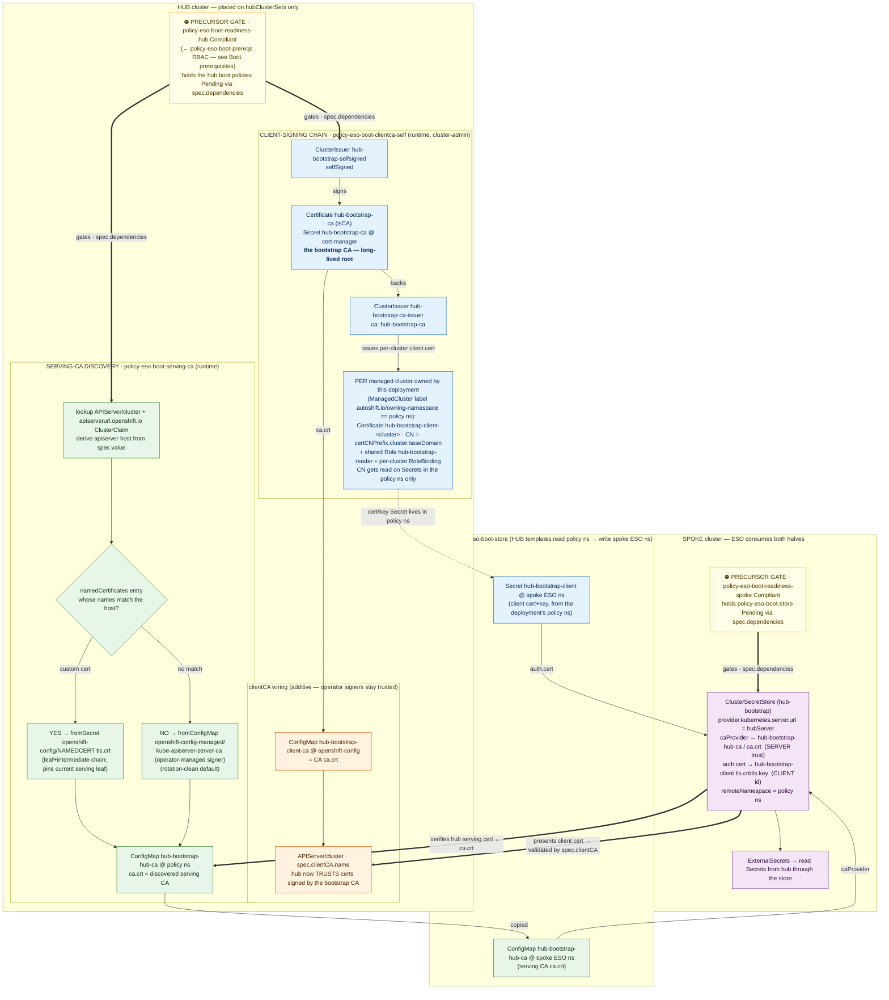
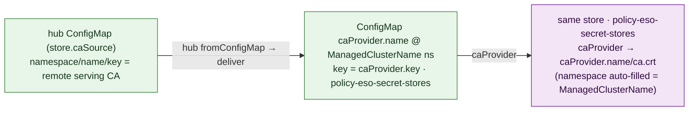
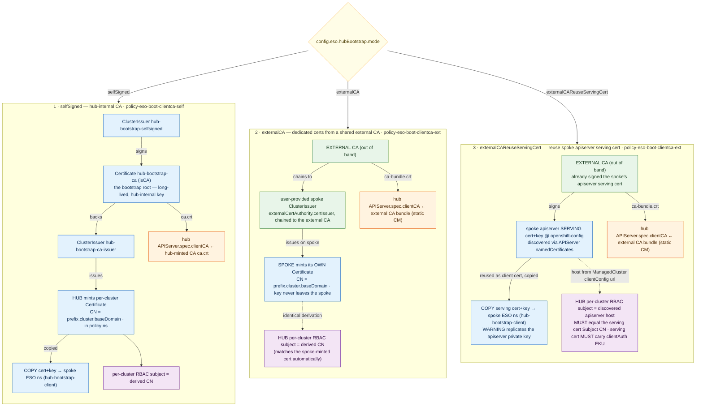
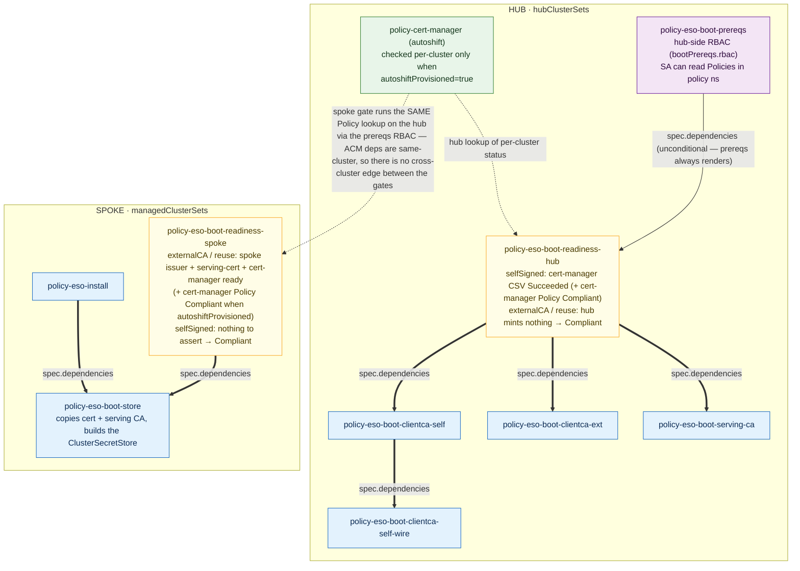

# external-secrets-operator AutoShift Policy

## Overview
This policy installs the external-secrets-operator operator using AutoShift patterns.

New here? Start with [quickstart.md](quickstart.md) — paste-ready values-file examples for
each bootstrap trust mode, from empty deployment to consumed secrets.

## Status
✅ **Operator Installation**: Ready to deploy  
🔧 **Configuration**: Requires operator-specific setup (see below)

## Architecture: cross-cluster cert auth flow

*Mechanism deep-dives: [the bootstrap store](mechanics.md#2-the-bootstrap-store--clustercluster-secret-transport) and [mTLS trust modes](mechanics.md#3-mtls-trust-modes) in mechanics.md.*

For the cluster→cluster bootstrap, an ESO `kubernetes`-provider store on a **spoke** reads
Secrets straight from the **hub** apiserver over **mutual TLS**. Two independent trust chains
are minted on the hub and meet at the spoke's store:

- **Client identity (blue)** — the spoke *proves who it is* to the hub. A self-signed
  bootstrap CA signs one client cert **per managed cluster** owned by this deployment (CN
  `<certCNPrefix>.<managedClusterName>.<baseDomain>`, RBAC'd to read Secrets in the deployment's
  policy namespace only); the CA is wired **additively** into the hub `APIServer.spec.clientCA`
  so the hub accepts those certs. This is the default `selfSigned` mode; the two external-CA
  modes share the same per-cluster identity contract — see [Trust modes](#trust-modes-configesohubbootstrapmode).
- **Server trust (green)** — the spoke *trusts the cert the hub presents*. The hub's existing
  serving CA is **discovered** (a matching `namedCertificates` entry if one serves the
  apiserver host, else the operator-managed signer) and shipped to the spoke as the store's
  `caProvider`. Nothing about the hub's serving setup is overwritten; no extra DNS is required.



> **Serving-cert rotation (named-cert path only).** The named-cert branch ships `tls.crt` —
> the **serving leaf chain**, not the issuing CA — so the spoke pins the current leaf. When the
> hub rotates its serving cert the spoke briefly distrusts it, then **self-heals**: the
> serving-ca policy re-discovers the new cert and the copy policy re-ships it as the store's
> `caProvider`. Recovery is a **two-hop** chain (serving-ca re-stash → copy re-ship), and each
> hop's *detection* latency is its **compliant** `evaluationInterval` (default 10m), not the 30s
> noncompliant one — so the fail-window can be tens of minutes with defaults. During it,
> already-synced Secrets persist; only refreshes/new pulls error. The **default-signer path has
> no such window** (it ships the CA bundle, not a leaf). To avoid leaf-pinning with a custom
> serving cert, point `hubCASource{Namespace,Name,Key}` at a stable CA bundle.

The same server-trust pattern, decoupled from the bootstrap hub, is available **per store** for a
*user-defined* kubernetes store reading an *arbitrary* remote apiserver: add a `caSource` to the
store and `policy-eso-secret-stores` delivers that CA into the store's own
`caProvider` ConfigMap in the per-cluster `<ManagedClusterName>` namespace (see
[Per-store server-CA delivery](#per-store-server-ca-delivery-casource)):



## Responsibilities — which policy owns what

The chart renders 13 Policies grouped into 6 PolicySets; **all placement lives in
`templates/policysets.yaml`** — the policy files carry none. Most policies pair an *enforce*
ConfigurationPolicy (does the work, records per-item failures into a status ConfigMap) with an
*inform gate* (surfaces those failures as NonCompliant detail). The full ownership map lives in
[responsibilities.md](responsibilities.md):

- [PolicySet table](responsibilities.md#policysets-templatespolicysetsyaml) — what deploys where (hubs-only vs all clusters) and why the six groups exist.
- [Per-file breakdown](responsibilities.md#per-file-breakdown) — every template file, its Policy, and each ConfigurationPolicy's concrete job; use it to answer "which policy owns that object?".

## Quick Deploy

### Test Locally
```bash
# Validate policy renders correctly
helm template policies/external-secrets-operator/
```

### Enable on Clusters
Edit AutoShift values files to add the operator labels:

```yaml
# In autoshift/values/clustersets/hub.yaml (or other clusterset files)
hubClusterSets:
  hub:
    labels:
      external-secrets-operator: 'true'
      external-secrets-operator-subscription-name: 'openshift-external-secrets-operator'
      external-secrets-operator-channel: 'stable-v1'
      external-secrets-operator-source: 'redhat-operators'
      external-secrets-operator-source-namespace: 'openshift-marketplace'
      # external-secrets-operator-version: 'external-secrets-operator.v1.x.x'  # Optional: pin to specific CSV version

managedClusterSets:
  managed:
    labels:
      external-secrets-operator: 'true'
      external-secrets-operator-subscription-name: 'openshift-external-secrets-operator'
      external-secrets-operator-channel: 'stable-v1'
      external-secrets-operator-source: 'redhat-operators'
      external-secrets-operator-source-namespace: 'openshift-marketplace'
      # external-secrets-operator-version: 'external-secrets-operator.v1.x.x'  # Optional: pin to specific CSV version

# For specific clusters (optional override)
clusters:
  my-cluster:
    labels:
      external-secrets-operator: 'true'
      external-secrets-operator-channel: 'fast'  # Override channel for this cluster
```

Labels are defined in values files only — never directly on managed clusters. The cluster-labels policy handles propagating these labels from the values files to managed clusters.

### AutoShift Policy Discovery
New policies are automatically discovered by the ApplicationSet. In Git mode, the ApplicationSet uses a `policies/*` wildcard to pick up all subdirectories. No manual registration is required — simply adding your policy folder under `policies/` is sufficient.

## Configuration

Full key-by-key tables for every chart value, runtime config key, and label live in
[CONFIG-REFERENCE.md](CONFIG-REFERENCE.md); the underlying mechanisms (bootstrap store, trust
modes, two-hop credential transport, gates, cleanup) are described in
[mechanics.md](mechanics.md); a per-PolicySet / per-policy / per-ConfigurationPolicy ownership
map lives in [responsibilities.md](responsibilities.md); the sections below explain
configuration in context.

### Namespace Scope
This operator is configured as:
- **Cluster-scoped**: Manages resources across all namespaces (default)
- **Namespace-scoped**: Limited to specific target namespaces (if `targetNamespaces` enabled in values.yaml)

To change scope, edit `values.yaml` and uncomment/configure the `targetNamespaces` field.

### Version Control
This policy supports AutoShift's operator version control system:

- **Automatic Upgrades**: By default, the operator follows automatic upgrade paths within its channel
- **Version Pinning**: Add `external-secrets-operator-version` label to pin to a specific CSV version
- **Manual Control**: Pinned versions require manual updates to upgrade

To pin to a specific version, set the version label in your clusterset or per-cluster values file:
```yaml
external-secrets-operator-version: 'external-secrets-operator.v1.x.x'
```

Find available CSV versions:
```bash
# List available versions for this operator
oc get packagemanifests external-secrets-operator -o jsonpath='{.status.channels[*].currentCSV}'
```

### ExternalSecretsConfig passthrough (`externalSecretsConfig` / `config.eso.externalSecretsConfig`)

The install policy creates the singleton `ExternalSecretsConfig` CR (name `cluster`) that makes
the operator deploy the external-secrets pods. Its **spec** is not modeled field-by-field —
the chart value `externalSecretsOperator.externalSecretsConfig` *is* the default spec,
verbatim (any CRD field goes there), and `config.eso.externalSecretsConfig` in the AutoShift
values is a same-shaped override deep-merged over it at ACM propagation time (override wins).
Key summary: the `externalSecretsConfig` rows in
[CONFIG-REFERENCE.md](CONFIG-REFERENCE.md#externalsecretsoperator).
The rendered config already resolves the AutoShift values levels, so setting the key at any
level composes naturally.

Full precedence, highest first: **cluster (`clusters.<name>.config`) > clusterset
(`hubClusterSets`/`managedClusterSets.<set>.config`) > AutoShift deployment defaults
(top-level `config:`) > chart values file.**

**Lists replace wholesale.** sprig `merge` does no listMap-style keyed merging — a list set at
a higher level replaces the lower level's list entirely, `networkPolicies` included. This is a
deliberate, honest limitation: emulating the API server's `listType=map` semantics inside the
templates would be behavior that's hard to see and debug from the config alone. When you
override `networkPolicies`, restate every entry you still want — including the chart default's
`allow-https-egress` :443 rule.

Defaults always apply *unless* something above them overrides. One caveat: a **zero value**
(`0`, `false`, `""`) at one level cannot override a non-zero value from a lower-precedence
level (sprig `merge` treats destination zeros as empty and fills them) — set such values at
the lowest level that needs them instead of zero-overriding above.

**Why this matters — operand egress is deny-all by default.** The OpenShift ESO operator
applies static NetworkPolicies to the operand namespace: a base `deny-all` plus allows for
DNS and TCP **6443** only. A store provider on a blocked port fails with
`context deadline exceeded` in the controller pod and `InvalidProviderConfig` on the store.
The chart's **default spec therefore includes `allow-https-egress`** — core controller egress
to TCP **443**, covering the common provider endpoints (Vault routes, AWS/Azure/GCP APIs) —
and the hub-bootstrap store rides the operator's own :6443 allow. Providers on any *other*
port need an entry of their own:

```yaml
# The same block works at every AutoShift values level; set it at the widest scope that fits:
#   config:                       <- deployment-wide default (top level of the values file)
#   hubClusterSets.<set>.config:  <- per clusterset
#   managedClusterSets.<set>.config:
#   clusters.<name>.config:       <- per cluster (highest precedence)
config:
  eso:
    externalSecretsConfig:
      controllerConfig:
        # overriding networkPolicies REPLACES the chart default's list — restate the 443 rule
        networkPolicies:
          - name: allow-https-egress                       # kept from the chart default
            componentName: ExternalSecretsCoreController   # |Webhook|CertController|BitwardenSDKServer
            egress:
              - ports:
                  - protocol: TCP
                    port: 443
          - name: allow-vault-8200-egress                  # the addition that prompted the override
            componentName: ExternalSecretsCoreController
            egress:
              - ports:
                  - protocol: TCP
                    port: 8200
                # optionally scope the destination:
                # to:
                #   - ipBlock: { cidr: 10.0.0.0/16 }
        # trustedCABundle: { name: my-ca-bundle, key: ca-bundle.crt }  # outbound-TLS CA (CM in operand ns)
```

Verify what the operator applied: `oc get networkpolicy -n external-secrets-operator` — the
`eso-sys-*` policies are the operator's static set; your custom ones appear alongside them.

## Secret Stores (`config.eso.secretStores`)

`policy-eso-secret-stores` creates ESO `SecretStore` /
`ClusterSecretStore` objects on each managed cluster from the per-cluster
rendered-config ConfigMap (read via hub-template `lookup`, the same mechanism the
`cluster-config-maps` policy uses). Key-by-key tables for every store field:
[`config.eso.secretStores[]`](CONFIG-REFERENCE.md#configesosecretstores--list-item-wrapper)
in CONFIG-REFERENCE.md.

Four policies are driven from the per-cluster ESO config:

| Policy | Creates |
|---|---|
| `policy-eso-secret-stores` | the `SecretStore` / `ClusterSecretStore` objects + the spoke-side auth `ExternalSecret`s (`authSecretConfig`, pulled from the hub via the bootstrap store) + (opt-in) per-store remote serving-CA delivery (`caSource`), from `config.eso.secretStores` |
| `policy-eso-hub-secrets` | (hubs only) the **hub-side** `ExternalSecret`s that materialize each `authSecretConfig` credential with an `external` origin into the owning cluster's namespace on the hub, so the spoke can pull it. One hub-resident copy serves every owned cluster across all deployments — see [Auth secrets](#auth-secrets-authsecretconfig) |
| `policy-eso-cert-auth-rbac` | the RBAC backing the kubernetes-provider `cert` auth method (`certAuthRBAC`) — see [Kubernetes cert auth RBAC](#kubernetes-cert-auth-rbac-certauthrbac) |
| `policy-eso-secret-reader` | the `secret-reader` ServiceAccount + RBAC for consuming provisioned Secrets — see [Reading provisioned Secrets](#reading-provisioned-secrets-secret-reader) |

The first three read `config.eso.secretStores`, below.

`config.eso.secretStores` is a **list of single-key items**. The key selects the
object kind; the rendered manifest differs by kind:

| Key | Renders | Scope | `metadata.namespace` |
|---|---|---|---|
| `clusterSecretStore` | `kind: ClusterSecretStore` | cluster-wide | omitted |
| `secretStore` | `kind: SecretStore` | namespaced | **required** |

Each item has `name` (and `namespace` for `secretStore`), a `spec` (the ESO
`SecretStoreSpec`, rendered verbatim), and an optional `authSecretConfig` (provisions
the auth Secret the store references — see [Auth secrets](#auth-secrets-authsecretconfig)).
An item that is missing these — no recognized kind key, no `name`, or a `secretStore`
without a `namespace` — is a per-store precondition error (recorded and skipped; the
other stores still provision).
The provider is independent of the kind — any provider can be used under either kind.
Set this where the config lives (`hubClusterSets.*.config` /
`managedClusterSets.*.config` / per-cluster `clusters/<name>.yaml` config) — never as a
label.

### ClusterSecretStore vs SecretStore — what changes in `spec`

These rules come from the ESO API (see `eso-vault-reference.md` §1); the policy does
not enforce them, so set them correctly in config:

- `caProvider.namespace` and `serviceAccountRef.namespace` / `secretRef.namespace` on
  auth refs are **only honored by `ClusterSecretStore`**. On a `SecretStore` they are
  ignored (refs always resolve in the SecretStore's own namespace) — omit them.
- `spec.conditions` (namespace restrictions) apply to `ClusterSecretStore` **only**.
- For a `ClusterSecretStore`, set an explicit `.namespace` on every auth ref unless
  you want referent (per-consuming-namespace) resolution.
- For a **kubernetes** provider, an **unset** `provider.kubernetes.server.caProvider.namespace`
  is auto-filled with the `<ManagedClusterName>` namespace — where the store's own `caSource`
  delivery lands the remote serving CA (see
  [Per-store server-CA delivery](#per-store-server-ca-delivery-casource)). Set it explicitly to override.

### Removing a store — pruning (`pruneRemovedStores` / per-store `prune`)

*Sweep mechanics (baked labels, label-driven `mustnothave`): [mechanics.md §8](mechanics.md#8-cleanup--baked-prune-labels-label-driven-sweeps-explicit-teardown).*

When a store entry is **removed from config**, everything it created is pruned by default: the
`ClusterSecretStore`/`SecretStore` itself, its spoke auth ExternalSecrets (**and their target
Secrets** — `creationPolicy: Owner` garbage-collects them), its hub-side credential
ExternalSecrets (`policy-eso-hub-secrets`), its delivered-CA ConfigMap, and its cert-auth RBAC
(`policy-eso-cert-auth-rbac`). Two knobs control this:

```yaml
config:
  eso:
    pruneRemovedStores: true      # deployment-wide default (chart default: true;
                                  # values-level: externalSecretsOperator.pruneRemovedStores)
    secretStores:
      - clusterSecretStore:
          name: vault-backend
          prune: false            # per-store override — this store's objects survive removal
          spec: ...
```

How it works: every emitted object is stamped with `autoshift.io/eso-prune: "true"|"false"`
(next to an ownership label — `autoshift.io/eso-store`, `…/eso-store-auth`, `…/eso-store-ca`,
`…/eso-hub-secret`, `…/eso-cert-auth-rbac`). The decision is **baked at emission time** because by
the time the sweep runs, the config entry is gone — the live object's label is the record of
intent. Each policy then diffs the labeled live objects against what the current render wants and
`mustnothave`s the leftovers whose label says `"true"`.

Consequences of the label-baking design:

- Flipping `pruneRemovedStores` **after** removing a store does nothing — its objects already
  carry the old decision. Relabel (`oc label ... autoshift.io/eso-prune=true --overwrite`) or
  delete manually.
- Stores that legitimately **share a target auth Secret** (identical signature) should agree on
  `prune`, or the shared ExternalSecret's label follows whichever store applied last (hub-side
  credentials AND the flag across declarers: any store wanting retention wins).
- If you take over a **delivered-CA ConfigMap** manually (drop `caSource`, keep `caProvider`),
  remove its `autoshift.io/*` labels first — otherwise the sweep treats it as a removed store's
  leftover.

Safety gates: sweeps are disabled whenever the policy reports **any** store error (a
declared-but-misconfigured store must never lose its live objects while you fix its config) and
when the rendered config could not be read at all (a transient miss must never prune a working
fleet). Unlabeled objects (created manually or by anything else) are never candidates.

### Auth secrets (`authSecretConfig`)

*Concept walkthrough: [the two-hop credential transport](mechanics.md#4-authsecretconfig--the-two-hop-credential-transport); key tables:
[`authSecretConfig`](CONFIG-REFERENCE.md#authsecretconfig) in CONFIG-REFERENCE.md.*

Most auth methods reference a Kubernetes Secret (the Vault token, AppRole SecretID,
client cert/key, a bearer token, cloud creds, ...). `authSecretConfig` — an optional
key sibling to `spec` on any store item — provisions those Secret(s) so you don't have to
manage them separately.

**How they're delivered: ESO is the transport (two hops), not a cross-cluster copy.** The
spoke's ESO materializes each auth Secret by pulling the value from the **hub** through the
**hub-bootstrap `ClusterSecretStore`** (see [hub bootstrap](#clustercluster-hub-bootstrap-configesohubbootstrap)).
So for each store credential there are two ExternalSecrets:

1. **hub side** (`policy-eso-hub-secrets`, placed on hubs) — *only when the source has an
   `external` block*. Pulls the value from your own external secret manager into a Secret
   named `hubSecretName` in your deployment's policy namespace on the hub (its clusters'
   owning namespace = the bootstrap store's `remoteNamespace`). One hub-resident copy does
   this for every owned cluster across all deployments. Omit `external` and the Secret is
   assumed already present there (native).
2. **spoke side** (`policy-eso-secret-stores`) — an ExternalSecret against the hub-bootstrap
   store pulls `hubSecretName` from the hub into the local auth Secret your `spec` references.

The only hub→spoke *copy* left anywhere in the chart is the bootstrap client cert.

**`spec` is authoritative.** You write the auth refs in `spec` the normal ESO way; you do
**not** restate Secret names/keys/namespaces anywhere else. `authSecretConfig` names the
method (`fromRef`) and, per component (its `SecretKeySelector` sub-keys), a `sources` entry
saying which hub Secret backs it — and, if not already on the hub, where to fetch it from:

```yaml
authSecretConfig:
  fromRef: kubernetesCert    # the auth method (see table); its components are clientCert, clientKey
  refreshInterval: 1h        # optional; how often the spoke ExternalSecret re-pulls (default 1h)
  sources:
    clientCert:
      hubSecretName: eso-cert-src   # Secret in the hub policy ns (bootstrap remoteRef.key)
      key: tls.crt                  # property within it -> the ref's key
    clientKey:
      hubSecretName: eso-cert-src
      key: tls.key
spec:
  provider:
    kubernetes:
      auth:
        cert:
          clientCert: { name: eso-cert, key: tls.crt }   # authoritative — target read from here
          clientKey:  { name: eso-cert, key: tls.key }
```

For each sourced component the policy reads that component's ref out of `spec` (its
`name`/`key`/`namespace`) for the **target** Secret, and builds a spoke ExternalSecret data
entry `{secretKey: ref.key, remoteRef: {key: hubSecretName, property: source.key}}`. No
`spec` mutation, nothing to keep in sync.

**Materializing the hub Secret from an external SM (`external`).** Add an `external` block to
a source and `policy-eso-hub-secrets` provisions `hubSecretName` on the hub for you:

```yaml
sources:
  tokenSecretRef:
    hubSecretName: vault-token
    key: token
    external:
      storeRef: { name: hub-vault, kind: ClusterSecretStore }  # a store that EXISTS ON THE HUB
      remoteRef: { key: secret/data/eso/vault-token, property: token }
```

`external.storeRef` must name a store that already exists **on the hub** (e.g. a `vault`
`ClusterSecretStore` you defined via this deployment's own `secretStores`, or a pre-existing
one). `remoteRef` supports `key` (required), `property`, and `version` (all rendered as
strings, so a numeric-looking `version: 2` is safe).

`external` is detected by **presence**: an empty or half-filled `external:` block is a loud
per-credential error in the `eso-hub-secrets-status` ConfigMap, never a silent fallback to
native. Only omitting (or misspelling) the `external` key itself means native.

`policy-eso-hub-secrets` resolves everything at **runtime on the hub**: it lists
`ManagedCluster`s and reads each owned cluster's `<name>.rendered-config` ConfigMap from that
cluster's owning namespace. The hub's config-policy-controller service account must be allowed
those reads — if the policy sits Compliant but emits nothing (no ExternalSecrets, no status
ConfigMap), check for lookup RBAC denials in the policy status and grant the reads via
[`bootPrereqs.rbac`](#boot-prerequisites--hub-side-rbac-bootprereqs) rather than widening the
policy itself.

**`sources` is one map; the policy branches on it** (a single invariant keeps source→target
unambiguous):

- **One entry, no `key` → whole-Secret pull.** When the method's refs all live in **one**
  Secret, give a single keyless entry and the whole hub Secret is extracted (all keys) into
  that one shared target:
  ```yaml
  authSecretConfig:
    fromRef: kubernetesCert
    sources:
      clientCert: { hubSecretName: eso-cert-src }   # no key -> whole Secret (dataFrom.extract)
  # cert's clientCert + clientKey both name eso-cert -> one Secret gets tls.crt + tls.key
  ```
  This is **rejected** if the method's refs point at *different* Secrets — give one keyed
  entry per component instead.

- **Everything else → per-component, each entry WITH a `key`.** One entry per component;
  `source.key` -> the property pulled for that component's target key. Use it for distinct
  keys and/or different Secrets:
  ```yaml
  authSecretConfig:
    fromRef: kubernetesCert
    sources:
      clientCert: { hubSecretName: cert-a, key: tls.crt }   # -> Secret cert-a
      clientKey:  { hubSecretName: key-b,  key: tls.key }   # -> Secret key-b
  ```
  A keyless entry that is **not** the lone source is rejected.

**Grouping & where each Secret lands.** Components are grouped by the target Secret their
refs name — same Secret → **merge** (several keys in one ExternalSecret); different Secrets →
**separate** ExternalSecrets. Provide sources only for the components you want; optional ones
(e.g. appRole `roleRef` when `roleId` is inline) are left unsourced.

**Target conflicts are precondition errors** (recorded in the status ConfigMap; the offending
store is skipped, the others still provision):
- two components writing the **same key** of one target Secret (silent last-write-wins would
  be miserable to debug);
- two **stores** claiming the same target Secret with *different* sources or
  `refreshInterval` — the two ExternalSecrets would fight over one Secret. Identical claims
  are fine (the rendered ExternalSecrets are the same object), so stores that genuinely share
  one credential can each declare it.

**Where each ExternalSecret (and its Secret) is created:**
- `SecretStore` → the store's own namespace (ESO resolves auth refs there; the ref's
  `.namespace` is ignored).
- `ClusterSecretStore` → the ref's `.namespace`, which is therefore **required** (a CSS
  ref with no namespace means per-consuming-namespace/referent creds — provision those
  yourself).

Other notes:
- With a per-component `key`, `source.key` (the hub property) and the spec ref's `key` (the
  local target key) may differ. Whole-copy preserves source key names.
- Omit `authSecretConfig` for methods that need no static Secret (Vault `kubernetes` auth
  via `serviceAccountRef`, or the Kubernetes provider's `serviceAccount` auth — ESO mints
  the token).
- A native `hubSecretName` (no `external`) must already exist in the hub policy namespace.
  With `external`, `policy-eso-hub-secrets` materializes it — that store must be reachable
  on the hub or its hub ExternalSecret sits NotReady (and the spoke pull waits).
- Native seeds are **verified, and a missing one is PENDING, not an error**:
  `policy-eso-hub-secrets` checks each natively-declared Secret exists in the owning
  namespace (and carries the declared `key`) and reports gaps by name under a separate
  `pending` key in its status ConfigMap (`eso-hub-secrets-status`) — so a forgotten seed
  surfaces there, not as a NotReady spoke ExternalSecret an hour later. Pending is
  deliberately soft: it never skips other credentials, never blocks store creation, and never
  suspends the removed-credential sweep — only real config errors do that. This is what makes
  **chained stores** converge: when store B's auth Secret is produced by store A's flow, B's
  seed is simply pending on early evaluations and clears once A syncs — each evaluation more
  stores come up. A native name that this policy itself materializes (an `external`
  declaration elsewhere targets the same Secret) is exempt from the check entirely. The check
  reads existence and key names only; Secret values are never rendered anywhere.

#### Supported `fromRef` values

`fromRef` selects the auth **method**; `sources` keys are its **components**. An unknown
`fromRef` or component, a provider not in `spec.provider`, a sourced component whose ref
isn't set in `spec`, or a source missing `hubSecretName` **records the store's problem and
skips just that store** (per-store skip, surfaced via the status ConfigMap + gate — see
[Precondition failures](#precondition-failures--where-to-look-status-configmap--gate)); every
other store still provisions.

| `fromRef` | `base` (under `spec.provider.<provider>`) | components |
|---|---|---|
| `vaultToken` | `vault` / `auth` | `tokenSecretRef` |
| `vaultAppRole` | `vault` / `auth.appRole` | `secretRef`, `roleRef` |
| `vaultLdap` | `vault` / `auth.ldap` | `secretRef` |
| `vaultUserPass` | `vault` / `auth.userPass` | `secretRef` |
| `vaultJwt` | `vault` / `auth.jwt` | `secretRef` |
| `vaultKubernetes` | `vault` / `auth.kubernetes` | `secretRef` |
| `vaultCert` | `vault` / `auth.cert` | `clientCert`, `secretRef` |
| `vaultIam` | `vault` / `auth.iam` | `accessKeyID`, `secretAccessKey`, `sessionToken` |
| `vaultGcp` | `vault` / `auth.gcp` | `secretAccessKey` |
| `kubernetesToken` | `kubernetes` / `auth.token` | `bearerToken` |
| `kubernetesCert` | `kubernetes` / `auth.cert` | `clientCert`, `clientKey` |

This table is the policy's `internal.authRefPaths` map in `values.yaml`, keyed by
`fromRef`. Each entry is `{ provider, base: "<dotted path under spec.provider.<provider>>",
components: { <name>: "<dotted path from the base block to the ref>" } }` (the policy
splits the dotted strings into segments at Helm render time). **`auth` is not assumed** —
it's part of `base`, so a provider that doesn't nest creds under `auth` (e.g. Azure Key
Vault's `authSecretRef`) just uses a different `base`; `base: ""` means refs sit directly
on the provider block. A component path may be multiple segments, so a ref nested under an
intermediate key is fine — e.g. `vaultIam`'s `accessKeyID` is `secretRef.accessKeyIDSecretRef`.
The component **name** is what `sources` keys on; it can differ from the spec key. To
support a new auth method/provider, add an entry — no template edits needed.

### Vault provider — common options

```yaml
config:
  eso:
    secretStores:
      - clusterSecretStore:
          name: vault-backend
          spec:
            # controller: ""                 # optional: which ESO instance owns this store
            # refreshInterval: 0              # optional: seconds; how often store auth is revalidated
            conditions:                       # ClusterSecretStore only — restrict consuming namespaces
              - namespaceSelector:
                  matchLabels:
                    eso: 'enabled'
                # namespaces: [team-a, team-b]
                # namespaceRegexes: ['^app-.*$']
            provider:
              vault:
                server: 'https://vault.example.com:8200'   # required
                path: 'secret'                             # KV mount; /data auto-appended for v2
                version: 'v2'                              # v1 | v2 (default v2)
                # namespace: 'platform'                    # Vault Enterprise namespace (data requests)
                caProvider:                                # pull CA from a ConfigMap/Secret
                  type: ConfigMap                          # ConfigMap | Secret
                  name: vault-ca
                  key: ca.crt
                  namespace: 'external-secrets-operator'   # ClusterSecretStore only
                # caBundle: <base64 PEM>                   # OR inline the CA instead of caProvider
                auth:                                      # pick exactly ONE method
                  kubernetes:                              # see "Vault auth methods" below for all options
                    mountPath: 'kubernetes'                # default 'kubernetes'
                    role: 'eso-reader'                     # required (Vault role)
                    serviceAccountRef:
                      name: 'external-secrets'
                      namespace: 'external-secrets-operator'
                      # audiences: ['vault']
```

A namespaced equivalent (`SecretStore`) drops cross-namespace fields. The
`tokenSecretRef` is written normally in `spec`; `authSecretConfig` provisions the Secret it
points at by pulling it from the hub (through the bootstrap store):

```yaml
      - secretStore:
          name: vault-backend
          namespace: 'team-a'                  # required for SecretStore
          authSecretConfig:
            fromRef: vaultToken                # mirror spec.provider.vault.auth.tokenSecretRef
            sources:
              tokenSecretRef:
                hubSecretName: vault-token     # Secret in the hub policy ns the bootstrap store serves
                key: token                     # property within it
                # external: {storeRef, remoteRef}  # add to materialize vault-token on the hub from an SM
          spec:
            provider:
              vault:
                server: 'https://vault.example.com:8200'
                path: 'secret'
                version: 'v2'
                auth:
                  tokenSecretRef:              # authoritative; Secret created in team-a from source
                    name: vault-token
                    key: token
```

### Vault auth methods

Set exactly one of these under `spec.provider.vault.auth`. Fields/defaults are from
`eso-vault-reference.md` §2.2. On a `ClusterSecretStore` you may add `.namespace` to any
`secretRef` / `serviceAccountRef` to pin it to a central namespace; on a `SecretStore`
those `.namespace` fields are ignored. `auth.namespace` (Vault Enterprise auth namespace)
may be set alongside any method.

**`kubernetes`** — Vault Kubernetes auth (most common in-cluster):
```yaml
auth:
  kubernetes:
    mountPath: 'kubernetes'                  # default 'kubernetes'
    role: 'eso-reader'                       # required — Vault role bound to the SA
    serviceAccountRef:                       # preferred: mint a short-lived SA token
      name: 'external-secrets'
      namespace: 'external-secrets-operator' # ClusterSecretStore only
      # audiences: ['vault']
    # secretRef:                             # OR a Secret holding a SA JWT (key defaults to 'token')
    #   name: sa-token
    #   key: token
    # (omit both to use the ESO controller's own SA token)
```

**`tokenSecretRef`** — static Vault token:
```yaml
auth:
  tokenSecretRef:
    name: vault-token
    key: token                               # required
    # namespace: external-secrets-operator   # ClusterSecretStore only
```

**`appRole`** — AppRole RoleID + SecretID:
```yaml
auth:
  appRole:
    path: 'approle'                          # default 'approle' (mount path)
    roleId: '<role-id>'                      # inline RoleID...
    # roleRef:                               # ...OR pull RoleID from a Secret
    #   name: approle-creds
    #   key: role-id
    secretRef:                               # SecretID (required)
      name: approle-creds
      key: secret-id
```

**`ldap`**:
```yaml
auth:
  ldap:
    path: 'ldap'                             # default 'ldap'
    username: 'svc-user'                     # required
    secretRef:
      name: ldap-creds
      key: password
```

**`userPass`**:
```yaml
auth:
  userPass:
    path: 'userpass'                         # default 'userpass'
    username: 'svc-user'                     # required
    secretRef:
      name: userpass-creds
      key: password
```

**`jwt` / OIDC**:
```yaml
auth:
  jwt:
    path: 'jwt'                              # default 'jwt'
    role: 'my-jwt-role'
    # ---- one token source ----
    secretRef:                               # static JWT in a Secret
      name: jwt-token
      key: jwt
    # kubernetesServiceAccountToken:         # OR mint a SA token via TokenRequest
    #   serviceAccountRef:
    #     name: my-app-sa
    #     audiences: ['vault']
```

**`cert`** — TLS certificate auth method:
```yaml
auth:
  cert:
    path: 'cert'                             # default 'cert'
    vaultRole: 'my-cert-role'                # optional
    clientCert:                              # client cert
      name: cert-auth
      key: tls.crt
    secretRef:                               # client private key
      name: cert-auth
      key: tls.key
```

**`iam`** — AWS IAM auth (Vault verifies a signed STS request):
```yaml
auth:
  iam:
    path: 'aws'                              # Vault mount of the AWS auth method
    vaultRole: 'my-vault-aws-role'           # required
    region: 'us-east-1'
    # role: 'arn:aws:iam::111122223333:role/assume-first'  # optional AWS role to assume first
    # externalID: '...'                      # optional STS ExternalId
    # vaultAwsIamServerID: 'vault.example.com'             # X-Vault-AWS-IAM-Server-ID header
    secretRef:                               # static creds...
      accessKeyIDSecretRef:     { name: aws-creds, key: access-key-id }
      secretAccessKeySecretRef: { name: aws-creds, key: secret-access-key }
      sessionTokenSecretRef:    { name: aws-creds, key: session-token }    # required if temporary
    # jwt:                                    # ...OR IRSA via a SA
    #   serviceAccountRef: { name: irsa-sa }
    # (omit secretRef and jwt to use the controller pod's IRSA / EKS Pod Identity)
```

**`gcp`** — GCP IAM auth:
```yaml
auth:
  gcp:
    path: 'gcp'                              # default 'gcp'
    role: 'my-vault-gcp-role'                # required
    # projectID: 'my-project'
    # ---- credential source: one of these, or omit for pod identity ----
    workloadIdentity:                        # GKE Workload Identity
      serviceAccountRef: { name: ksa }
      clusterLocation: us-central1
      clusterName: my-gke
      clusterProjectID: my-project
    # secretRef:                             # OR a GCP SA key
    #   secretAccessKeySecretRef: { name: gcp-sa-key, key: key.json }
    # serviceAccountRef: { name: impersonate-this-gsa }    # OR SA impersonation
```

### Kubernetes provider — read Secrets from a remote cluster

Use this when the source of truth is native `Secret`s in another cluster's API server
(`eso-vault-reference.md` §3.2). ESO connects to the remote apiserver and reads
Secrets from `remoteNamespace`.

```yaml
config:
  eso:
    secretStores:
      - clusterSecretStore:
          name: remote-cluster
          spec:
            provider:
              kubernetes:
                server:
                  url: 'https://remote-apiserver.example.com:6443'  # default: in-cluster
                  caProvider:                                        # validate remote apiserver cert
                    type: ConfigMap
                    name: remote-ca
                    key: ca.crt
                    namespace: 'external-secrets-operator'
                  # caBundle: <base64 PEM>                           # OR inline the CA
                remoteNamespace: 'shared-secrets'                    # remote ns to read (default 'default')
                auth:
                  # ---- pick exactly ONE: serviceAccount | cert | token ----
                  serviceAccount:
                    name: eso-remote-reader
                    namespace: 'external-secrets-operator'
                    # audiences: ['https://remote-apiserver.example.com']
                  # cert:
                  #   clientCert: { name: remote-creds, key: tls.crt }
                  #   clientKey:  { name: remote-creds, key: tls.key }
                  # token:
                  #   bearerToken: { name: remote-creds, key: token }
                # authRef:                                           # OR a Secret bundling kubeconfig-style auth
                #   name: kubeconfig-secret
```

> **Out-of-band prerequisites (not created by this policy):** the `remote-ca`
> ConfigMap, the `eso-remote-reader` ServiceAccount and its token on this cluster,
> and RBAC on the *remote* cluster granting that identity `get`/`list` on Secrets in
> `remoteNamespace`. An `ExternalSecret` then reads remote Secrets where
> `remoteRef.key` = remote Secret name and `remoteRef.property` = a key within it.

### Kubernetes cert auth RBAC (`certAuthRBAC`)

*Key tables: [`certAuthRBAC`](CONFIG-REFERENCE.md#certauthrbac) in CONFIG-REFERENCE.md.*

When a store uses the **kubernetes** provider with **cert** auth
(`spec.provider.kubernetes.auth.cert`), the apiserver identifies the client by the
certificate's **CN** (a `User`). A **separate policy**,
`policy-eso-cert-auth-rbac`, reads the same
`config.eso.secretStores` list and generates the RBAC that grants that user secret
access — so the cert can read/write the secrets the store manages. (The
`...-stores` policy creates the store object; this one creates only the RBAC. Both are
gated on the `autoshift.io/external-secrets-operator` label.)

This is the **authorization** half. For the apiserver to *accept* the cert in the first
place, its signing CA must be in the apiserver's client-CA trust bundle — wired hub-only by
`policy-eso-boot-clientca-self`.

Add `certAuthRBAC` (sibling of `spec`) with the CN as `username`. For now the username
is a literal value (deriving it from the cert programmatically can come later). The
policy then creates a (Cluster)Role + binding granting `create`/`update`/`list`/`delete`
on `secrets`:

```yaml
- clusterSecretStore:
    name: remote-cert
    certAuthRBAC:
      username: 'eso-remote-cert-cn'        # the cert CN -> RBAC subject (kind: User)
      # namespaces: [team-a, team-b]        # optional: explicit target namespaces
      # verbs: [create, update, list, delete, get]   # optional: override the default verb set
    spec:
      provider:
        kubernetes:
          server: { url: 'https://remote-apiserver.example.com:6443' }
          remoteNamespace: 'shared-secrets'
          auth:
            cert:
              clientCert: { name: eso-remote-cert, key: tls.crt }
              clientKey:  { name: eso-remote-cert, key: tls.key }
```

Scope of the generated RBAC, by store kind:

| Store kind | Target namespaces | Objects created |
|---|---|---|
| `SecretStore` | `certAuthRBAC.namespaces`, else `remoteNamespace`, else the store's namespace | `Role` + `RoleBinding` per namespace |
| `ClusterSecretStore` (no scoping) | — (cluster-wide) | `ClusterRole` + `ClusterRoleBinding` |
| `ClusterSecretStore` with `certAuthRBAC.namespaces` or explicit `spec.conditions[].namespaces` | those namespaces | `ClusterRole` + a `RoleBinding` per namespace |

Notes:
- `username` is **required** when a kubernetes store uses cert auth — the template
  **fails** otherwise (`spec.provider.kubernetes.auth.cert requires
  certAuthRBAC.username`).
- RBAC bindings cannot express label selectors, so a `ClusterSecretStore` whose
  `conditions` use only `namespaceSelector`/`namespaceRegexes` (no explicit
  `namespaces`) falls back to a cluster-wide `ClusterRoleBinding`.
- Role/binding names are `eso-cert-<kind>-<storeName>`.
- The cert Secret itself (`clientCert`/`clientKey`) can be provisioned by an
  `authSecretConfig` with `fromRef: kubernetesCert` and a `sources` entry per component
  (see [Auth secrets](#auth-secrets-authsecretconfig)) — same Secret merges, different
  Secrets are provisioned separately. Or supply it out of band.

### Full examples

Complete `config.eso.secretStores` blocks you can drop into a clusterset
(`hubClusterSets.*.config` / `managedClusterSets.*.config`) or per-cluster
(`clusters/<name>.yaml`) config. Examples 1–2 write the auth ref in `spec` normally and
use `authSecretConfig` (`fromRef` + `sources`) to provision the Secret it points at by
pulling it from the hub through the bootstrap store. Example 3 shows cert auth, where
`certAuthRBAC` drives the separate RBAC policy. Example 4 is the end-to-end two-hop: a root
store on the hub sourced from a single manual seed, feeding `external` spoke stores.

#### 1. Kubernetes provider + `authSecretConfig` (bearer-token auth)

Read native `Secret`s from a remote cluster's API server, authenticating with a bearer
token. The `token.bearerToken` ref is written in `spec`; `fromRef: kubernetesToken`
tells the policy to provision *that* Secret, pulling the value from a hub Secret through
the bootstrap store. Since this is a `ClusterSecretStore`, the ref carries `.namespace`
(where the ExternalSecret + Secret are created).

```yaml
config:
  eso:
    secretStores:
      - clusterSecretStore:
          name: remote-cluster
          authSecretConfig:
            fromRef: kubernetesToken               # mirror spec.provider.kubernetes.auth.token.bearerToken
            sources:                               # hub Secret the bootstrap store serves
              bearerToken:
                hubSecretName: remote-reader-token
                key: token
          spec:
            provider:
              kubernetes:
                server:
                  url: https://remote-apiserver.example.com:6443
                  caProvider:                      # validate the remote apiserver cert
                    type: ConfigMap
                    name: remote-ca
                    key: ca.crt
                    namespace: external-secrets-operator   # ClusterSecretStore only
                remoteNamespace: shared-secrets    # remote namespace to read from
                auth:
                  token:                           # authoritative; Secret provisioned from source above
                    bearerToken:
                      name: remote-reader-token
                      key: token
                      namespace: external-secrets-operator   # CSS: where the Secret is created
```

> The remote apiserver's bearer token (a long-lived SA token, or a kubeconfig token)
> must exist as the `remote-reader-token` Secret in the **hub** policy namespace (place it
> there natively, or add an `external` block so `policy-eso-hub-secrets` materializes it),
> and the identity it represents needs `get`/`list` on Secrets in `remoteNamespace` on the
> **remote** cluster. The `remote-ca` ConfigMap is an out-of-band prerequisite.
> `KubernetesAuth` accepts exactly one of `serviceAccount`/`cert`/`token`, so don't combine
> this with another method.

#### 2. Vault provider with OIDC (`jwt`) authentication

Vault's OIDC/JWT auth method verifies a JWT and returns a Vault token. Here a static JWT
lives in a hub Secret; the `jwt.secretRef` is written in `spec`, and `fromRef: vaultJwt`
provisions that Secret on the managed cluster by pulling it from the hub. The OIDC backend
is mounted at `oidc` (set `path` to your actual mount).

```yaml
config:
  eso:
    secretStores:
      - clusterSecretStore:
          name: vault-oidc
          authSecretConfig:
            fromRef: vaultJwt                      # mirror spec.provider.vault.auth.jwt.secretRef
            sources:                               # hub Secret the bootstrap store serves
              secretRef:
                hubSecretName: vault-oidc-jwt
                key: jwt
          spec:
            provider:
              vault:
                server: https://vault.example.com:8200    # required
                path: secret                       # KV mount; /data auto-appended for v2
                version: v2
                caProvider:                        # pull Vault's CA from a ConfigMap
                  type: ConfigMap
                  name: vault-ca
                  key: ca.crt
                  namespace: external-secrets-operator     # ClusterSecretStore only
                auth:
                  jwt:
                    path: oidc                     # mount path of the OIDC/JWT auth method (default 'jwt')
                    role: eso-reader               # Vault JWT/OIDC role bound to policies
                    secretRef:                     # authoritative; Secret provisioned from source above
                      name: vault-oidc-jwt
                      key: jwt
                      namespace: external-secrets-operator   # CSS: where the Secret is created
```

> The JWT must already exist as the `vault-oidc-jwt` Secret on the **hub** in
> `eso-auth-secrets`, and the Vault `oidc` role must accept that JWT's issuer/claims.
> For a workload-minted token instead of a static JWT, drop `authSecretConfig` and set
> `jwt.kubernetesServiceAccountToken.serviceAccountRef` in `spec` directly (ESO mints
> the SA token via the TokenRequest API — no static Secret needed).

#### 3. Kubernetes provider + cert auth (generates RBAC)

Authenticate to the remote apiserver with a client certificate. Set
`certAuthRBAC.username` to the cert's CN; the companion
`policy-eso-cert-auth-rbac` policy then creates the RBAC: this is
a `ClusterSecretStore` scoped to two namespaces, so a `ClusterRole` plus a `RoleBinding`
in each of `team-a`/`team-b` are generated (bound to `User: eso-remote-cert-cn`). The
cert/key Secret can be provisioned with `authSecretConfig` (`fromRef: kubernetesCert`,
a `sources` entry per component — see [Auth secrets](#auth-secrets-authsecretconfig)) or
supplied out of band — shown out of band here.

```yaml
config:
  eso:
    secretStores:
      - clusterSecretStore:
          name: remote-cert
          certAuthRBAC:
            username: eso-remote-cert-cn           # cert CN -> RBAC subject (kind: User)
            # namespaces: [team-a, team-b]          # optional: override the derived target namespaces
            # verbs: [create, update, list, delete] # optional: override the default verb set
          spec:
            conditions:                            # restricts which namespaces may use the store;
              - namespaces:                        # explicit names also scope the generated RBAC
                  - team-a
                  - team-b
            provider:
              kubernetes:
                server:
                  url: https://remote-apiserver.example.com:6443
                  caProvider:
                    type: ConfigMap
                    name: remote-ca
                    key: ca.crt
                    namespace: external-secrets-operator
                remoteNamespace: shared-secrets
                auth:
                  cert:                            # client cert/key Secret (provision out of band)
                    clientCert: { name: eso-remote-cert, key: tls.crt }
                    clientKey:  { name: eso-remote-cert, key: tls.key }
```

> The `eso-remote-cert` Secret (with `tls.crt`/`tls.key`) and the `remote-ca` ConfigMap
> are out-of-band prerequisites. Drop the `conditions` block to make the generated RBAC
> cluster-wide (`ClusterRole` + `ClusterRoleBinding`); use a `secretStore` instead for a
> namespaced `Role` + `RoleBinding`.

#### 4. End-to-end two-hop — root store on the hub + `external`-sourced spoke stores

The full pattern that lets **one manual secret** on the global hub bootstrap every spoke's
stores. A root `ClusterSecretStore` on the self-managed hub authenticates to Vault with a
manually-placed seed; `policy-eso-hub-secrets` then uses that root store to materialize each
spoke store's credential on the hub, and the mTLS bootstrap store fans them out to the spokes.
Nothing about the root store is special — it's an ordinary store entry whose auth source has
**no `external`** block (native), so its credential is the one thing you provide by hand.

**(a) The one manual seed** — a plain Secret in the **policy namespace** on the hub. This is
the *only* credential you create by hand; everything else derives from it. The identity it
represents needs read access in Vault to every path the root store will fetch below.

```yaml
apiVersion: v1
kind: Secret
metadata:
  name: hub-vault-seed              # == the native hubSecretName referenced in (b)
  namespace: open-cluster-policies  # the policy namespace (the bootstrap store's remoteNamespace)
type: Opaque
stringData:
  token: s.rootVaultTokenXXXXXXXX   # or an AppRole secret-id, etc.
```

**(b) The root store — hub only.** Put this in the **self-managed hub's** config
(`clusters/local-cluster.yaml`, or a clusterset only the hub belongs to). Its auth source is
**native** (no `external`): the seed above is pulled into the store's auth Secret through the
hub's *own* bootstrap store — the hub is just another bootstrap consumer, so this needs no
special path.

```yaml
config:
  eso:
    secretStores:
      - clusterSecretStore:
          name: hub-vault                          # referenced by external.storeRef in (c)
          authSecretConfig:
            fromRef: vaultToken
            sources:
              tokenSecretRef:
                hubSecretName: hub-vault-seed       # native — NO external -> you place it (a)
                key: token
          spec:
            provider:
              vault:
                server: https://vault.example.com:8200
                path: secret
                version: v2
                auth:
                  tokenSecretRef:                   # store reads its token from here (hub ESO ns)
                    name: hub-vault-token
                    key: token
                    namespace: external-secrets-operator   # CSS auth ref needs a namespace
```

**(c) The spoke stores — `external`-sourced.** Put this in the spokes' clusterset/cluster
config. Each store's credential is declared with an `external` block pointing at the root
`hub-vault` store; `policy-eso-hub-secrets` (on the hub) fetches it from Vault into
`hubSecretName` in the policy namespace, and each spoke pulls it via its bootstrap store.

```yaml
config:
  eso:
    secretStores:
      - clusterSecretStore:
          name: app-vault
          authSecretConfig:
            fromRef: vaultToken
            sources:
              tokenSecretRef:
                hubSecretName: app-vault-token      # materialized on the hub by hub-secrets
                key: token
                external:                           # pull it on the hub FROM the root store
                  storeRef: { name: hub-vault, kind: ClusterSecretStore }
                  remoteRef: { key: secret/data/apps/app-vault, property: token }
          spec:
            provider:
              vault:
                server: https://vault.example.com:8200
                path: secret
                version: v2
                auth:
                  tokenSecretRef:
                    name: app-vault-token
                    key: token
                    namespace: external-secrets-operator
```

What happens, in order (each step self-heals until its input exists):

1. You place `hub-vault-seed` in the policy namespace (a).
2. On the hub, `policy-eso-secret-stores` pulls the seed through the hub's bootstrap store
   into `hub-vault-token` (hub ESO ns); the `hub-vault` `ClusterSecretStore` (b) goes Ready.
3. `policy-eso-hub-secrets` (hub) uses `hub-vault` to fetch each spoke credential from Vault
   into `app-vault-token` in the policy namespace.
4. On each spoke, `policy-eso-secret-stores` pulls `app-vault-token` through *its* bootstrap
   store into the local `app-vault-token` Secret; the spoke's `app-vault` store goes Ready.

> `hub-vault` must land on the hub (its config lives in the hub's clusterset/cluster config,
> and the hub carries `autoshift.io/external-secrets-operator: 'true'`). The seed is the root
> of trust — scope its Vault policy tightly and rotate it. Same `server` is shown for brevity;
> the root and per-app stores can point at different Vaults or different token scopes.
>
> **Nothing special-cases `hub-vault`.** It's an ordinary store whose auth source has no
> `external` — that's the only thing that makes it a "root." Because it's a *cluster-scoped*
> `ClusterSecretStore`, every deployment's configs on that hub can name it in `external.storeRef`,
> and the single hub-resident `policy-eso-hub-secrets` (which serves *all* owned clusters, emitting
> into each cluster's owning namespace) will pull through it. So one such store + one seed can
> bootstrap **every deployment on the hub**. If you'd rather isolate a tenant, give it its own
> root store + seed — the policy treats that identically, no code path differs. The trade-off is
> the usual one: a shared root store means its Vault identity spans every tenant that pulls from it.

For a kubernetes-provider store, ESO must **trust the TLS cert the remote apiserver
presents** — via `provider.kubernetes.server.caBundle` (inline PEM) or `…server.caProvider`
(a ConfigMap/Secret ref). That CA is the one that signed the **remote** apiserver's serving
cert; it has nothing to do with the consuming cluster's own apiserver.

Rather than a separate policy and a hand-matched ConfigMap name, this is **a property of the
store**: add an optional `caSource` (sibling of `spec`) naming a hub ConfigMap that holds the
remote serving CA, and `policy-eso-secret-stores` delivers it into the store's
**own** `caProvider` ConfigMap — same `name`, same `key`, in the per-cluster
`<ManagedClusterName>` namespace ACM auto-creates — where ESO reads it. It does **not** touch
the local apiserver.

> This is the **server-trust** half. The client-signing-CA / `APIServer.spec.clientCA` half is
> a hub-role, single-writer concern handled **hub-only** by
> `policy-eso-boot-clientca-self` — the stores policy must never write
> `APIServer/cluster`.

```yaml
config:
  eso:
    secretStores:
      - clusterSecretStore:
          name: remote-cluster
          caSource:                       # ConfigMap on the HUB holding the remote serving CA bundle
            namespace: eso-trust
            name: eso-client-ca
            key: ca-bundle.crt
          spec:
            provider:
              kubernetes:
                server:
                  url: https://remote-apiserver.example.com:6443
                  caProvider:             # the delivered CA lands here; names always match
                    type: ConfigMap
                    name: remote-ca        # dest ConfigMap name in the <ManagedClusterName> ns
                    key: ca.crt            # dest key the bundle is written under
                    # namespace omitted -> defaults to <ManagedClusterName>
                remoteNamespace: shared-secrets
                auth:
                  serviceAccount: { name: eso-remote-reader, namespace: external-secrets-operator }
```

- **Opt-in & intrinsic gate:** delivery happens only for a store that is a kubernetes provider
  **and** carries a `caSource`. No `caSource` → the store is created but you supply the CA
  yourself (inline `caBundle`, or a pre-existing `caProvider` ConfigMap). A partial `caSource`
  (some of namespace/name/key), a `caSource` on a store with no `caProvider`, or a
  non-`ConfigMap` `caProvider` is a **per-store precondition error**: that store is recorded in
  the status ConfigMap and skipped while the others still provision (see
  [Precondition failures](#precondition-failures--where-to-look-status-configmap--gate)).
- **No name mismatch:** the destination is the store's own `caProvider` (`name`/`key`/namespace),
  so there is nothing to keep in sync. ESO's controller already has cluster-wide ConfigMap read,
  so no extra RBAC is needed.
- **Multi-hop topologies:** the source ConfigMap is read by a hub template on the
  **immediate propagator** — the hub whose ACM places this policy on the store's cluster. In
  a global-hub → spoke-hub → leaf tree, a leaf's `caSource` CM must therefore exist on the
  **spoke-hub**, not (only) the global hub.
- **No apiserver change:** it only writes a ConfigMap into the `<ManagedClusterName>` namespace —
  no kube-apiserver rollout. In `dryRun` the parent stores policy is `inform`.
- This is the **server-trust** half; `certAuthRBAC` is the **authorization** half (CN →
  username). The client cert and the remote apiserver's `spec.clientCA` trust are provisioned
  separately (out of band, or via the hub-bootstrap flow).

## Cluster→cluster hub bootstrap (`config.eso.hubBootstrap`)

*Concept walkthrough: [the bootstrap store](mechanics.md#2-the-bootstrap-store--clustercluster-secret-transport); key tables:
[`config.eso.hubBootstrap`](CONFIG-REFERENCE.md#configesohubbootstrap) in CONFIG-REFERENCE.md.*

A self-contained way to make hub Secrets reachable from a spoke **through ESO**, before the
spoke has any real `secretStores` configured. It stands the **hub up as a
`kubernetes`-provider `ClusterSecretStore` on the spoke**, so the spoke's ESO can read native
Secrets straight off the hub apiserver. The only cross-cluster Secret copy is the client
cert/key the store authenticates with.

**This policy provisions the store only.** Its job is the bootstrap `ClusterSecretStore` plus
the auth cert/Secret that store needs — it does **not** create application `ExternalSecret`s.
Any policy/component that wants Secrets from the hub is a **consumer**: it creates its own
`ExternalSecret` referencing this store (`kind: ClusterSecretStore`, the store name below). That
keeps each consumer's Secrets owned by the consumer, not funnelled through the bootstrap config.

This is **separate** from `config.eso.secretStores` above: that feature configures arbitrary
user-defined stores; this one is an opinionated, fixed-shape bootstrap store.

**Tenancy:** an AutoShift deployment is a tenancy boundary. The hub issues **one client cert
per deployment** (= per policy namespace), and that identity can read Secrets **only in its own
namespace** — deployments can't read across each other.

Three policies cooperate — two run on the hub, one copies to the spokes:

- `policy-eso-boot-clientca-self` runs **on the hub**. cert-manager mints
  **one generic self-signed CA** (its own key, hub-internal), and that CA is wired into the hub
  apiserver `spec.clientCA`. That wiring is **additive** — OpenShift merges a custom `clientCA`
  with the operator-managed client signers (`csr-signer`, admin, kubelet, …), so existing client
  auth keeps working; we just add one more trusted issuer. The CA is long-lived and fully ours
  (no chasing a Red-Hat-managed signer, no OCP-version coupling). It then enumerates every
  **`ManagedCluster`** on the hub and keeps the ones this deployment owns — those whose
  `autoshift.io/owning-namespace` label (set by the `cluster-labels` policy) equals this policy
  namespace (a cluster-scoped lookup, so it works no matter how many AutoShift deployments share the
  hub; a cluster missing the label is skipped). Into the policy namespace it mints, **per eligible
  cluster**, an **auto-rotating** client `Certificate` with CN
  `<certCNPrefix>.<managedClusterName>.<baseDomain>` (signed by the CA; the cluster-name segment is
  truncated so the whole CN fits 63 chars) plus a per-cluster `RoleBinding` to a shared reader `Role`,
  granting that CN **read** on Secrets in the policy namespace only. Depends on cert-manager being
  installed on the hub (`autoshift.io/cert-manager: 'true'`).
  - **Hub vs runtime split:** hub templates do **only** rendered-config derivation — they load this
    cluster's `<cluster>.rendered-config` and read the `config.eso.hubBootstrap` cert settings
    (`mode`/`certCNPrefix`/`baseDomain`/`certDuration`/`certRenewBefore`), bridging them to runtime
    (chart `values.yaml` supplies the defaults). The **ManagedCluster enumeration and every action**
    (CA, issuers, `clientCA` wiring, per-cluster certs/RBAC) are **runtime** templates.
  - **Least privilege & intermediate-hub safe:** because the ManagedCluster lookup and actions are runtime,
    they run as the *target* cluster's local config-policy-controller (cluster-admin) and resolve
    against the cluster the policy actually landed on — so the propagator needs no privileged service
    account, and it works for a self-managed hub (acts on `local-cluster`) **and** an intermediate
    hub managed by a self-managed hub (acts on the intermediate hub itself). A hub-side lookup would
    wrongly resolve against the top-level propagating hub.
- `policy-eso-boot-serving-ca` runs **on the hub** (client→server
  trust). The store must trust the TLS cert the hub apiserver presents. This policy is **100%
  runtime** — it lands on the hub and the local config-policy-controller (cluster-admin) reads
  `APIServer/cluster spec.servingCerts.namedCertificates` and the `apiserverurl.openshift.io`
  ClusterClaim (`spec.value`) *on the cluster itself*; if a named cert serves the external apiserver host
  it takes that cert's chain (its `openshift-config` Secret, key `tls.crt`), else it falls back to
  the operator-managed serving CA (`openshift-config-managed/kube-apiserver-server-ca`). It writes
  the result into a **ConfigMap in the policy namespace** (`<storePrefix>-hub-ca`).
  - **Why separate + runtime:** the apiserver cert lives in `openshift-config` / the `APIServer`
    object, which the policy propagator may **not** read — so this can't be a hub template. Running
    it on the hub itself and stashing into the policy namespace means the copy policy below only ever
    reads the policy namespace (which hub templates *are* allowed to read), so the flow composes
    across multiple deployments and the hub → managed-hub → spoke topology (each hub captures its own
    serving CA locally).
- `policy-eso-boot-store` is the **copy policy** — placed on hubs and
  spokes. Both inputs already sit in the policy namespace (the client cert from the trust policy, the
  serving CA from the serving-ca policy), so its hub templates copy **only policy-namespace
  resources** into the ESO namespace — never `openshift-config` or the `APIServer` object. It then
  builds the `ClusterSecretStore` (cert auth) against `hubServer` with `remoteNamespace` = the policy
  namespace. It stops there — **no `ExternalSecret`s**; consumers create their own against the store.
  cert-manager rotates the client cert and the serving-ca policy refreshes the serving CA; this
  policy re-copies both each evaluation.

```yaml
config:
  eso:
    hubBootstrap:
      # ---- connection (all modes, flat) ----
      hubServer: https://api.hub:6443        # hub apiserver URL (default: values externalSecretsOperator.hubServer)
      # deriveHubUrl: true                   # OR look it up from the propagating hub's apiserverurl ClusterClaim.
      #                                      # Multi-hop (global hub -> spoke-hub -> leaf): PREFER this over a static
      #                                      # hubServer — it resolves each cluster's IMMEDIATE hub (the one that
      #                                      # minted its cert), while one shared hubServer value would wrongly point
      #                                      # every level at the same apiserver.
      storeName: hub-bootstrap               # ClusterSecretStore name (default: chart hubBootstrap.storePrefix)
      mode: selfSigned                       # selfSigned | externalCA | externalCAReuseServingCert
      # ---- clientIdentity (selfSigned + externalCA; ignored in reuse) ----
      # The cert-spec tunables (certDuration / certRenewBefore / certUsages / privateKey*) are EMITTED ON
      # THE Certificate ONLY WHEN SET. Left unset they fall back to MODE-BASED defaults: selfSigned (our own
      # CA honors them verbatim) -> sensible values INCLUDING the client-auth usage; externalCA / reuse ->
      # LEFT UNSET so the external issuer governs validity + keyUsage and is never fought into a perpetual
      # re-issue loop (see the "external issuers" note below).
      clientIdentity:
        certCNPrefix: autoshift-eso-client   # client cert CN = <prefix>.<managedClusterName>.<baseDomain> (default from values)
        # baseDomain: eso.hub.example.com    # CN FQDN tail (selfSigned default: autoshift.io; REQUIRED in externalCA)
        # certDuration: 720h                 # unset -> selfSigned: 720h; external: omitted (issuer decides)
        # certRenewBefore: 480h              # unset -> selfSigned: 480h; external: omitted (issuer decides)
        # certUsages: [client auth, digital signature, key encipherment]  # unset -> selfSigned: this set; external: omitted
        # privateKeyAlgorithm: RSA           # unset -> selfSigned: RSA; external: omitted (issuer decides)
        # privateKeySize: 2048               # unset -> selfSigned: 2048; external: omitted (issuer decides)
      # ---- externalCertAuthority (externalCA + reuse; omit entirely in selfSigned) ----
      externalCertAuthority:
        caTrustBundle:                       # the external CA bundle the hub apiserver clientCA trusts (REQUIRED in external modes)
          namespace: openshift-config
          name: external-shared-ca
          key: ca-bundle.crt
        certIssuer:                          # cert-manager issuer the spoke mints its client cert with (externalCA only)
          name: shared-ca-issuer
          kind: ClusterIssuer                #   ClusterIssuer | Issuer
          group: cert-manager.io
        autoshiftProvisioned: true           # true => readiness gate requires the autoshift cert-manager policy Compliant
                                             #   (per-cluster) + introspects the issuer/serving cert. false => cert-manager is
                                             #   out-of-band: only verify it is INSTALLED, trust the rest. Default from values.
      # The hub apiserver serving CA is resolved on the hub by the serving-ca policy (named cert ->
      # operator-managed CA) and stashed in the policy namespace — no per-cluster serving-CA config.
      # ---- diagnostics (per-cluster; each defaults to the chart value of the same name) ----
      diagnostics:
        # readinessOnly: true                # the 5 cert boot policies render an EMPTY object stream on this cluster
        #                                    #   (no-op, Compliant) — only the readiness gates run. Default: values
        #                                    #   externalSecretsOperator.hubBootstrap.diagnostics.readinessOnly.
        # debugRender: true                  # each cert boot policy emits a <configpolicy>-debug-render ConfigMap previewing
        #                                    #   the full object stream it WOULD apply (Secret data redacted to a source
        #                                    #   descriptor) and applies NOTHING live. Default: hubBootstrap.diagnostics.debugRender.
```

> **External issuers (Venafi/TPP, ACME, …) and the cert-spec tunables.** cert-manager compares the
> X.509 it gets back against the `Certificate` spec; **any field the issuer overrides becomes permanent
> drift, so cert-manager re-issues every reconcile (~1/min)** — which, against an issuer that notifies on
> issuance, can blast an org's mailing list. Many enterprise issuers enforce their *own* validity,
> key usage, and key type. That is why in `externalCA` / `externalCAReuseServingCert` modes the bootstrap
> requests a **bare** client cert — `dnsNames` + `issuerRef` only — and emits `duration`/`renewBefore`/
> `usages`/`privateKey` **only if you explicitly set them** under `clientIdentity`. In `selfSigned` mode
> our own CA honors the spec verbatim, so the mode-based defaults (incl. the `client auth` usage hub mTLS
> needs) are applied. Only set these fields for an external issuer if you know it won't override them.

There is **no `externalSecrets` key** — this policy only provisions the store. To consume Secrets
from the hub, a consumer creates its own `ExternalSecret` referencing the store by name (the
`storeName` above, default `hub-bootstrap`):

```yaml
apiVersion: external-secrets.io/v1
kind: ExternalSecret
metadata:
  name: app-secrets
  namespace: app-secrets
spec:
  secretStoreRef:
    name: hub-bootstrap            # the bootstrap ClusterSecretStore
    kind: ClusterSecretStore
  refreshInterval: 1h
  target: { name: app-secrets, creationPolicy: Owner }
  data:
    - secretKey: db_password
      remoteRef: { key: app-db, property: password }
```

The cert identity and the namespace it reads are fixed by the deployment, so the spoke block sets
no `certCN`/`remoteNamespace`. `certCNPrefix` is read from `config.eso.hubBootstrap` (default the chart
value `hubBootstrap.clientIdentity.certCNPrefix`). The remaining cert-spec tunables
(`certDuration`/`certRenewBefore`/`certUsages`/`privateKey*`) are **emit-only-when-set** with mode-based
fallbacks — see the external-issuer note above; precedence per field is explicit per-deployment config →
chart `values.yaml` → mode-based default (selfSigned sensible / external bare).

- **Opt-in / all-or-nothing:** the copy policy is a no-op unless `hubBootstrap` is set (needs
  at least a `hubServer`); the trust policy is a no-op unless at least one owned `ManagedCluster`
  (carrying `autoshift.io/owning-namespace` == this policy namespace) exists.
- **Per-cluster identity, per-deployment authorization:** each spoke authenticates as its own unique
  CN `<certCNPrefix>.<managedClusterName>.<baseDomain>`, but every cluster in a deployment is bound
  (via a per-cluster `RoleBinding`) to the **same** reader `Role` in the policy namespace — so they
  all read the same Secrets (the deployment's namespace) and cannot read across deployments. Distinct
  CNs mean hub audit logs **can** attribute a read to a specific cluster. A cert lifted from one spoke
  can still read everything that namespace holds, but only that deployment's namespace.
- **Cross-cluster ordering** isn't expressible via ACM `dependencies` (same-cluster only).
  The spoke policy simply stays noncompliant and retries until the hub has minted the cert
  and granted RBAC — no manual sequencing needed.
- **One-time apiserver rollout:** wiring the CA into `APIServer/cluster spec.clientCA` triggers a
  kube-apiserver rollout the first time it's set. The wiring is **additive** (operator-managed
  client signers stay trusted, so kubelets/admin kubeconfig keep working), and the CA is ~10y, so
  it's effectively a one-time event — adding/removing clusters or deployments only changes per-cluster
  certs/RBAC, not the CA or `clientCA`. In `dryRun` all three parent policies are `inform`.
- **AutoShift owns `APIServer/cluster spec.clientCA`:** that field references exactly **one**
  ConfigMap cluster-wide, and this feature claims it (stable name `<storePrefix>-client-ca`, shared
  idempotently across deployments). If anything else on the hub needs a custom client-CA bundle it
  must merge into the same ConfigMap — two independent custom `clientCA`s cannot coexist.
- **Owning-namespace label is a hard invariant:** the trust policy mints a client cert only for
  `ManagedCluster`s whose `autoshift.io/owning-namespace` label equals this policy namespace. A spoke
  whose `ManagedCluster` is missing that label (or carries a different value) never gets a cert
  minted, so the copy policy never finds `<storePrefix>-client-<cluster>` and the spoke store stays
  noncompliant indefinitely. The `cluster-labels` policy sets the label; the copy policy's failure
  message calls this out explicitly.
- **Serving CA is resolved on the hub** by the serving-ca policy (custom named cert for the external
  apiserver host → operator-managed serving-CA bundle), stashed in the policy namespace, then copied
  to spokes. The fallback bundle is `values.yaml` `hubCASource{Namespace,Name,Key}`. **Named-cert
  caveat:** that path pins the serving leaf chain (not a CA), so on serving-cert rotation there's a
  one-`evalInterval` window where the spoke trusts the stale leaf and reads fail closed; the
  operator-managed fallback is rotation-clean. Point `hubCASource*` at a stable custom CA to avoid it.

### Trust modes (`config.eso.hubBootstrap.mode`)

*Concept walkthrough: [mTLS trust modes](mechanics.md#3-mtls-trust-modes) in mechanics.md.*

The bootstrap supports three ways to establish the **client identity** the spoke presents to the
hub. The mode selects *who mints the client cert* and *what the hub `APIServer.spec.clientCA`
trusts*; the serving-CA / server-trust half is identical across modes. Pick **one mode per hub** —
`spec.clientCA` is a single field, so deployments sharing a hub must agree.

| Mode | Client cert | Hub `clientCA` trusts | RBAC subject | Hub policy |
|---|---|---|---|---|
| `selfSigned` *(default)* | hub mints per-cluster cert, copies to spoke | hub-minted self-signed CA | derived CN `<prefix>.<cluster>.<baseDomain>` | `…-boot-clientca-self` |
| `externalCA` | **spoke** mints its own cert via a user-provided issuer (key never leaves the spoke) | a shared **external** CA bundle | same derived CN (both sides compute it from `.ManagedClusterName`) | `…-boot-clientca-ext` |
| `externalCAReuseServingCert` | **spoke reuses its apiserver serving cert** (no cert minted) | the same external CA bundle | the cluster's registered apiserver **host** (discovered from `ManagedCluster.spec.managedClusterClientConfigs[].url`) | `…-boot-clientca-ext` |

The three cert-creation paths — what mints the client cert, what the hub `clientCA` trusts, and
what the per-cluster RBAC binds to:



In both external modes the hub mints **no CA and no client certs** — it only materializes the
configured external CA bundle into the `openshift-config` clientCA ConfigMap and creates the
per-cluster RBAC. Config (per-deployment, under `config.eso.hubBootstrap`):

```yaml
# externalCA — spoke mints its own cert; chart values supply the defaults.
mode: externalCA
clientIdentity:
  baseDomain: eso.hub.example.com   # REQUIRED: spoke-derived CN + hub RBAC both use it
externalCertAuthority:
  certIssuer:                       # REQUIRED: user-provisioned issuer chained to the external CA
    name: shared-ca-issuer
    kind: ClusterIssuer             # ClusterIssuer | Issuer
    group: cert-manager.io
  caTrustBundle:                    # REQUIRED: the external CA bundle the hub apiserver trusts
    namespace: openshift-config
    name: external-shared-ca
    key: ca-bundle.crt
  # autoshiftProvisioned: true      # default; false if cert-manager + issuer are managed out-of-band
```

> **`externalCAReuseServingCert` is a last-resort mode with a real security blast radius.** It
> copies the spoke's apiserver serving cert **including its private key** into the ESO namespace to
> reuse as the client cert. Only enable it when a customer categorically cannot mint or be issued a
> dedicated client cert. Two **preconditions the policy cannot verify** (if unmet, auth fails
> silently — at the TLS handshake or because RBAC never matches):
> 1. **EKU** — the serving cert must carry `clientAuth` (or `anyExtendedKeyUsage`) in addition to
>    `serverAuth`. A `serverAuth`-only cert is rejected by the hub apiserver's mTLS handshake.
> 2. **Identity** — the hub binds RBAC to the cluster's registered apiserver host, and the
>    kube-apiserver maps a client cert to its Subject CN, so the serving cert's **Subject CN must
>    equal that host**. A cert that carries the host only in SANs (generic/empty CN) will not match.
>
> It needs only `mode` + `externalCertAuthority.caTrustBundle` (no `clientIdentity`/`certIssuer` — the identity is the
> discovered host).

### Mode switches — what gets cleaned up automatically

Switching `mode` on a live hub converges without manual steps; the policies sweep the previous
mode's cert-manager objects rather than leaving them to renew (and fight the new mode) forever:

- **Leaving `externalCA`** (spoke side, `policy-eso-boot-store`): the spoke-minted `Certificate`
  `<prefix>-client` is deleted — otherwise cert-manager would keep renewing it and **rewriting the
  client secret the new mode's copy enforces**, flapping auth on every renewal. The secret itself
  is kept: it is the copy target the new mode overwrites.
- **Leaving `selfSigned`** (hub side, `policy-eso-boot-clientca-self`): the two `ClusterIssuer`s,
  the CA `Certificate` **and its CA `Secret`**, and every per-cluster client `Certificate` (labeled
  `autoshift.io/hub-bootstrap-client-cert`) plus its generated `Secret` are deleted. The clientCA
  ConfigMap and `APIServer.spec.clientCA` are **not** removed — the new mode's wiring policy
  overwrites the same ConfigMap in place.
- **A departed cluster** (owning-namespace label removed / cluster deleted) has its client
  `Certificate` + `Secret` swept in `selfSigned` even without a mode switch (its RoleBinding
  subject was already dropped by `mustonlyhave`; this removes the renewing cert too).
- **An orphaned owning namespace** (no clusters left in it this evaluation) has its labeled reader
  `Role` (`autoshift.io/secret-reader-role`) and `RoleBinding` (`…-rolebinding`) swept by the
  active mode's clientca policy — each kind independently by its own label, diffed against the
  namespaces the current render wants, so a half-deleted pair still converges.

All cert-manager sweeps are guarded by a CRD-existence lookup, so a cluster that never had
cert-manager installed (e.g. a `selfSigned`-mode spoke) renders cleanly. One consequence: if
cert-manager is **uninstalled before** a mode switch, the orphaned cert `Secret`s can no longer be
discovered through their `Certificate`s — delete them manually by label:
`oc delete secret,certificate -A -l autoshift.io/hub-bootstrap-client-cert`. Sweeps are also
skipped while the policy's status ConfigMap reports precondition errors, so a transient derivation
failure can never revoke a live cluster's cert.

### Decommissioning — `teardown: true`

Simply **removing** `config.eso.hubBootstrap` (or unlabeling the last cluster) is deliberately a
no-op: unsetting `APIServer.spec.clientCA` is a disruptive apiserver rollout, and a transient
rendered-config read miss must never dismantle a working fleet. To actually decommission, set the
explicit flag:

```yaml
config:
  eso:
    hubBootstrap:
      teardown: true   # (or values-level externalSecretsOperator.hubBootstrap.teardown)
```

Every boot policy then switches from provisioning to removal:

- **spoke** (`boot-store`): the `ClusterSecretStore`, the `<prefix>-client` Secret, the
  `<prefix>-hub-ca` ConfigMap, and (CRD-guarded) the spoke-minted Certificate.
- **hub mint** (`clientca-self`): the full estate — CA Certificate + Secret, both ClusterIssuers,
  every labeled client Certificate + Secret, and all labeled reader Roles/RoleBindings.
- **hub wiring** (`clientca-self-wire` + `clientca-ext`, both — idempotent): `APIServer.spec.clientCA`
  is set back to `""` **before** the `<prefix>-client-ca` ConfigMap is deleted (no dangling
  reference). The clientCA unset is the same disruptive kube-apiserver rollout as first enablement.
- **hub capture** (`serving-ca`): the stashed `<prefix>-hub-ca` ConfigMap in the policy namespace.

Teardown is mode-independent (it even works with a typo'd `mode`). Sequence: migrate or remove the
consumers' ExternalSecrets first (they go NotReady the moment the store is deleted); in the external
modes run teardown **before** dismantling the external PKI (the spoke readiness gate still checks
the issuer/serving cert, and a NonCompliant gate holds `boot-store` Pending — including its
teardown). Once everything reports Compliant, delete the `hubBootstrap` block (and the ESO label if
retiring the cluster from the feature).

### Cleanup reference — every automatic removal in one place

*Concept walkthrough: [cleanup mechanics](mechanics.md#8-cleanup--baked-prune-labels-label-driven-sweeps-explicit-teardown) in mechanics.md.*

The chart never relies on ACM `pruneObjectBehavior`; every removal is an explicit, label-driven
`mustnothave` sweep in the policy that created the object. This table consolidates them — each row
links to the section with the full mechanics:

| Trigger | Removed automatically | Policy |
|---|---|---|
| store entry removed from `config.eso.secretStores` (its `eso-prune` label says `"true"`) | the `ClusterSecretStore`/`SecretStore` itself; its spoke auth `ExternalSecret`s **and their target Secrets** (`creationPolicy: Owner` garbage-collects them); its delivered-CA ConfigMap | `policy-eso-secret-stores` — [pruning](#removing-a-store--pruning-pruneremovedstores--per-store-prune) |
| *(same trigger)* | its hub-side credential `ExternalSecret`s — prune is ANDed across declaring stores, so any store wanting retention wins | `policy-eso-hub-secrets` |
| *(same trigger)* | its cert-auth RBAC (`ClusterRole`/`ClusterRoleBinding`/`Role`/`RoleBinding`) | `policy-eso-cert-auth-rbac` |
| mode switch **leaving `externalCA`** | the spoke-minted `Certificate` `<prefix>-client` (its Secret is kept — the new mode's copy target) | `policy-eso-boot-store` — [mode switches](#mode-switches--what-gets-cleaned-up-automatically) |
| mode switch **leaving `selfSigned`** | the hub mint estate: both ClusterIssuers, the CA `Certificate` + `Secret`, every labeled client `Certificate` + generated `Secret` | `policy-eso-boot-clientca-self` |
| a cluster **departs the deployment** (`selfSigned`) | that cluster's client `Certificate` + generated `Secret` | `policy-eso-boot-clientca-self` |
| an owning namespace has **no clusters left** this evaluation | its labeled reader `Role` + `RoleBinding` (each kind swept independently, so half-deleted pairs converge) | the active mode's clientca policy |
| `diagnostics.debugRender` switched **off** | that policy's `<configpolicy>-debug-render` preview ConfigMap | every cert boot policy — [diagnostics](#diagnostics--readinessonly--debugrender-per-cluster) |
| all preconditions healthy | the policy's `<name>-status` ConfigMap (self-clearing) | every policy with preconditions — [status ConfigMap](#precondition-failures--where-to-look-status-configmap--gate) |
| `hubBootstrap.teardown: true` | the full bootstrap estate, incl. `APIServer.spec.clientCA` set back to `""` | all five cert boot policies — [decommissioning](#decommissioning--teardown-true) |

Deliberate **non-removals** (all safety-motivated):

- **Removing `config.eso.hubBootstrap` is a no-op** — decommission requires the explicit
  `teardown: true` flag, so a transient rendered-config read miss can never dismantle a fleet.
- **Flipping `pruneRemovedStores` after a store is already gone does nothing** — the decision was
  baked into the live objects' `eso-prune` label at emission. Relabel or delete manually.
- **Leaving `selfSigned` does not remove the clientCA ConfigMap or unset `APIServer.spec.clientCA`** —
  the new mode's wiring overwrites the same ConfigMap in place (no apiserver rollout). Only
  `teardown` unsets the field.
- **Unlabeled objects are never sweep candidates** — anything created manually or by another tool is
  invisible to every sweep.

Safety gates common to all sweeps: a sweep is skipped while its policy reports **any** precondition
/ store error (a transient derivation failure or a store being fixed must never lose live objects
or revoke a live cert), and when the per-cluster rendered config could not be read at all.

#### Chart-managed labels

Every object the chart may later need to find again is labeled at creation. Useful for auditing
what the chart owns, and for manual cleanup when automation can't run (e.g. cert-manager
uninstalled before a mode switch):

| Label | Value | On |
|---|---|---|
| `autoshift.io/eso-store` | `"true"` | `ClusterSecretStore` / `SecretStore` objects from `config.eso.secretStores` |
| `autoshift.io/eso-store-auth` | `"true"` | spoke auth `ExternalSecret`s (`authSecretConfig`) |
| `autoshift.io/eso-store-ca` | `"true"` | delivered-CA ConfigMaps (`caSource`) |
| `autoshift.io/eso-hub-secret` | `"true"` | hub-side credential `ExternalSecret`s (`policy-eso-hub-secrets`) |
| `autoshift.io/eso-cert-auth-rbac` | `"true"` | RBAC from `certAuthRBAC` (all four kinds) |
| `autoshift.io/eso-prune` | `"true"` / `"false"` | all of the above — the prune decision, baked at emission |
| `autoshift.io/hub-bootstrap-client-cert` | `<storePrefix>` | hub-minted client `Certificate`s **and** their generated `Secret`s |
| `autoshift.io/secret-reader-role` | `<storePrefix>` | the shared reader `Role` per owning namespace |
| `autoshift.io/secret-reader-rolebinding` | `<storePrefix>` | the per-cluster reader `RoleBinding`s |
| `autoshift.io/eso-debug-render` | `"true"` | debug-preview ConfigMaps (`diagnostics.debugRender`) |
| `autoshift.io/eso-boot-status` | `"true"` | per-policy status ConfigMaps (+ `autoshift.io/eso-boot-policy: <policy>`) |

```bash
# audit everything the store policies own on a cluster (and each object's baked prune decision)
oc get clustersecretstore,secretstore,externalsecret,configmap -A \
  -l autoshift.io/eso-prune -o custom-columns='KIND:.kind,NS:.metadata.namespace,NAME:.metadata.name,PRUNE:.metadata.labels.autoshift\.io/eso-prune'
oc get clusterrole,clusterrolebinding,role,rolebinding -A -l autoshift.io/eso-cert-auth-rbac

# hub bootstrap estate (hub)
oc get certificate,secret -A -l autoshift.io/hub-bootstrap-client-cert
oc get role -A -l autoshift.io/secret-reader-role
oc get rolebinding -A -l autoshift.io/secret-reader-rolebinding

# change a removed store's baked prune decision (the sweep honors the new value next evaluation)
oc label clustersecretstore <name> autoshift.io/eso-prune=true --overwrite

# manual fallback when cert-manager was uninstalled before a mode switch (sweep can't discover these)
oc delete secret,certificate -A -l autoshift.io/hub-bootstrap-client-cert
```

### Values-file examples — what to put in the AutoShift application (all three modes)

Drop these under a cluster's per-cluster file (`autoshift/values/clusters/<name>.yaml`) as
`clusters.<cluster-name>.config.eso.hubBootstrap`, or — more commonly — under a clusterset
(`hubClusterSets.*.config.eso.hubBootstrap` / `managedClusterSets.*.config.eso.hubBootstrap`),
same keys. The `config.eso.hubBootstrap` block is read on **both** the hub (trust policy) and the
spokes (copy policy), and `mode` selects `APIServer.spec.clientCA` — a single hub-wide field — so
**every deployment sharing a hub must agree on the mode**; setting it at clusterset scope keeps hub
and spokes in lockstep. The per-cluster form below is shown because that's what was asked for.

`hubServer` is mode-independent (the copy policy uses it in every mode); only the
**client-identity** keys differ between modes, so the three examples are otherwise identical. None
of them lists `externalSecrets` — this policy provisions the store only; consumers create their own
`ExternalSecret` against it (see [above](#clustercluster-hub-bootstrap-configesohubbootstrap)).

#### 1. `selfSigned` (default) — hub mints the CA and a per-cluster client cert

No external PKI. Omitting `mode` selects this. `baseDomain` defaults to `autoshift.io`. The cert-spec
tunables are optional and shown only to make the knobs explicit; left unset, selfSigned applies its
mode-based defaults (720h / 480h / `[client auth, digital signature, key encipherment]` / RSA 2048).

```yaml
clusters:
  my-spoke:                                # must match the cluster name in ACM
    config:
      eso:
        hubBootstrap:
          hubServer: https://api.hub.example.com:6443   # hub apiserver URL (required)
          mode: selfSigned                              # default; may be omitted
          # ---- client identity (all optional in selfSigned) ----
          clientIdentity:
            certCNPrefix: autoshift-eso-client          # CN = <prefix>.<cluster>.<baseDomain>
            baseDomain: autoshift.io                    # default; origin marker, never leaves the trust domain
            # certDuration: 720h                        # optional; selfSigned default if unset
            # certRenewBefore: 480h                     # optional; selfSigned default if unset
```

#### 2. `externalCA` — spoke mints its own cert from a shared external CA

The spoke mints its client cert via a user-provided `externalCertAuthority.certIssuer` (the key never
leaves the spoke); the hub trusts the shared `externalCertAuthority.caTrustBundle`. `clientIdentity.baseDomain`,
`certIssuer`, and `caTrustBundle` are **all required** — both sides derive the same CN
`<certCNPrefix>.<cluster>.<baseDomain>`, so the hub RBAC matches the spoke-minted cert automatically.

```yaml
clusters:
  my-spoke:
    config:
      eso:
        hubBootstrap:
          hubServer: https://api.hub.example.com:6443
          mode: externalCA
          clientIdentity:
            baseDomain: eso.hub.example.com             # REQUIRED: spoke-derived CN + hub RBAC both use it
            # certCNPrefix: autoshift-eso-client        # optional; defaults to the chart value
          externalCertAuthority:
            certIssuer:                                 # REQUIRED: user-provisioned, chained to the external CA
              name: shared-ca-issuer
              kind: ClusterIssuer                       # ClusterIssuer | Issuer
              group: cert-manager.io
            caTrustBundle:                              # REQUIRED: the external CA bundle the hub clientCA trusts
              namespace: openshift-config
              name: external-shared-ca
              key: ca-bundle.crt
            # autoshiftProvisioned: true                # default; set false if cert-manager + the issuer are out-of-band
```

#### 3. `externalCAReuseServingCert` — spoke reuses its apiserver serving cert

Last-resort mode for when the spoke cannot mint a dedicated client cert: it reuses the apiserver
**serving cert (and its private key)** as the client cert. Needs only `mode` +
`externalCertAuthority.caTrustBundle` — **no** `clientIdentity`/`certIssuer`, because the identity is
the discovered apiserver host, not a derived CN. Read the security blast-radius and the two
unverifiable preconditions (EKU, Subject CN == host) in the callout above before enabling.

```yaml
clusters:
  my-spoke:
    config:
      eso:
        hubBootstrap:
          hubServer: https://api.hub.example.com:6443
          mode: externalCAReuseServingCert
          externalCertAuthority:
            caTrustBundle:                              # REQUIRED: the external CA that signed the serving cert
              namespace: openshift-config
              name: external-shared-ca
              key: ca-bundle.crt
            # autoshiftProvisioned: true                # default; set false if cert-manager is out-of-band
```

### Diagnostics — `readinessOnly` / `debugRender` (per-cluster)

*Concept: [diagnostics run modes](mechanics.md#7-diagnostics-run-modes); using them as instruments:
[troubleshooting.md R9](troubleshooting.md#r9--using-the-diagnostics-toggles-as-instruments).*

Two **separate, composable** switches for bringing up or debugging the cert bootstrap without letting
the active (cluster-mutating) boot policies fire. Both are read **per-cluster** from
`config.eso.hubBootstrap` by a hub template, so one cluster can dry-render or sit readiness-only while
others apply live — they are *not* hub-wide like `mode`. Each defaults to the chart value of the same
name (`externalSecretsOperator.hubBootstrap{ReadinessOnly,DebugRender}`), so you can also flip the
default for a whole deployment and override per cluster/clusterset. They affect only the five cert
boot policies (`clientca-self`, `clientca-self-wire`, `clientca-ext`, `serving-ca`, `boot-store`); the
readiness gates and the non-cert policies (`install`, `secret-stores`, `cert-auth-rbac`,
`secret-reader`) are never touched.

| `debugRender` | `readinessOnly` | what each cert boot policy does on that cluster |
|:---:|:---:|---|
| – | – | applies its objects **live** (normal) |
| ✓ | – | emits its `<configpolicy>-debug-render` preview ConfigMap; **nothing live** |
| – | ✓ | applies nothing (only the preview-CM clear renders — no-op, Compliant); **nothing live** |
| ✓ | ✓ | preview ConfigMap renders (debug wins for output); nothing live → only the readiness gates run |

- **`debugRender`** previews the *full* object stream the policy would apply, resolved on the target
  cluster (real `lookup`/`fromConfigMap` values), **except** Secret-sourced data — that is replaced by
  a `DEBUG would-read/would-copy` source descriptor (namespace/name/key), never the value. The preview
  lands as ConfigMap `eso-boot-<name>-debug-render` (label `autoshift.io/eso-debug-render: "true"`) in
  the policy namespace. Switching `debugRender` back **off** clears the preview ConfigMap
  automatically (the policy `mustnothave`s it whenever debug is inactive).
- **`readinessOnly`** makes the policy a no-op (it stays Compliant, so its dependents still proceed).
  The Policy object still exists — it is *not* absent — which is what lets the per-cluster override work.

#### 4. Debug / test deployment — readiness-only + dry-render

A non-production deployment that validates readiness preconditions and previews exactly what the
bootstrap *would* apply, **without mutating any cluster** (no CA mint, no `APIServer.spec.clientCA`
rollout, no store/secret writes). Set both flags at clusterset scope so every cluster in the test
deployment behaves the same; `hubBootstrap` still needs its normal keys (`hubServer`, `mode`, …) so
the previews resolve against real config.

```yaml
# autoshift/values/clustersets/test-eso.yaml  (or hubClusterSets.* / managedClusterSets.*)
managedClusterSets:
  test-eso:
    config:
      eso:
        hubBootstrap:
          hubServer: https://api.hub.example.com:6443   # still required — previews resolve against it
          mode: selfSigned                              # the mode whose object stream you want to preview
          # ---- diagnostics: nothing is applied live on these clusters ----
          diagnostics:
            readinessOnly: true                         # the 5 cert boot policies render an empty no-op...
            debugRender: true                           # ...but each still emits its -debug-render preview CM
```

Inspect a preview on a target cluster:

```bash
# every boot policy's dry-render, in the policy namespace
oc get cm -n open-cluster-policies -l autoshift.io/eso-debug-render=true

# the full object stream a given policy would have applied (Secret data shown as a descriptor)
oc get cm -n open-cluster-policies eso-boot-store-debug-render -o jsonpath='{.data.rendered\.yaml}'
```

To go live on one cluster while the rest of the test set stays dry, override just that cluster:
`clusters.<name>.config.eso.hubBootstrap.diagnostics.{readinessOnly: false, debugRender: false}`.

## Boot prerequisites — hub-side RBAC (`bootPrereqs`)

The boot machinery resolves its hub templates as the `autoshift-policy-service-account` ServiceAccount,
which must be able to read certain hub objects for those templates to succeed. The concrete driver is
the readiness gates' per-cluster cert-manager-policy compliance check (a hub lookup of
`policies.policy.open-cluster-management.io` in the policy namespace) — without read access there it
fails closed and the gate cannot go Compliant. `policy-eso-boot-prereqs` centralizes that RBAC and is
driven entirely by config, so grants are declared in one place rather than scattered across policies.

This is a **deployment-wide chart value** (`externalSecretsOperator.bootPrereqs`), not per-cluster
`config.eso` — RBAC prerequisites are fixed infrastructure for a deployment. `bootPrereqs.rbac` is a
list of grants; each renders to a `Role`+`RoleBinding` (namespaced) or `ClusterRole`+`ClusterRoleBinding`
(cluster), bound to the grant's ServiceAccount. Set it to `[]` (or omit) and the policy still renders
with an **empty** `object-templates-raw` list — a Compliant no-op that creates no RBAC — so dependents
can always rely on it (see below). The structure is intentionally generic so it can later be lifted
into a standalone, shared policy group that centralizes **all** AutoShift-internal RBAC.

```yaml
# values overlay (umbrella / chart values), under externalSecretsOperator:
bootPrereqs:
  rbac:
    - name: eso-boot-policy-reader            # base name for the generated Role/RoleBinding
      serviceAccount:
        name: autoshift-policy-service-account # subject; namespace defaults to the policy namespace
        # namespace: open-cluster-policies
      scope: namespaced                        # namespaced (default) | cluster
      # namespaces: [open-cluster-policies]     # namespaced scope only; defaults to [ policy namespace ]
      rules:                                   # standard RBAC policyRules, passed through verbatim
        - apiGroups: ["policy.open-cluster-management.io"]
          resources: ["policies"]
          verbs: ["get", "list", "watch"]
```

Placement is hub-only (`hubClusterSets`) — these grants back hub-side template resolution. Because
the policy **always renders** (empty `rbac` → Compliant no-op), `policy-eso-boot-readiness-hub`
declares an **unconditional** `spec.dependencies` on `policy-eso-boot-prereqs` (both are hub-placed,
so the same-cluster dependency is valid), keeping the hub gate Pending until the RBAC is in place.
The consumer gate (`policy-eso-boot-readiness-spoke`) is placed on managed sets too where this policy
is absent, so it carries no such dependency; its hub lookups resolve on the hub where the grant exists.

The full precursor chain — RBAC backs the gates, the gates hold the active boot policies `Pending`
(via `spec.dependencies`) until their preconditions are `Compliant`:



> Note: `autoshift-policy-service-account` is currently bound to `cluster-admin` cluster-wide, so the
> Policy read already works without this policy. `bootPrereqs` exists to make the required access
> **explicit and config-driven** — the foundation for moving AutoShift internals off blanket
> cluster-admin toward least privilege.

### Precondition failures — where to look (status ConfigMap + gate)

*Concept: [failure surfacing](mechanics.md#6-failure-surfacing--status-configmap--inform-gate); reading the signals in practice:
[troubleshooting.md §2](troubleshooting.md#2-signal-sources--where-truth-lives-in-the-order-to-consult-it).*

The boot policies never call the template `fail` builtin. `fail` aborts template **processing**, so the
config-policy-controller reports a `template error` whose envelope embeds the **entire** hub-resolved
policy (hundreds of lines, twice — in `status` *and* `spec`) with the real reason truncated off the end:
effectively unreadable in the ACM/OCP console. Instead, every policy that has preconditions is split into
**two ConfigurationPolicies** that surface problems as **data**:

- the **report CP** (`remediationAction: enforce`) — the policy's action CP itself (e.g. `eso-boot-store`;
  only the readiness policies, which have no other action, name theirs `<name>-report`) — does the real
  work, collects every problem into a
  list, and writes a per-policy **status ConfigMap `<name>-status`** in the
  **`open-cluster-management-agent-addon`** namespace (which always exists on a managed cluster) holding
  `policy`, `errorCount`, and the full `errors` list. When everything is healthy it **deletes** that
  ConfigMap (self-clearing). This CP stays Compliant — it just reconciles its objects.
- **`<name>-gate`** (`remediationAction: inform`) asserts (`mustnothave`) that the status ConfigMap is
  **absent**. Present (the report found problems) → **NonCompliant** with a short message naming the
  ConfigMap; absent → Compliant. This gate is the Policy's compliance signal, so anything depending on
  the Policy via `spec.dependencies` keeps gating exactly as before.

No custom Event is emitted — ACM already fires Events on every policy compliance transition. To read the
detail:

```bash
# the Policy shows NonCompliant; the gate's message names the status ConfigMap. Read the full list:
oc get cm eso-boot-store-status -n open-cluster-management-agent-addon -o yaml
oc get cm -n open-cluster-management-agent-addon -l autoshift.io/eso-boot-status=true   # all of them
```

Each message in a flat `errors` list carries a `[hub]`/`[spoke]` prefix naming the **templating layer**
that produced it — hub-template resolution vs runtime resolution on the managed cluster — **not** which
cluster it ran on. A hub-placed all-runtime policy like `policy-eso-hub-secrets` therefore tags its
errors `[spoke]` even though they evaluate on the hub (the hub is the managed cluster there).

Applies to every policy with preconditions: the readiness gates (`policy-eso-boot-readiness-hub`,
`…-readiness-spoke`), the action boot policies (`policy-eso-boot-store`, `…-clientca-self`,
`…-clientca-ext`), and the store policies (`policy-eso-cert-auth-rbac`, `policy-eso-secret-stores`,
`policy-eso-hub-secrets`).
For an action policy the live objects (cert mint, secret copy, the `ClusterSecretStore`) are additionally
gated on **no** precondition errors, so a bad precondition skips the action instead of half-applying it.

Two failure semantics, matched to what the policy provisions:

- **All-or-nothing** for policies that mint a **single shared object** — `policy-eso-boot-store` (one
  store), `…-clientca-self`/`…-clientca-ext` (one CA / clientCA). One bad input blocks the whole mint (a
  half-built shared object is incoherent), exactly as the old `fail`-aborts-everything did.
- **Per-store skip** for policies whose resources are **independent per store** —
  `policy-eso-secret-stores`, `policy-eso-cert-auth-rbac`, and `policy-eso-hub-secrets` (per *credential*).
  A misconfigured store/credential is recorded and **skipped**; every other one still provisions. The
  Policy goes NonCompliant (its status ConfigMap exists) even though most objects are healthy — so
  "NonCompliant" here means *some* store is broken, not that nothing provisioned. Read the status
  ConfigMap to see which. This is deliberate: in a shared dev/test/prod hub, one team breaking their
  store must not stop the workloads pulling from the others.

#### Per-store status format (`policy-eso-secret-stores`)

`policy-eso-secret-stores` provisions many independent stores, so its status ConfigMap keys the problems
**by store then by templating layer** — `errors.<storename>.[hub|spoke]` — instead of the flat list the
other policies use. The store name and the side that produced the error are top-level structural keys, so
you can see at a glance *which* store failed and *which* layer (hub-side hub-template resolution vs
spoke-side runtime resolution) surfaced it. `storeCount` replaces `errorCount` (number of errored stores):

```yaml
# oc get cm eso-secret-stores-status -n open-cluster-management-agent-addon -o yaml
data:
  policy: eso-secret-stores
  storeCount: "2"
  errors: |
    vault-backend:
      hub:
        - caProvider.name is required to deliver caSource
    remote-cluster:
      hub:
        - unsupported authSecretConfig.fromRef "foo"
```

```bash
# just the structured error map:
oc get cm eso-secret-stores-status -n open-cluster-management-agent-addon -o jsonpath='{.data.errors}'
```

## Reading provisioned Secrets (`secret-reader`)

*Concept walkthrough: [consuming what ESO provisions](mechanics.md#9-consuming-what-eso-provisions) in mechanics.md.*

The Secrets ESO provisions are consumed by other AutoShift components. Rather than each
reaching for ESO internals, `policy-eso-secret-reader` creates a
single read-only identity — the **`secret-reader` ServiceAccount** (in the ESO operator
namespace) — and grants it `get`/`list`/`watch` on `secrets` in a configured set of
namespaces (one `ClusterRole` named `eso-secret-reader` + a `RoleBinding` per namespace).

The namespace set is read from the per-cluster rendered config and de-duplicated:

| Config key | Shape | Role |
|---|---|---|
| `config.externalSecretsOperator.secretReaderNamespaces` | list | namespaces to grant read on |
| `config.defaultSecretsNamespace` | string (top-level) | the cluster's default Secrets namespace; **appended** to the list above |

```yaml
config:
  defaultSecretsNamespace: app-secrets        # top-level; appended to the reader namespaces
  externalSecretsOperator:
    secretReaderNamespaces:
      - team-a
      - team-b
# -> ServiceAccount secret-reader (ns: external-secrets-operator)
#    ClusterRole eso-secret-reader (get/list/watch secrets)
#    RoleBinding eso-secret-reader in team-a, team-b, app-secrets -> the SA
```

The ServiceAccount name defaults to `secret-reader` (`externalSecretsOperator.secretReaderName`
in `values.yaml`) and is created in `externalSecretsOperator.namespace`. With no namespaces
configured, the SA + ClusterRole are still created (no bindings).

### Verify

```bash
oc get clustersecretstores                       # Status / Capabilities / Ready
oc get secretstores -A
oc describe clustersecretstore <name>             # check Ready condition + reason

# cert-auth RBAC generated by policy-eso-cert-auth-rbac:
oc get clusterrole,clusterrolebinding | grep eso-cert-
oc get role,rolebinding -A | grep eso-cert-

# secret-reader identity + RBAC (policy-eso-secret-reader):
oc get serviceaccount secret-reader -n external-secrets-operator
oc get clusterrole eso-secret-reader
oc get rolebinding -A | grep eso-secret-reader

# per-store server-CA delivery (policy-eso-secret-stores, when a store sets caSource):
# the remote serving CA lands in the store's caProvider ConfigMap, in the per-cluster namespace
# named after the managed cluster (the same namespace ACM replicates policies into on the spoke)
oc get configmap remote-ca -n <ManagedClusterName>   # e.g. local-cluster (= the store's caProvider.name)

# hub bootstrap (policy-eso-boot-clientca-self), on the hub:
oc get clusterissuer hub-bootstrap-selfsigned hub-bootstrap-ca-issuer
oc get certificate hub-bootstrap-ca -n cert-manager          # the self-signed bootstrap CA
oc get configmap hub-bootstrap-client-ca -n openshift-config # CA wired into apiserver clientCA
oc get apiserver cluster -o jsonpath='{.spec.clientCA.name}'
oc get certificate -A | grep hub-bootstrap-client            # one client cert per owned managed cluster (selfSigned)
oc get role,rolebinding -A | grep hub-bootstrap-reader       # shared reader Role + one RoleBinding per cluster

# hub serving-CA capture (policy-eso-boot-serving-ca), on the hub:
oc get configmap hub-bootstrap-hub-ca -n <policy-namespace>  # serving CA stashed for the copy policy

# hub bootstrap copy (policy-eso-boot-store), on each spoke:
oc get configmap hub-bootstrap-hub-ca -n external-secrets-operator   # serving CA copied in
oc get secret hub-bootstrap-client -n external-secrets-operator      # client cert copied in
oc get clustersecretstore hub-bootstrap                              # the bootstrap store

# everything the store policies own, with each object's baked prune decision — see
# "Cleanup reference — chart-managed labels" for the full label table:
oc get clustersecretstore,secretstore,externalsecret,configmap -A -l autoshift.io/eso-prune
```

## Next Steps: Configuration

### 1. Explore Installed CRDs
After operator installation, check what Custom Resources are available:
```bash
# Wait for operator to install
oc get pods -n external-secrets-operator

# Check available CRDs
oc get crds | grep external-secrets-operator

# Explore CRD specifications
oc explain <CustomResourceName>
```

### 2. Create Configuration Policies
Add operator-specific configuration policies to `templates/` directory.

#### Common Patterns:
- `policy-eso-config.yaml` - Main configuration
- `policy-eso-<feature>.yaml` - Feature-specific configs

#### Template Structure:

Policy files carry **no Placement/PlacementBinding** — all placement lives in
`templates/policysets.yaml`, where policies are grouped by shared intent + placement into
PolicySets and each PolicySet is bound to one Placement. A new policy therefore needs two
things: the Policy itself (with a `description` annotation), and a membership line in an
existing PolicySet — or a new PolicySet + Placement + PlacementBinding block in
`policysets.yaml` if it doesn't share intent + placement with any existing group.

```yaml
{{- $policyName := "policy-eso-config" }}

apiVersion: policy.open-cluster-management.io/v1
kind: Policy
metadata:
  name: {{ $policyName }}
  namespace: {{ .Values.policy_namespace }}
  annotations:
    policy.open-cluster-management.io/description: 'One line - what this policy provisions and where.'
    policy.open-cluster-management.io/standards: NIST SP 800-53
    policy.open-cluster-management.io/categories: CM Configuration Management
    policy.open-cluster-management.io/controls: CM-2 Baseline Configuration
spec:
  disabled: false
  dependencies:
    - name: policy-eso-install
      namespace: {{ .Values.policy_namespace }}
      apiVersion: policy.open-cluster-management.io/v1
      compliance: Compliant
      kind: Policy
  policy-templates:
    - objectDefinition:
        apiVersion: policy.open-cluster-management.io/v1
        kind: ConfigurationPolicy
        metadata:
          name: eso-config
        spec:
          remediationAction: enforce
          severity: high
          evaluationInterval:
            compliant: {{ ((($.Values.autoshift).evaluationInterval).compliant) | default "10m" }}
            noncompliant: {{ ((($.Values.autoshift).evaluationInterval).noncompliant) | default "30s" }}
          object-templates:
            - complianceType: musthave
              objectDefinition:
                apiVersion: # Your operator's API version
                kind: # Your operator's Custom Resource
                metadata:
                  name: eso-config
                  namespace: {{ .Values.externalSecretsOperator.namespace }}
                spec:
                  # Your operator-specific configuration
                  # Use dynamic labels when needed:
                  # setting: '{{ "{{hub" }} index .ManagedClusterLabels "autoshift.io/external-secrets-operator-setting" | default "default-value" {{ "hub}}" }}'
          pruneObjectBehavior: None
```

Then add the policy to the matching group in `templates/policysets.yaml` (see that file's
header comment for each group's intent + placement):

```yaml
spec:
  policies:
    - policy-eso-secret-stores
    - policy-eso-cert-auth-rbac
    - policy-eso-config          # <- new member
```

### 3. Reference Examples
**Study similar complexity policies:**
- **Simple**: `policies/openshift-gitops/` - Basic operator + ArgoCD config
- **Medium**: `policies/advanced-cluster-security/` - Multiple related policies
- **Complex**: `policies/metallb/` - Multiple configuration types (L2, BGP, etc.)
- **Advanced**: `policies/openshift-data-foundation/` - Storage cluster configuration

### 4. AutoShift Labels
Add configuration labels to `values.yaml` and use in templates:

```yaml
# Add to values.yaml AutoShift Labels Documentation:
# external-secrets-operator-setting<string>: Configuration option (default: 'value')
# external-secrets-operator-feature-enabled<bool>: Enable optional feature (default: 'false')
# external-secrets-operator-provider<string>: Provider-specific config (default: 'generic')

# Use in templates:
setting: '{{ "{{hub" }} index .ManagedClusterLabels "autoshift.io/external-secrets-operator-setting" | default "default-value" {{ "hub}}" }}'
```

## Common Patterns

### CSV Status Checking (Optional)
For operators that need installation verification:
```yaml
- objectDefinition:
    apiVersion: policy.open-cluster-management.io/v1
    kind: ConfigurationPolicy
    metadata:
      name: external-secrets-operator-csv-status
    spec:
      remediationAction: inform
      severity: high
      evaluationInterval:
        compliant: {{ ((($.Values.autoshift).evaluationInterval).compliant) | default "10m" }}
        noncompliant: {{ ((($.Values.autoshift).evaluationInterval).noncompliant) | default "30s" }}
      object-templates:
        - complianceType: musthave
          objectDefinition:
            apiVersion: operators.coreos.com/v1alpha1
            kind: ClusterServiceVersion
            metadata:
              namespace: {{ .Values.externalSecretsOperator.namespace }}
            status:
              phase: Succeeded
```

## Troubleshooting

The full diagnosis manual — system invariants, symptom→cause runbooks with expected outputs,
the end-to-end mTLS probe, and a staged validation pipeline (human- and agent-executable) —
is [troubleshooting.md](troubleshooting.md). The quick checks below cover the basics.

### Policy Not Applied
1. Check cluster labels: `oc get managedcluster <cluster> --show-labels`
2. Verify placement: `oc get placement -n open-cluster-policies`
3. Check policy status: `oc describe policy policy-eso-install`

### Operator Installation Issues
1. Check subscription: `oc get subscription -n external-secrets-operator`
2. Check install plan: `oc get installplan -n external-secrets-operator`
3. Verify operator source exists: `oc get catalogsource -n openshift-marketplace`

### Template Rendering Issues
1. Test locally: `helm template policies/external-secrets-operator/`
2. Check hub escaping: Look for `{{ "{{hub" }} ... {{ "hub}}" }}` patterns
3. Validate YAML: `helm lint policies/external-secrets-operator/`

### Boot/readiness policy NonCompliant
A boot or readiness Policy showing NonCompliant has hit a precondition — the detail is in its **status
ConfigMap**, not in the policy controller logs (the boot policies no longer use `fail`, so there is no
`template error` to chase). The gate's compliance message names the ConfigMap; read the full list with:
```bash
oc get cm -n open-cluster-management-agent-addon -l autoshift.io/eso-boot-status=true
oc get cm <policy>-status -n open-cluster-management-agent-addon -o jsonpath='{.data.errors}'
```
Most policies write a flat `errors` list; the per-store store policies (`policy-eso-secret-stores`) key it
`errors.<storename>.[hub|spoke]` and go NonCompliant when *any* store is broken while still provisioning
the healthy ones. See [Precondition failures — where to look](#precondition-failures--where-to-look-status-configmap--gate).

## Resources
- [Operator Documentation](https://operatorhub.io/operator/external-secrets-operator) - Find your operator details
- [AutoShift Developer Guide](../../docs/developer-guide.md) - Comprehensive policy development guide
- [ACM Policy Documentation](https://access.redhat.com/documentation/en-us/red_hat_advanced_cluster_management_for_kubernetes) - Policy syntax reference in Governence Section
- [Similar Policies](../) - Browse other policies for patterns and examples