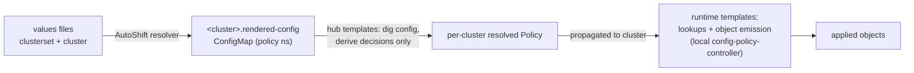
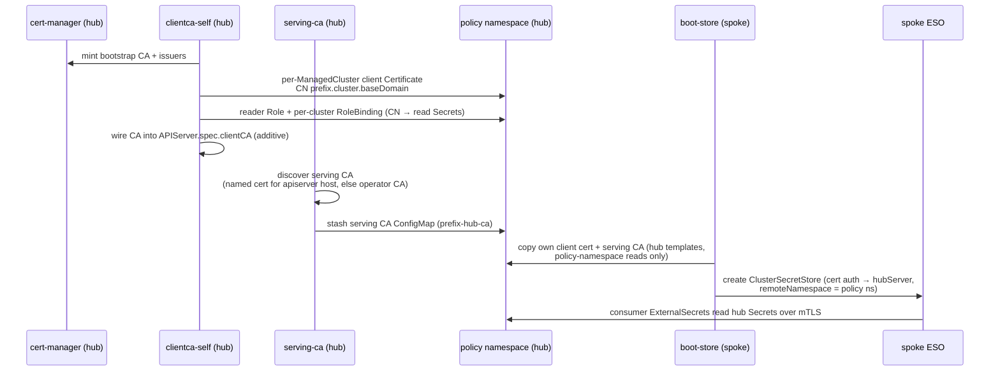
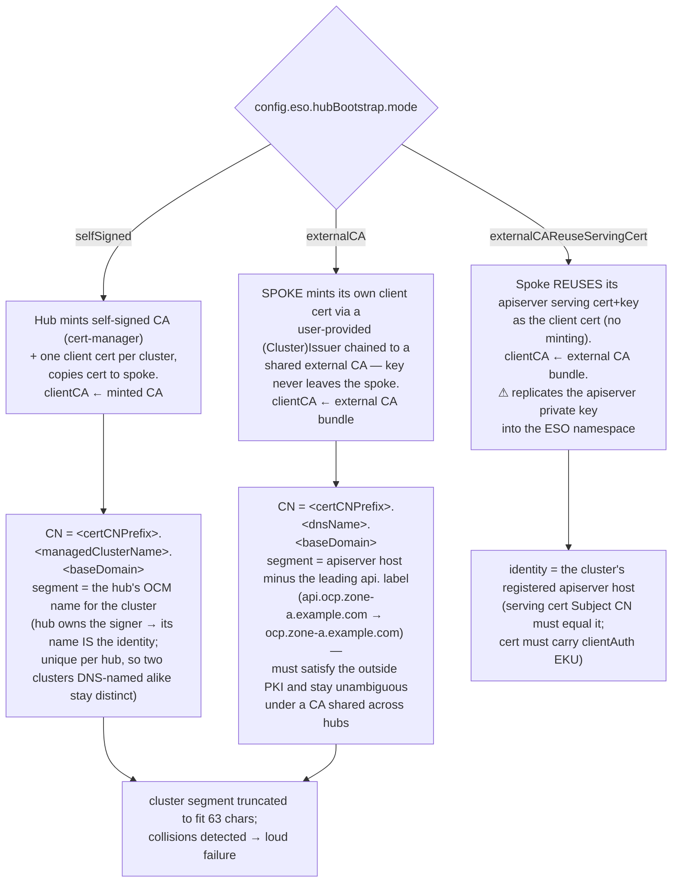
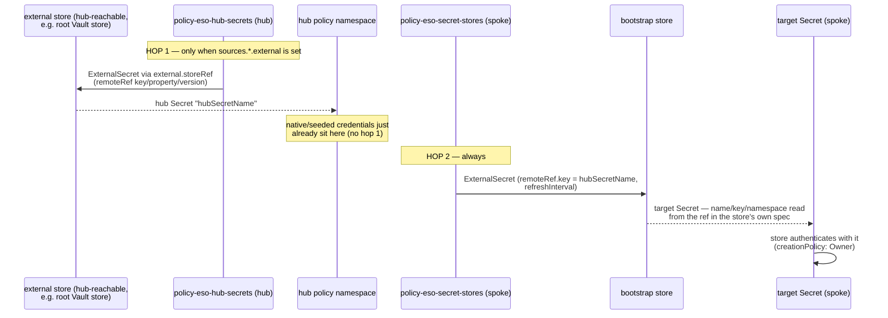
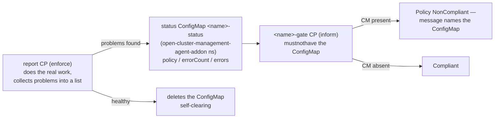
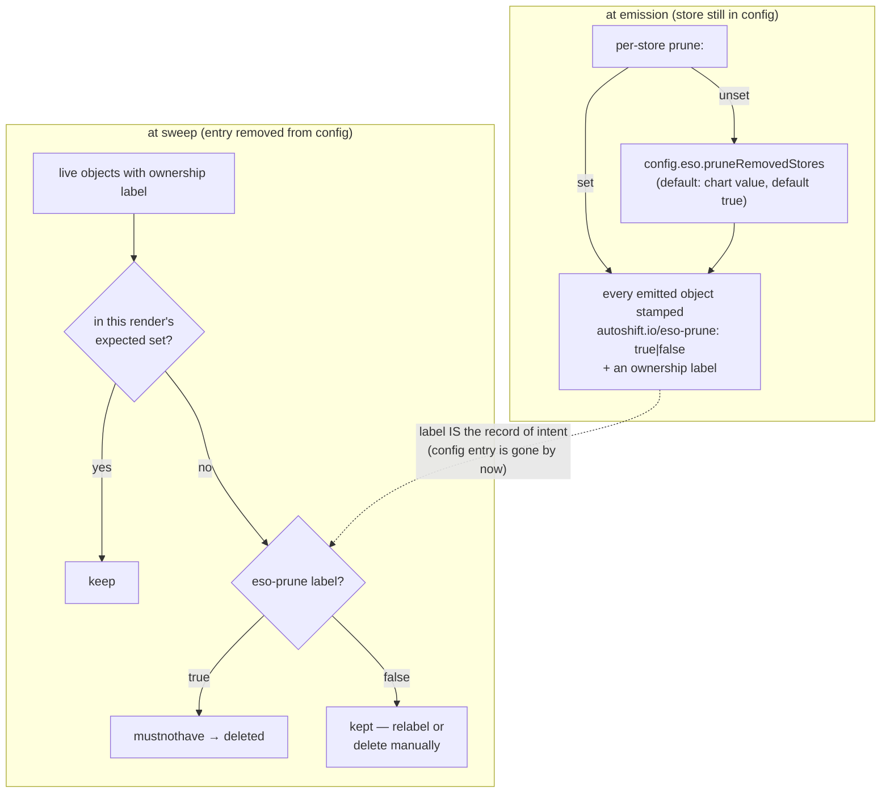

# Mechanics

The recurring mechanisms this policy set is built from — *how* things work, independent of any
one configuration. Operational how-tos live in the [README](README.md); the full key-by-key
variable tables live in [CONFIG-REFERENCE.md](CONFIG-REFERENCE.md); the per-PolicySet /
per-policy / per-ConfigurationPolicy ownership map is
[responsibilities.md](responsibilities.md); diagnosis is
[troubleshooting.md](troubleshooting.md); first-time setup is
[quickstart.md](quickstart.md).

## Policy inventory

*One-line view. The full map — per ConfigurationPolicy, with render gates and placement
detail — is [responsibilities.md](responsibilities.md#per-file-breakdown).*

| Policy | PolicySet | Runs on | Job |
|---|---|---|---|
| `policy-eso-install` | `policyset-eso-install` | all placed clusters | Operator Subscription/OperatorGroup + the `ExternalSecretsConfig` CR (the operator deploys no pods until that CR exists). CR spec = chart defaults ← chart overlay ← per-cluster `config.eso.externalSecretsConfig` overlay (deep merge, later wins) — e.g. the `controllerConfig.networkPolicies` egress allows required for non-:6443 providers. |
| `policy-eso-secret-stores` | `policyset-eso-secret-stores` | all placed clusters | User-defined `SecretStore`/`ClusterSecretStore` objects from `config.eso.secretStores`, plus the spoke-side auth `ExternalSecret`s and delivered-CA ConfigMaps. |
| `policy-eso-hub-secrets` | `policyset-eso-hub-secrets` | hubs only | Materializes external-origin store credentials **onto the hub** (hop 1 of the two-hop transport). |
| `policy-eso-cert-auth-rbac` | `policyset-eso-secret-stores` | all placed clusters | RBAC granting a store's client-cert CN Secret access (`certAuthRBAC`). |
| `policy-eso-secret-reader` | `policyset-eso-secret-reader` | all placed clusters | Read-only ServiceAccount other AutoShift components use to consume ESO-provisioned Secrets. |
| `policy-eso-boot-prereqs` | `policyset-eso-boot-hub` | hubs | Hub-side RBAC the hub-template ServiceAccount needs (config-driven grant list). |
| `policy-eso-boot-readiness-hub` / `-spoke` | `policyset-eso-boot-hub` / `-spoke` | hubs / spokes | Precursor gates — assert cert-manager/issuer/serving-cert health before the active boot policies may run. |
| `policy-eso-boot-clientca-self` (+ `-self-wire`) | `policyset-eso-boot-hub` | hubs | selfSigned mode: mint the bootstrap CA, per-cluster client certs, reader RBAC; wire `APIServer.spec.clientCA`. |
| `policy-eso-boot-clientca-ext` | `policyset-eso-boot-hub` | hubs | External modes: materialize the external CA bundle into the clientCA ConfigMap + reader RBAC (no minting). |
| `policy-eso-boot-serving-ca` | `policyset-eso-boot-hub` | hubs | Discover the hub apiserver's serving CA and stash it in the policy namespace. |
| `policy-eso-boot-store` | `policyset-eso-boot-spoke` | hubs + spokes | Copy the client cert + serving CA to the cluster and build the bootstrap `ClusterSecretStore`. |

Placement is defined once per PolicySet in `templates/policysets.yaml` — policies are grouped
by shared intent + placement, each group bound to a single Placement (hub-only groups render
only when `hubClusterSets` exist). Individual policy files carry no Placement/PlacementBinding.
Every Policy also carries a `policy.open-cluster-management.io/description` annotation, and
each PolicySet a `spec.description`, so both surfaces are self-describing in the ACM console.

---

## 1. Two-layer templating: derive on the hub, act at runtime

ACM policies pass through **two** template evaluations:

1. **Hub templates** (`{{hub … hub}}`) — resolved by the policy propagator **on the hub, once
   per target cluster**, as a ServiceAccount (`autoshift-policy-service-account`).
2. **Runtime templates** (`{{ … }}`) — resolved by the config-policy-controller **on the
   cluster the policy landed on**, as cluster-admin.

This chart follows one hard rule: **hub templates only derive configuration; every lookup and
action is runtime.** Each cluster's merged AutoShift values are delivered as a
`<cluster>.rendered-config` ConfigMap in the policy namespace; hub templates read it, compute
per-cluster decisions (mode, toggles, store lists, names), and bridge them into the runtime
layer as literals. The runtime layer then does all `lookup`s and object emission on the target
cluster.

Why it matters here:

- **Least privilege** — the propagator SA never needs to read `openshift-config`, the
  `APIServer` object, or Secrets; only the policy namespace (plus whatever
  `policy-eso-boot-prereqs` explicitly grants, e.g. Policy status for the readiness gates).
- **Intermediate-hub correctness** — a runtime `lookup` resolves against the cluster the
  policy actually landed on. A hub-side lookup would always resolve against the top-level
  propagating hub, which is wrong for a managed hub in a hub→managed-hub→spoke topology.
- **Per-cluster branching** — because decisions are hub-derived per cluster, one cluster can
  sit in `debugRender` while its neighbors apply live, from the same chart render.

Corollary: **templates never render Secret data.** A hub-template Secret lookup would
serialize plaintext into the resolved policy envelope (visible in the hub console/etcd).
Secret material moves only via ACM's `fromSecret`/`copySecretData` (encrypted in the
envelope) or — for everything in this chart's store machinery — via ESO itself (§4). The one
sanctioned exception: a **runtime** lookup used purely for existence/key checks (the native
seed verification in `policy-eso-hub-secrets`), which renders booleans and names, never
values.

### Multi-hop topology contract (global hub → spoke-hub → leaf)

"Hub templates" resolve on the **immediate propagator** — whichever hub's ACM holds the root
Policy — not on some fixed global hub. The AutoShift `cluster-labels` /
`cluster-config-maps` policies are themselves hub-placed runtime policies that materialize,
**on every hub**, the ManagedCluster labels and `<cluster>.rendered-config` ConfigMaps for
that hub's own clusters. That yields the general architecture rule this chart follows:

> **Anything that must materialize hub objects consumed by other policies does RUNTIME
> lookups for its materialization inputs.** Then every resource a policy's naive hub-template
> lookup expects is created locally by another policy, regardless of whether the hub is
> self-managed or itself managed by another hub — the policy contract is identical at every
> level of the tree.

Locality of every hub-template input in this chart, on an arbitrary propagating hub:

| Hub-layer input | Read by | Guaranteed local by |
|---|---|---|
| `<cluster>.rendered-config` CM | all store/boot policies | `policy-cluster-configs` (runtime, hub-placed) |
| `$PREFIX-hub-ca` CM | boot-store | `policy-eso-boot-serving-ca` (runtime, lands on each hub) |
| `$PREFIX-client-<cluster>` Secret | boot-store | `policy-eso-boot-clientca-self` (runtime — each hub mints for **its own** ManagedClusters) |
| cert-manager Policy status | readiness gates | each hub carrying the root policy set |
| `apiserverurl` ClusterClaim (`deriveHubUrl`) | boot-store | intrinsic — resolves the **immediate** hub, which is exactly the hub that minted this cluster's cert; prefer it over a static `hubServer` in multi-hop |
| `caSource` CA bundle CM | secret-stores | **operator-provided** — must exist on the immediate propagator of that store's cluster |

Credential materialization (`policy-eso-hub-secrets`, §4) is likewise hub-placed + runtime:
each hub sweeps **its own** clusters' rendered-configs and materializes their credentials in
its own owning namespaces — self-managed hubs and spoke-hubs behave identically.

---

## 2. The bootstrap store — cluster→cluster secret transport

The foundational transport: make hub Secrets reachable from every spoke **through ESO**,
before any user store exists. The hub is stood up as a `kubernetes`-provider
`ClusterSecretStore` on each spoke, so the spoke's ESO reads native Secrets straight off the
hub apiserver over mTLS. The only Secret ever *copied* across clusters is the client cert the
store authenticates with.

Three policies cooperate (selfSigned mode shown):

Key mechanics:

- **Store-only contract.** The bootstrap provisions the store and its auth — never
  application `ExternalSecret`s. Every consumer creates its own `ExternalSecret` against the
  store (`storeName`, default `hub-bootstrap`), so consumers own their Secrets.
- **Per-cluster identity, per-deployment authorization.** One client cert per owned
  `ManagedCluster` (unique CN → hub audit logs attribute reads to a cluster), but every
  cluster binds to the *same* reader Role scoped to this deployment's policy namespace — a
  deployment is a tenancy boundary; no cross-deployment reads.
- **Ownership by label.** The mint loop keeps only `ManagedCluster`s whose
  `autoshift.io/owning-namespace` label equals this policy namespace (set by the
  cluster-labels policy). Multiple AutoShift deployments share a hub safely.
- **Serving-CA discovery runs on the hub itself** because `openshift-config` and `APIServer`
  are not hub-template-readable. It stashes the result in the policy namespace, so the copy
  policy's hub templates only ever read the policy namespace.
- **Cross-cluster ordering by retry.** ACM `dependencies` are same-cluster only, so the spoke
  store policy simply stays NonCompliant until the hub has minted its cert and RBAC — no
  manual sequencing.
- **Rotation is continuous.** cert-manager rotates the client cert, the serving-ca policy
  re-resolves the serving CA, and the copy policy re-copies both every evaluation.

---

## 3. mTLS trust modes

Two independent trust chains meet at the spoke's store: **client identity** (spoke proves
itself to the hub) and **server trust** (spoke trusts the hub's serving cert). Server trust is
always the discovered serving CA (§2). The `mode` selects who mints the client cert and what
the hub `APIServer.spec.clientCA` trusts:

- **Additive clientCA, single writer.** OpenShift *merges* a custom `clientCA` with the
  operator-managed client signers, so existing client auth keeps working — the cost is one
  kube-apiserver rollout when first set. But `APIServer.spec.clientCA` names exactly **one**
  ConfigMap cluster-wide: this feature claims it (stable name `<storePrefix>-client-ca`,
  idempotent across deployments), and one hub must agree on one mode.
- **Same CN derivation on hub and spoke.** In `externalCA` mode the spoke derives the CN
  segment from its own apiserver URL — the full host minus the leading `api.` label
  (`api.ocp.zone-a.example.com` → `ocp.zone-a.example.com`, via the
  `apiserverurl.openshift.io` ClusterClaim; the full remainder rather than just the first
  label, so clusters installed under the same DNS cluster name in different zones stay
  distinct) — exactly as the hub derives the RBAC subject from the same claim on the
  ManagedCluster, so identity and authorization match without any cert crossing clusters.
  The segment is truncated to whatever CN budget remains after the prefix and `baseDomain`
  (trailing `.`/`-` trimmed after a mid-label cut); the untruncated name rides as a SAN. In
  `selfSigned` mode the segment is instead the **OCM ManagedCluster name** — the hub owns the
  signer, so the name it registered the cluster under is the identity; the spoke needs no
  derivation at all (its cert is minted on the hub and copied).
- **Emit-only-when-set cert fields.** cert-manager re-issues whenever the returned X.509
  drifts from the `Certificate` spec. External issuers (Venafi/TPP, ACME…) often override
  validity/usages/key type — a spec that insists on them causes a permanent re-issue loop
  (~1/min, and issuance-notification storms). So in the external modes the chart requests a
  *bare* cert (`dnsNames` + `issuerRef` only) and emits `duration`/`renewBefore`/`usages`/
  `privateKey` **only if explicitly configured**; in selfSigned mode (our own CA honors the
  spec) sensible defaults including the required `client auth` usage are applied.

---

## 4. `authSecretConfig` — the two-hop credential transport

User stores usually authenticate with a static credential (Vault token, AppRole secret-id,
client cert…). That credential must exist on the spoke — but Secrets are never template-copied
(§1 corollary). Instead the credential rides ESO end-to-end, in two hops through the
bootstrap store:

Mechanics that make it hands-off:

- **`spec` stays authoritative.** You write the store's `spec` exactly as ESO documents it,
  auth refs included. `authSecretConfig` never repeats the target Secret's name/key/namespace
  — the policy *introspects the ref in `spec`* and provisions what it points at.
- **`fromRef` tokens.** The chart-internal `internal.authRefPaths` table maps a token
  (`vaultToken`, `vaultAppRole`, `kubernetesCert`, …) to where that auth method keeps its
  `SecretKeySelector`s relative to `spec.provider.<provider>`. Adding a new auth method is a
  table edit, not a template change.
- **Keyed vs whole-Secret.** A source entry with `key:` maps one hub-Secret property to the
  ref's key; entries naming the same `hubSecretName` merge into one pull. An entry *without*
  `key` pulls the **whole** hub Secret (`dataFrom.extract`) — then every ref the token covers
  must target the same Secret.
- **Hub-side dedup across declarers.** `policy-eso-hub-secrets` collects every
  `external`-sourced credential across all clusters/stores that declare it, merges identical
  declarations into one hub ExternalSecret, and errors on conflicting ones (same hub Secret,
  different remoteRefs).
- **Deadlock guard.** The bootstrap store itself authenticates with the cert flow (§2), never
  through `authSecretConfig` — a store can't be the transport for its own credential. The
  same rule applies to any root store: its own credential must be native (a manually seeded
  hub Secret), which is exactly the "root store" pattern — one seeded store on the hub feeds
  every other store's credentials.
- **Native seeds are verified — missing means *pending*, not error.** For sources without
  `external`, `policy-eso-hub-secrets` checks the declared Secret exists in the owning
  namespace (and carries the declared `key`) — existence and key names only, never values —
  and reports gaps under a separate `pending` key in its status ConfigMap. Pending keeps the
  gate NonCompliant (visibility) but has **no blast radius**: other credentials still
  materialize, stores are still created, the sweep still runs. That is the chaining contract:
  a store whose auth Secret is produced by *another store's* flow starts pending and clears
  once the upstream syncs, so successive evaluations bring up successive layers of stores.
  Names this policy itself materializes are exempt (their ExternalSecret Ready condition is
  the signal).
- **GC on prune.** Auth ExternalSecrets use `creationPolicy: Owner`, so pruning the
  ExternalSecret garbage-collects the credential Secret it created.

---

## 5. Readiness gates and ordering

The cert bootstrap can lock itself out: if the PKI is broken at the moment client certs
expire, every retry path needs cert auth that no longer works. The gates prevent that by
being **pure precursors** — they assert the plumbing is healthy and hold the active policies
back until it is:

- `policy-eso-boot-readiness-hub` / `-spoke` check (per mode) cert-manager operator health,
  issuer existence, serving-cert health. The five **active** cert boot policies
  (clientca-self, clientca-self-wire, clientca-ext, serving-ca, boot-store) list the gate in
  `spec.dependencies`, so they sit **Pending** — never half-run against dead infrastructure —
  and self-heal when the gate recovers.
- **Two trust levels** via `externalCertAuthority.autoshiftProvisioned`: `true` → the gate
  requires the AutoShift cert-manager Policy Compliant *for this cluster* and introspects the
  issuer/serving cert; `false` → the PKI is managed out-of-band, so the gate only verifies
  cert-manager is installed (CSV Succeeded) and trusts the rest.
- The gates need to read Policy status on the hub — that read permission is exactly what
  `policy-eso-boot-prereqs` grants (a generic, config-driven grant list for the hub-template
  ServiceAccount; the gates depend on it).
- Gates and non-cert policies are **never** suppressed by the diagnostics toggles (§7) — they
  are the part that must always tell the truth.

---

## 6. Failure surfacing — status ConfigMap + inform gate

*Reading these signals in practice: [troubleshooting.md §2](troubleshooting.md#2-signal-sources--where-truth-lives-in-the-order-to-consult-it).*

Template `fail` is never used: it aborts template processing and buries the real reason in a
truncated, hundreds-of-lines `template error` envelope. Instead every policy with
preconditions is split into two ConfigurationPolicies that surface problems **as data**:

- The **gate** is the Policy's compliance signal, so `spec.dependencies` chains keep working
  unchanged. No custom Events — ACM already fires them on every compliance transition.
- The status CM can carry a second severity: **`pending`** (with `pendingCount`) — declared
  inputs that don't exist *yet* but are expected to converge (currently: native seeds,
  hub-secrets). Pending keeps the gate NonCompliant for visibility but callers never treat it
  as an error — no action skip, no sweep suspension.
- Error messages carry a `[hub]`/`[spoke]` prefix naming the **templating layer** that
  produced them (hub-template vs runtime resolution), not the cluster.
- **Two failure semantics**, matched to what the policy provisions:
  - *All-or-nothing* — policies minting one shared object (boot-store's store, the clientca
    policies' CA/clientCA): any precondition error blocks the whole action; a half-built
    shared object is incoherent.
  - *Per-store skip* — policies whose resources are independent per store/credential
    (secret-stores, cert-auth-rbac, hub-secrets): a broken entry is recorded and skipped,
    every other entry still provisions. NonCompliant then means "*some* store is broken",
    deliberately — one team's misconfiguration must not stop the others' workloads.
- `policy-eso-secret-stores` structures its status map by store then layer
  (`errors.<store>.[hub|spoke]`) so the broken store is a top-level key.

---

## 7. Diagnostics run modes

Two composable, per-cluster escape valves for the five active cert boot policies (gates and
non-cert policies always run). Each is decided at ACM propagation time from that cluster's
rendered config, so one cluster can dry-run while the fleet applies live:

- **`readinessOnly`** — the active policies render an empty object stream (Compliant no-op);
  only the readiness gates do real work. Use to prove preconditions green before standing the
  bootstrap up.
- **`debugRender`** — the policy applies nothing live and instead writes one
  `<configpolicy>-debug-render` ConfigMap containing the full object stream it *would* have
  applied — resolved on the target cluster (real lookups), with Secret-sourced data replaced
  by a source descriptor. Switching it off `mustnothave`-clears the preview.
- Both set → debug wins for output. Branch order inside every active policy:
  `if debug → preview` / `else → clear preview; if not readinessOnly → live objects`.

---

## 8. Cleanup — baked prune labels, label-driven sweeps, explicit teardown

The chart never relies on ACM `pruneObjectBehavior`; every removal is an explicit,
label-driven `mustnothave` sweep. The core problem: when a store entry is removed from
config, the sweep runs *after* the entry is gone — the config can no longer say whether that
store wanted pruning. So the decision is **baked onto the objects at emission time**:

- **Diff-based sweeps everywhere.** Each policy computes the set it wants *this evaluation*
  and removes labeled leftovers not in it: store objects/auth ES/delivered-CA CMs
  (secret-stores), hub credential ES (hub-secrets, prune-ANDed across all declarers),
  cert-auth RBAC, departed clusters' certs, orphaned reader Roles/RoleBindings, stale
  debug-preview CMs.
- **Safety gates.** A sweep is skipped whenever the policy reports *any* precondition/store
  error (a misconfigured store must never get its live objects deleted) and whenever the
  rendered config can't be read (a transient read miss must never look like "everything was
  removed"). Unlabeled objects are never candidates. Kind-level sweeps are guarded by CRD
  `lookup`s so an uninstalled cert-manager/ESO can't break rendering.
- **Removal ≠ teardown.** Removing `config.eso.hubBootstrap` is a deliberate no-op. Full
  decommission requires the explicit `teardown: true` flag, which flips every boot policy
  from provisioning to removal (spoke store + secrets, hub mint estate, reader RBAC, clientCA
  ConfigMap, `APIServer.spec.clientCA` → `""` — one more apiserver rollout).
- The complete trigger→removal table and label inventory: README →
  *Cleanup reference — every automatic removal in one place*.

---

## 9. Consuming what ESO provisions

- **`secret-reader`** — a read-only ServiceAccount (in the operator namespace) that other
  AutoShift components use to consume ESO-provisioned Secrets, granted read on
  `config.externalSecretsOperator.secretReaderNamespaces` + `config.defaultSecretsNamespace`.
  Keeps consumers off cluster-admin and makes the consumption surface auditable.
- **`certAuthRBAC`** — for `kubernetes`-provider stores using cert auth against a *remote*
  cluster, the policy generates the RBAC that cert's CN needs on the remote side, scoped to
  match the store: namespaced store → Role+RoleBinding; cluster store → ClusterRole (+
  per-namespace RoleBindings when `spec.conditions` scopes it — RBAC can't express label
  selectors, so explicit namespace lists only).
- **`caSource`** — per-store delivery of a remote apiserver's serving CA: a hub ConfigMap is
  shipped into the ConfigMap the store's own `caProvider` names, so the two never drift.
