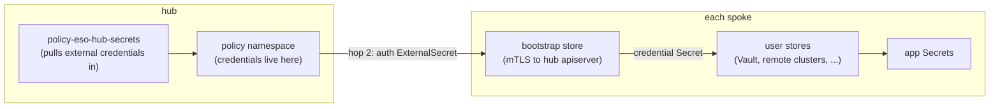

# Quickstart

The fastest path from an empty AutoShift deployment to working cross-cluster secrets, with the
concepts explained as you hit them. Everything here is a complete, paste-ready values-file
example — pick the bootstrap mode that matches your PKI situation and follow that section.

Deeper material lives elsewhere:

- [README.md](README.md) — the full operational reference (every store option, cleanup, teardown).
- [mechanics.md](mechanics.md) — *how* the mechanisms work (templating layers, trust modes, two-hop transport).
- [CONFIG-REFERENCE.md](CONFIG-REFERENCE.md) — key-by-key tables for every chart value and runtime config key.
- [troubleshooting.md](troubleshooting.md) — signal sources, triage flow, runbooks.
- [responsibilities.md](responsibilities.md) — which policy/PolicySet owns which object.

## What you're deploying

Three layers, each optional beyond the first:

1. **The operator** — External Secrets Operator (ESO) installed on every labeled cluster, plus
   the `ExternalSecretsConfig` CR that actually makes it deploy pods.
2. **The hub bootstrap store** (`config.eso.hubBootstrap`) — the hub stood up as a
   `kubernetes`-provider `ClusterSecretStore` on each spoke, authenticated with an
   auto-rotating client certificate. This is the foundational transport: it makes Secrets in
   the hub's policy namespace readable from every spoke *through ESO*, before any user store
   exists. Consumers (including AutoShift itself) pull hub Secrets by creating
   `ExternalSecret`s against it.
3. **User secret stores** (`config.eso.secretStores`) — your Vault / Kubernetes / cloud stores,
   declared as plain ESO `spec`s. When a store needs a static credential (Vault token,
   AppRole secret-id, client cert), `authSecretConfig` delivers it hands-off through the
   bootstrap store — no Secret is ever copied by a template.



The one decision you must make up front is the bootstrap **trust mode** — who mints the
client cert and what the hub apiserver trusts. That is what the mode sections below break out.

## Prerequisites

- A working AutoShift deployment: ACM hub, GitOps, and the `cluster-labels` /
  `cluster-config-maps` policies running (they materialize the labels and
  `<cluster>.rendered-config` ConfigMaps everything below reads).
- **cert-manager on the hub** for the `selfSigned` bootstrap mode (label
  `cert-manager: 'true'` on the hub clusterset), and on the **spokes** too for `externalCA`
  mode (the spoke mints its own cert). The readiness gates verify this before anything runs.
- Labels and config go in the AutoShift **values files only** — never directly on managed
  clusters. The cluster-labels policy propagates them.
- One hub = one trust mode. `APIServer.spec.clientCA` is a single cluster-wide field, so every
  deployment sharing a hub must agree on `mode`. Set it at clusterset scope to keep the hub
  and its spokes in lockstep.

## Step 1 — enable the operator

Add the labels to the clustersets that should run ESO (hub sets, managed sets, or both):

```yaml
# autoshift/values/clustersets/<your-set>.yaml
hubClusterSets:
  hub:
    labels:
      external-secrets-operator: 'true'
      external-secrets-operator-channel: 'stable-v1'
      external-secrets-operator-source: 'redhat-operators'
      external-secrets-operator-source-namespace: 'openshift-marketplace'
      # external-secrets-operator-version: 'external-secrets-operator.v1.x.x'  # optional CSV pin

managedClusterSets:
  managed:
    labels:
      external-secrets-operator: 'true'
      external-secrets-operator-channel: 'stable-v1'
      external-secrets-operator-source: 'redhat-operators'
      external-secrets-operator-source-namespace: 'openshift-marketplace'
```

That alone installs the operator and its `ExternalSecretsConfig` CR everywhere the label lands.
If you only need ESO with stores whose auth is handled out-of-band (e.g. Vault Kubernetes auth
via ServiceAccount — no static credential), you can stop after Step 3 and never configure the
bootstrap at all.

## Step 2 — choose a bootstrap mode

*Background: [mTLS trust modes](mechanics.md#3-mtls-trust-modes) in mechanics.md; full option tables:
[Trust modes](README.md#trust-modes-configesohubbootstrapmode) in the README.*

The bootstrap's client identity works one of three ways. Concept in one line each:

| `mode` | Who mints the client cert | Hub `clientCA` trusts | External PKI needed | Use when |
|---|---|---|---|---|
| `selfSigned` (default) | The **hub** (cert-manager self-signed CA), one cert per cluster, copied to each spoke | The hub-minted CA | none | Default. No PKI requirements; fully self-contained. |
| `externalCA` | Each **spoke** mints its own, via a customer-provided (Cluster)Issuer chained to a shared external CA — the key never leaves the spoke | The external CA bundle | issuer on every spoke + CA bundle CM on the hub | Security policy forbids hub-minted CAs or cross-cluster key copies. |
| `externalCAReuseServingCert` | Nobody — the spoke **reuses its apiserver serving cert+key** as the client cert | The external CA bundle | CA bundle CM on the hub (the CA that signed the serving certs) | Last resort: the customer cannot issue a dedicated client cert at all. |

Common to every mode:

- **Connection** — `hubServer` (the hub apiserver URL) or `deriveHubUrl: true`. Prefer
  `deriveHubUrl` in multi-hop topologies (global hub → spoke-hub → leaf): each cluster then
  resolves the apiserver of its *immediate* hub — the one that minted its cert — instead of
  every level pointing at one static URL.
- **Store-only contract** — the bootstrap provisions the store (named `storeName`, default
  `hub-bootstrap`) and its auth, never application `ExternalSecret`s. Consumers own theirs.
- **Tenancy** — every spoke gets its own identity (unique CN, auditable) but the same
  authorization: read-only on **this deployment's policy namespace**, nothing else.
- **One apiserver rollout** — first enablement wires the trust CA into
  `APIServer.spec.clientCA` (additive; existing client auth keeps working). Expect one
  kube-apiserver rollout on the hub then, and one more if you ever tear down.
- **Readiness gates** — precursor policies verify cert-manager / issuer / serving-cert health
  before any cluster-mutating boot policy is allowed to fire, and hold them `Pending` if the
  PKI degrades. You do not sequence anything manually.

---

### Mode 1: `selfSigned` (default) — hub mints everything

**Concept.** cert-manager on the hub mints one self-signed CA and, from it, one client cert
per owned managed cluster (CN `<certCNPrefix>.<managedClusterName>.<baseDomain>` — the name the
hub registered the cluster under, e.g. `eso-client.local-cluster.autoshift.io`; the hub owns
the signer, so its name for the cluster is the identity). The CA is wired into the hub apiserver's
client trust; each spoke copies *its own* cert and builds the store with it. Rotation is
continuous — cert-manager renews the cert, the copy policy re-copies it every evaluation.
Nothing external is required; `autoshift.io` as `baseDomain` is just an origin marker (the
certs never leave the AutoShift trust domain).

**Prerequisites.** cert-manager on the hub (label it in the same values file).

```yaml
# autoshift/values/clustersets/hub.yaml
hubClusterSets:
  hub:
    config:
      eso:
        hubBootstrap:
          hubServer: 'https://api.hub.example.com:6443'
          # deriveHubUrl: true          # ...or omit hubServer and let each cluster resolve its
          #                             # immediate hub — the right choice for multi-hop trees
          # mode: selfSigned            # default; may be omitted
          # storeName: hub-bootstrap    # ClusterSecretStore name created on each spoke (default)
          clientIdentity:
            baseDomain: autoshift.io    # default; CN = eso-client.<cluster>.autoshift.io
            # certDuration: 720h        # optional; selfSigned defaults 720h / 480h are applied if unset
            # certRenewBefore: 480h     # (external modes omit unset fields — the issuer decides;
            # useDefaultCertValues: true # true/false forces the default set on/off in any mode)
    labels:
      external-secrets-operator: 'true'
      external-secrets-operator-channel: 'stable-v1'
      external-secrets-operator-source: 'redhat-operators'
      external-secrets-operator-source-namespace: 'openshift-marketplace'
      cert-manager: 'true'
      cert-manager-channel: stable-v1
      cert-manager-source: redhat-operators
      cert-manager-source-namespace: openshift-marketplace

managedClusterSets:
  managed:
    config:
      eso:
        hubBootstrap:
          hubServer: 'https://api.hub.example.com:6443'   # same block — spokes read it too
    labels:
      external-secrets-operator: 'true'
      external-secrets-operator-channel: 'stable-v1'
      external-secrets-operator-source: 'redhat-operators'
      external-secrets-operator-source-namespace: 'openshift-marketplace'
```

**What happens on first sync (in order, automatically):**

1. Readiness gate (`policy-eso-boot-readiness-hub`) waits for cert-manager healthy.
2. `clientca-self` mints the CA + per-cluster client certs + reader RBAC in the policy
   namespace; `clientca-self-wire` sets `APIServer.spec.clientCA` (one apiserver rollout).
3. `serving-ca` discovers the hub's serving CA and stashes it in the policy namespace.
4. On each spoke, `boot-store` copies that cluster's cert + the serving CA and creates the
   `hub-bootstrap` ClusterSecretStore. It stays NonCompliant until steps 2–3 land — retry is
   the cross-cluster ordering; no action needed.

---

### Mode 2: `externalCA` — spokes mint their own certs from a shared external CA

**Concept.** No hub-minted CA and no private key ever crosses a cluster boundary. Each spoke
mints its own client cert through a customer-provided `ClusterIssuer`/`Issuer` chained to a
shared external CA; the hub trusts that CA's bundle. Identity still lines up automatically:
the spoke derives its CN from its own apiserver URL — the full host minus the leading `api.`
label (`api.ocp.zone-a.example.com` → `ocp.zone-a.example.com`; a trailing `.<baseDomain>` is
stripped from the segment so the base domain never appears twice in the CN) — with the
exact same `<certCNPrefix>.<cluster>.<baseDomain>` formula the hub uses for the RBAC subject
(from the same `apiserverurl.openshift.io` ClusterClaim) — so authorization matches without
any coordination beyond agreeing on `baseDomain`.

**Prerequisites.**

- cert-manager on **every spoke** (they mint) — and the issuer below provisioned on each,
  chained to the shared external CA. This is a precondition the customer owns.
- The external CA bundle as a ConfigMap **on the hub** (the readiness gate and clientca-ext
  policy read it there).
- `clientIdentity.baseDomain` is **required** (no default) — the CN must satisfy the customer
  PKI. CN is capped at 63 chars; the cluster-name segment is truncated to fit, and collisions
  are detected and fail loudly.

```yaml
# autoshift/values/clustersets/hub.yaml (same keys on the managed sets)
hubClusterSets:
  hub:
    config:
      eso:
        hubBootstrap:
          hubServer: 'https://api.hub.example.com:6443'
          mode: externalCA
          clientIdentity:
            baseDomain: eso.corp.example.com     # REQUIRED — both sides derive the same CN from it
            # certCNPrefix: eso-client # optional; chart default
          externalCertAuthority:
            certIssuer:                          # REQUIRED — customer-provisioned on each spoke,
              name: shared-ca-issuer             # chained to the shared external CA
              kind: ClusterIssuer                # ClusterIssuer | Issuer
              group: cert-manager.io
            caTrustBundle:                       # REQUIRED — the CA bundle the hub apiserver trusts
              namespace: openshift-config
              name: external-shared-ca
              key: ca-bundle.crt
            # autoshiftProvisioned: true         # default. Set false when cert-manager + the PKI are
            #                                    # managed entirely out-of-band: the readiness gate then
            #                                    # only checks cert-manager is INSTALLED and trusts the rest.
    labels:
      external-secrets-operator: 'true'
      cert-manager: 'true'                       # spokes need it too in this mode
      # ... channel/source labels as in Mode 1
```

**What happens on first sync:** the readiness gates verify cert-manager *and* the issuer /
serving-cert plumbing per cluster (or only the install, if `autoshiftProvisioned: false`);
`clientca-ext` materializes the external CA bundle into the clientCA ConfigMap + reader RBAC
(no minting); each spoke mints its cert and builds the store. If the external PKI breaks
later, the gates go NonCompliant and hold the boot policies back — the system never retries
cert auth against dead infrastructure, which is what prevents lock-out at cert expiry.

---

### Mode 3: `externalCAReuseServingCert` — spoke reuses its apiserver serving cert

**Concept.** No cert is minted at all: the spoke replicates its existing apiserver **serving
cert and private key** into the ESO namespace and authenticates with that. Identity is the
cluster's registered apiserver host (from `ManagedCluster` client configs), which the hub
binds RBAC to.

> ⚠️ **Security blast radius:** this copies the apiserver's private key into another
> namespace. Only use when the customer genuinely cannot issue a dedicated client cert.
>
> Two preconditions the policy **cannot verify** (failure shows up as TLS/RBAC errors):
> 1. **EKU** — the serving cert must carry `clientAuth` (or `anyExtendedKeyUsage`); a
>    serverAuth-only cert is rejected by the hub's mTLS handshake.
> 2. **Identity** — the serving cert's **Subject CN must equal the registered apiserver
>    host**. Host-only-in-SANs with a generic CN will not match the RBAC subject.

**Prerequisites.** Only the external CA bundle (the CA that signed the spokes' serving certs)
as a ConfigMap on the hub. No `clientIdentity`, no `certIssuer`.

```yaml
hubClusterSets:
  hub:
    config:
      eso:
        hubBootstrap:
          hubServer: 'https://api.hub.example.com:6443'
          mode: externalCAReuseServingCert
          externalCertAuthority:
            caTrustBundle:                       # REQUIRED — the CA that signed the serving certs
              namespace: openshift-config
              name: external-shared-ca
              key: ca-bundle.crt
            # autoshiftProvisioned: true         # as in Mode 2
```

---

### Optional first run for any mode: dry-run the bootstrap

Two per-cluster diagnostics flags let you validate everything **without mutating any
cluster** — no CA mint, no apiserver rollout, no store writes:

```yaml
        hubBootstrap:
          hubServer: 'https://api.hub.example.com:6443'
          mode: selfSigned                # the mode whose object stream you want to preview
          diagnostics:
            readinessOnly: true           # the 5 cert boot policies apply nothing live
            debugRender: true             # ...but each emits a preview CM of what it WOULD apply
```

Readiness gates still run for real (prove the preconditions green), and each boot policy
writes a `<name>-debug-render` ConfigMap holding its fully-resolved would-be object stream
(Secret data replaced by descriptors). Inspect, then remove the two flags to go live:

```bash
oc get cm -n open-cluster-policies -l autoshift.io/eso-debug-render=true
oc get cm -n open-cluster-policies eso-boot-store-debug-render -o jsonpath='{.data.rendered\.yaml}'
```

### Verify the bootstrap (all modes)

```bash
# on the hub: rollup by intent group first (install / boot-hub / boot-spoke / stores / ...)
oc get policysets -n open-cluster-policies | grep eso

# then the individual boot policies (readiness gates first, then the actives)
oc get policies -n open-cluster-policies | grep eso-boot

# on a spoke: store exists and is Ready
oc get clustersecretstore hub-bootstrap -o jsonpath='{.status.conditions}'

# any policy NonCompliant -> its status ConfigMap says exactly why
oc get cm -n open-cluster-management-agent-addon | grep status
oc get cm -n open-cluster-management-agent-addon eso-boot-store-status -o yaml
```

Every precondition failure lands as data in a `<name>-status` ConfigMap (with an inform gate
holding the Policy NonCompliant) — start there, then [troubleshooting.md](troubleshooting.md)
for the runbooks.

## Step 3 — add your first user store

*Background: [the two-hop credential transport](mechanics.md#4-authsecretconfig--the-two-hop-credential-transport) in mechanics.md; every store
option: [Secret Stores](README.md#secret-stores-configesosecretstores) and
[Auth secrets](README.md#auth-secrets-authsecretconfig) in the README.*

Stores are declared under `config.eso.secretStores` as ordinary ESO `spec`s — the `spec` is
authoritative, exactly as ESO documents it. The interesting part is credentials:

- **No static credential** (e.g. Vault Kubernetes auth): just write the spec. Done — this
  works even without the bootstrap.
- **Static credential** (token, AppRole secret-id, client cert): add `authSecretConfig`. The
  credential then rides ESO end-to-end in **two hops**: hop 1 (optional) pulls it from an
  external store *onto the hub*; hop 2 pulls it from the hub *through the bootstrap store*
  onto the spoke, into exactly the Secret the store's own `spec` ref points at. You never
  repeat names — the policy introspects the ref in `spec` (`fromRef` names which auth
  method's refs to mirror).

> ⚠️ **Operand egress is NetworkPolicy-restricted.** The operator deny-alls egress from the
> external-secrets pods, allowing only TCP 6443 and DNS; the chart's default
> `ExternalSecretsConfig` adds a :443 allow for the core controller, so providers on
> **443** (Vault/cloud endpoints behind standard HTTPS) and **6443** (the hub-bootstrap store)
> work out of the box. A provider on any *other* port times out (`context deadline exceeded`
> in the pod, `InvalidProviderConfig` on the store) until you add an egress entry via the
> `ExternalSecretsConfig` passthrough. Lists merge **wholesale** — an overriding
> `networkPolicies` list replaces the chart default's, so restate the 443 rule alongside
> your addition:
>
> ```yaml
> config:
>   eso:
>     externalSecretsConfig:
>       controllerConfig:
>         networkPolicies:
>           - name: allow-https-egress          # restated: overriding replaces the default list
>             componentName: ExternalSecretsCoreController
>             egress:
>               - ports: [{ protocol: TCP, port: 443 }]
>           - name: allow-vault-8200-egress     # your extra port
>             componentName: ExternalSecretsCoreController
>             egress:
>               - ports: [{ protocol: TCP, port: 8200 }]
> ```
>
> Full merge semantics: README → *ExternalSecretsConfig passthrough*.

The canonical pattern — one manually-seeded **root store** on the hub feeds every other
store's credentials:

How the two halves of a store entry join up:

- **`spec` declares the DESTINATION.** You write the store exactly as ESO documents it, auth
  ref included. The policy reads the target Secret's `name`/`key`/`namespace` *from that ref*
  — `authSecretConfig` never repeats them, so they can't drift.
- **`fromRef` names the auth method**, which tells the policy *where in `spec` that method
  keeps its Secret refs* (via the chart-internal `internal.authRefPaths` table — e.g.
  `vaultToken` → `spec.provider.vault.auth.tokenSecretRef`). It's declared rather than
  auto-detected because a spec is full of ref-shaped fields that must NOT be provisioned
  (caProviders, TLS refs, serviceAccountRefs) — `fromRef` states which refs this policy owns.
- **`sources` is keyed by the method's component names** (from the same table) because a
  method can have several independent refs, each needing its own source: `vaultToken` has just
  one (`tokenSecretRef`), but `kubernetesCert` has `clientCert` + `clientKey`, `vaultIam` has
  `accessKeyID` + `secretAccessKey`. Each entry supplies only the SOURCE side:
  `hubSecretName` (+ `key`) in the hub policy namespace.
- From each source→ref pair the policy emits one spoke `ExternalSecret` against the bootstrap
  store, and spoke ESO performs the copy:
  `<hubSecretName>.data.<sources key>` → `<ref name>.data.<ref key>` in the ref's namespace.

```yaml
managedClusterSets:
  managed:
    config:
      eso:
        secretStores:
          # Root store: hub-reachable Vault, auth = one manually seeded Secret in the hub
          # policy namespace (native source — no `external`, nothing to pull it from).
          - clusterSecretStore:
              name: hub-vault
              authSecretConfig:
                fromRef: vaultToken                   # auth method = vault token auth; tells the policy
                                                      # the ref to provision lives at
                                                      # spec.provider.vault.auth.tokenSecretRef
                sources:
                  tokenSecretRef:                     # <- component name from the vaultToken method
                                                      #    (its only one; cert methods have two)
                    hubSecretName: hub-vault-seed     # SOURCE: Secret in the hub policy namespace.
                    key: token                        # SOURCE property within it.
                                                      # Seed it once by hand: the deadlock guard —
                                                      # a store can't transport its own credential.
              spec:
                provider:
                  vault:
                    server: 'https://vault.example.com:8200'
                    path: 'secret'
                    version: 'v2'
                    auth:
                      tokenSecretRef:                 # DESTINATION: the policy reads name/key/namespace
                        name: hub-vault-token         # from THIS ref and provisions exactly that Secret.
                        key: token                    # Net effect, performed by spoke ESO through the
                        namespace: 'external-secrets-operator'
                                                      # bootstrap store:
                                                      #   hub-vault-seed.data.token (hub policy ns)
                                                      #     -> hub-vault-token.data.token (this ns)
          # Team store: its token is materialized on the hub FROM the root store (hop 1),
          # then delivered to the spoke through the bootstrap store (hop 2).
          - secretStore:
              name: team-a-vault
              namespace: 'team-a'
              authSecretConfig:
                fromRef: vaultToken
                sources:
                  tokenSecretRef:
                    hubSecretName: team-a-vault-token  # SOURCE on the hub — but this one doesn't exist
                    key: token                         # until hop 1 creates it:
                    external:                          # hop 1: policy-eso-hub-secrets pulls it onto the
                      storeRef: { name: hub-vault, kind: ClusterSecretStore }   # hub VIA the root store
                      remoteRef: { key: 'secret/data/eso/team-a-token', property: token }
              spec:
                provider:
                  vault:
                    server: 'https://vault.example.com:8200'
                    path: 'secret'
                    version: 'v2'
                    auth:
                      tokenSecretRef:                  # DESTINATION (SecretStore: no .namespace — the
                        name: vault-token              # store's own namespace, team-a, is used):
                        key: token                     #   team-a-vault-token.data.token (hub)
                                                       #     -> vault-token.data.token (team-a)
```

Seed the root credential once, on the hub:

```bash
oc create secret generic hub-vault-seed -n open-cluster-policies --from-literal=token=<vault-token>
```

**Convergence is automatic.** A store whose credential comes from *another* store's flow
starts **pending** (reported under a `pending` key in the `eso-hub-secrets-status` ConfigMap —
visible, but not an error): nothing is blocked, every other credential still materializes, and
each successive evaluation brings the next layer of stores up. Chains of stores just settle
over a few evaluations.

Everything else stores can do — Kubernetes-provider stores against remote clusters, cert-auth
RBAC generation (`certAuthRBAC`), remote serving-CA delivery (`caSource`), whole-Secret
pulls, pruning removed stores — is in the [README](README.md#secret-stores-configesosecretstores),
with full worked examples.

## Step 4 — consume secrets

*Background: [consuming what ESO provisions](mechanics.md#9-consuming-what-eso-provisions) in mechanics.md.*

The bootstrap store provisions **no** application secrets — consumers own their
`ExternalSecret`s. Pull any Secret from the hub policy namespace onto a spoke:

```yaml
apiVersion: external-secrets.io/v1
kind: ExternalSecret
metadata: { name: app-secrets, namespace: app-secrets }
spec:
  secretStoreRef: { name: hub-bootstrap, kind: ClusterSecretStore }   # = storeName
  refreshInterval: 1h
  target: { name: app-secrets, creationPolicy: Owner }
  data:
    - secretKey: db_password
      remoteRef: { key: app-db, property: password }    # key = Secret NAME in the hub policy ns
```

Your user stores work the same way with their own `secretStoreRef`. For AutoShift components
that need to *read* ESO-provisioned Secrets, the chart also creates a read-only
`secret-reader` ServiceAccount scoped to `config.externalSecretsOperator.secretReaderNamespaces`
plus `config.defaultSecretsNamespace` (see [README](README.md#reading-provisioned-secrets-secret-reader)).

## Responsibilities — who does what

Everything you just deployed is 13 Policies in 6 PolicySets; placement lives entirely in
`templates/policysets.yaml`. Each policy pairs an *enforce* ConfigurationPolicy (does the
work) with an *inform gate* (reports why something didn't happen — the gates are what you
saw in the verify steps above). The ownership map is
[responsibilities.md](responsibilities.md): the [PolicySet table](responsibilities.md#policysets-templatespolicysetsyaml) for what
deploys where, the [per-file breakdown](responsibilities.md#per-file-breakdown) for which policy owns which object.

## Where to go next

- Multi-hop trees (global hub → spoke-hub → leaf): use `deriveHubUrl: true` and read
  *Multi-hop topology contract* in [mechanics.md](mechanics.md#multi-hop-topology-contract-global-hub--spoke-hub--leaf).
- Removing stores and what gets cleaned up: README → *Removing a store — pruning*.
- Decommissioning the bootstrap entirely (`teardown: true` — removal of the block alone is a
  deliberate no-op): README → *Decommissioning*.
- Anything NonCompliant: [troubleshooting.md](troubleshooting.md) — status ConfigMaps first,
  then the runbooks.
