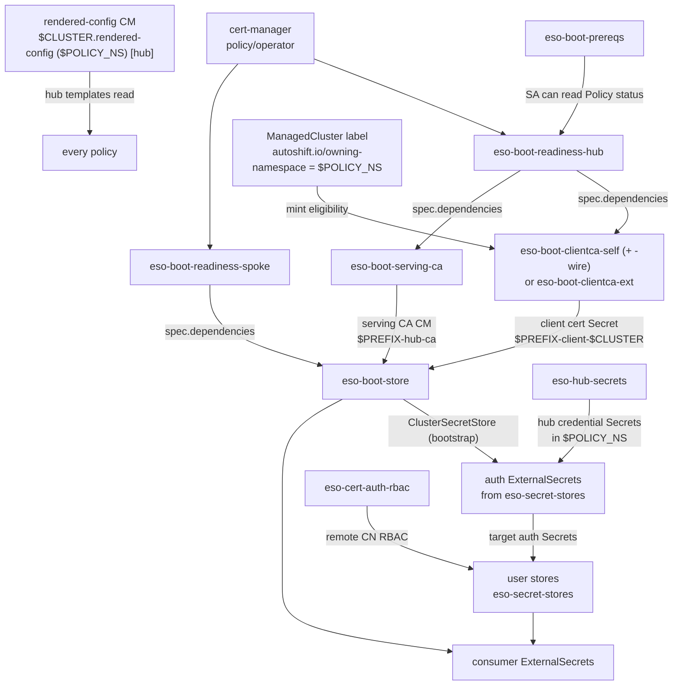
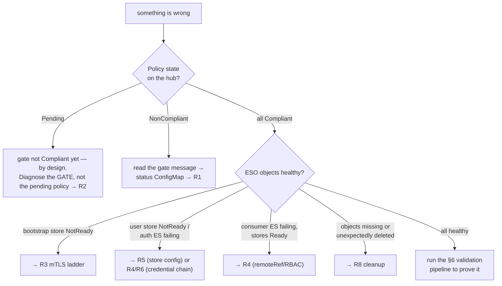

# Troubleshooting reference

A diagnosis manual for humans **and** agents. It codifies the system's relationships and data
flow, tells you where truth lives, and provides parameterized command templates with expected
outputs so runbooks can be executed interactively or from a validation/debugging pipeline.
Concepts: [mechanics.md](mechanics.md). Keys: [CONFIG-REFERENCE.md](CONFIG-REFERENCE.md).

## 0. Execution contract (read first, especially if you are an agent)

**Variables** — resolve these before running anything:

```bash
export POLICY_NS=open-cluster-policies      # chart policy_namespace (= the deployment / tenancy boundary)
export PREFIX=hub-bootstrap                 # chart externalSecretsOperator.hubBootstrap.storePrefix
export ESO_NS=external-secrets-operator     # chart externalSecretsOperator.namespace
export CLUSTER=<managed-cluster-name>       # the cluster being diagnosed
export ADDON_NS=open-cluster-management-agent-addon   # fixed: where status ConfigMaps live
```

**Contexts.** Every command is tagged `[hub]` or `[spoke]` — the cluster whose API it must run
against. `[spoke]` commands need a kubeconfig for `$CLUSTER` (a self-managed hub is both).

**Safety rules:**

1. Diagnosis is **read-only**. The only mutations any runbook here performs are: creating and
   deleting the canary ExternalSecret (§6), and toggling `diagnostics.debugRender` /
   `readinessOnly` **in the values files** (never on live objects).
2. **Never** delete a chart-managed object directly as a "fix" — removal is config-driven
   (remove the store entry / set `teardown`). Before deleting anything manually, check its
   `autoshift.io/eso-prune` label and confirm with a human.
3. **Never** edit `APIServer/cluster spec.clientCA` by hand — one wrong value locks out
   client-cert auth cluster-wide. Only the clientca policies (and `teardown`) write it.
4. Findings that require config changes go back to the **values files** (git), never `oc edit`
   on policy-managed objects (the policy will revert them anyway).

**Reading this doc:** each runbook is SYMPTOM → CONFIRM → causes ordered by likelihood, each
cause with a CHECK (command + expected output) and FIX. `# expect:` comments state the healthy
result — a non-matching output confirms that cause.

---

## 1. System model — what depends on what

### Dependency / data-flow graph



Distilled invariants (each is a checkable claim):

| # | Invariant | Broken ⇒ |
|---|---|---|
| I1 | `$CLUSTER.rendered-config` ConfigMap exists in `$POLICY_NS` on the hub and parses | every policy for that cluster degrades / sweeps are skipped |
| I2 | `ManagedCluster/$CLUSTER` carries `autoshift.io/owning-namespace: $POLICY_NS` | no client cert ever minted → boot-store NonCompliant forever (R3) |
| I3 | readiness gate Compliant | active boot policies sit **Pending** (by design, not an error) |
| I4 | hub: `Certificate` `$PREFIX-client-$CLUSTER` Ready in `$POLICY_NS` | spoke copy fails (R3) |
| I5 | hub: `APIServer.spec.clientCA.name == $PREFIX-client-ca` (non-teardown) | hub rejects the client cert at TLS layer (R3) |
| I6 | hub: CM `$PREFIX-hub-ca` in `$POLICY_NS` holds the current serving CA | spoke store fails TLS server verification (R3) |
| I7 | spoke: `ClusterSecretStore` (bootstrap) condition `Ready=True` | all hub-sourced auth/consumer ES fail (R4) |
| I8 | every status ConfigMap in `$ADDON_NS` is **absent** | the owning policy found precondition errors (R1) |
| I9 | store-auth chain: hub Secret → spoke auth ES `Ready=True` → target Secret exists | that user store can't authenticate (R5/R6) |

### Object inventory when healthy (derives from `$PREFIX`)

**Hub, in `$POLICY_NS`** (selfSigned mode): Certificates `$PREFIX-ca` +
`$PREFIX-client-$CLUSTER` (one per owned cluster) and their Secrets; Issuers
`$PREFIX-selfsigned`, `$PREFIX-ca-issuer`; Role `$PREFIX-reader` + one RoleBinding per
cluster; CM `$PREFIX-hub-ca`; hub-secrets credential Secrets + their ExternalSecrets.
**Hub, `openshift-config`:** CM `$PREFIX-client-ca` (external modes: materialized from the
external bundle; selfSigned: the minted CA).
**Spoke, in `$ESO_NS`:** Secret `$PREFIX-client`; `ClusterSecretStore` (name =
`config.eso.hubBootstrap.storeName`, default `$PREFIX`); per-store auth ExternalSecrets +
target Secrets; delivered-CA ConfigMaps.
Ownership labels for all of these: README → *Cleanup reference — chart-managed labels*.

---

## 2. Signal sources — where truth lives, in the order to consult it

| Order | Signal | Where | Healthy state |
|---|---|---|---|
| 1 | Policy compliance per cluster | hub, ns `$CLUSTER` (replicated policies `$POLICY_NS.<policy>`) | all Compliant |
| 2 | Status ConfigMaps (the chart's own error channel) | target cluster, `$ADDON_NS` | **none exist** (self-clearing) |
| 3 | Gate ConfigurationPolicy message | policy status details | names the status CM when NonCompliant |
| 4 | ESO CR conditions | `ClusterSecretStore`/`SecretStore`/`ExternalSecret` `.status.conditions` | `Ready=True` / reason `SecretSynced` |
| 5 | cert-manager conditions | `Certificate`/`CertificateRequest`/issuer `.status` | `Ready=True`, stable `.status.revision` |
| 6 | debug-render previews (opt-in) | `$POLICY_NS`, `<configpolicy>-debug-render` | only while `debugRender: true` |

```bash
# [hub] 1 — compliance for one cluster (replicated policies live in the cluster's namespace):
oc get policy -n $CLUSTER
# expect: every $POLICY_NS.policy-eso-* row Compliant. NonCompliant rows -> R1. Pending -> I3/R2.

# [hub] 1b — rollup by intent group: policies are grouped into PolicySets
# (policyset-eso-{install,secret-stores,secret-reader,boot-hub,boot-spoke,hub-secrets}):
oc get policyset -n $POLICY_NS
# expect: every policyset-eso-* Compliant. A NonCompliant set names the broken intent group;
# list its members (spec.policies) and drill in with command 1.

# [spoke] 2 — the chart's error channel. THE single most informative command in this doc:
oc get cm -n $ADDON_NS -l autoshift.io/eso-boot-status=true
# expect: No resources found.   Any hit: read it ->
oc get cm -n $ADDON_NS <name>-status -o jsonpath='{.data}' | python3 -m json.tool
# errors carry a [hub]/[spoke] prefix = which TEMPLATING LAYER produced them (not which cluster).

# [spoke] 4 — ESO health:
oc get clustersecretstore,secretstore -A
oc get externalsecret -A -o custom-columns='NS:.metadata.namespace,NAME:.metadata.name,READY:.status.conditions[?(@.type=="Ready")].status,REASON:.status.conditions[?(@.type=="Ready")].reason'
# expect: stores READY True/Valid; ExternalSecrets True/SecretSynced.

# [hub] 5 — cert estate for this deployment:
oc get certificate -n $POLICY_NS -l autoshift.io/hub-bootstrap-client-cert=$PREFIX \
  -o custom-columns='NAME:.metadata.name,READY:.status.conditions[?(@.type=="Ready")].status,REVISION:.status.revision'
# expect: one row per owned cluster, Ready True, low & stable REVISION (climbing fast -> R7 reissue loop).
```

Status ConfigMaps that can exist (all in `$ADDON_NS`, all self-clearing):
`eso-boot-readiness-hub-status`, `eso-boot-readiness-spoke-status`, `eso-boot-store-status`,
`eso-boot-clientca-self-status`, `eso-boot-clientca-ext-status`, `eso-secret-stores-status`
(structured `errors.<store>.[hub|spoke]`, `storeCount`), `eso-cert-auth-rbac-status`,
`eso-hub-secrets-status`.

---

## 3. Triage — entry decision tree



---

## 4. Runbooks

### R1 — a policy is NonCompliant

CONFIRM `[hub]`: `oc get policy -n $CLUSTER | grep -v Compliant`

1. **Chart-detected precondition error** (most common — the design routes everything here).
   CHECK `[spoke]`: signal #2 above. The status CM's `errors` list is the actual diagnosis;
   each entry's `[hub]`/`[spoke]` prefix says which templating layer saw it.
   FIX: per the message — almost always a values-file correction (missing required key, bad
   `fromRef`, unresolvable Secret ref). Per-store policies (`eso-secret-stores`,
   `eso-cert-auth-rbac`, `eso-hub-secrets`) skip only the broken entry — NonCompliant there
   means *some* store is broken, the rest still provisioned.
2. **Object drift / apply failure** (no status CM exists).
   CHECK `[hub]`: `oc describe policy $POLICY_NS.<policy> -n $CLUSTER` — read per-template
   compliance details for the failing object and reason.
3. **Template error** (envelope says `template error`). The chart never uses `fail`, so this
   is a real resolution failure: missing rendered-config (I1), RBAC (R2 cause 3), or a chart
   bug. CHECK I1 `[hub]`:
   `oc get cm $CLUSTER.rendered-config -n $POLICY_NS -o jsonpath='{.data.config}' | head -20`

### R2 — readiness gate stuck NonCompliant (boot policies Pending)

The gate is doing its job: **do not** bypass it; make it green.

CONFIRM `[spoke]`: `oc get cm -n $ADDON_NS eso-boot-readiness-{hub,spoke}-status -o jsonpath='{.data.errors}'`

1. **cert-manager not healthy.** CHECK: CSV per the error message
   (`oc get csv -n cert-manager-operator` → `Succeeded`); if
   `autoshiftProvisioned: true`, also the cert-manager Policy Compliant for this cluster
   `[hub]`: `oc get policy -n $CLUSTER | grep cert-manager`.
2. **Issuer / serving cert missing** (external modes, `autoshiftProvisioned: true` — the gate
   introspects them). CHECK: the named `ClusterIssuer` exists and is Ready.
   FIX: provision the customer PKI piece; the gate (and everything behind it) self-heals.
3. **Gate itself erroring (RBAC).** The hub gate reads Policy status as the hub-template SA —
   requires `policy-eso-boot-prereqs` grants. CHECK `[hub]`:
   `oc auth can-i get policies.policy.open-cluster-management.io -n $POLICY_NS --as=system:serviceaccount:$POLICY_NS:autoshift-policy-service-account`
   `# expect: yes`

### R3 — bootstrap store NotReady on the spoke (the mTLS ladder)

CONFIRM `[spoke]`:
`oc get clustersecretstore -o jsonpath='{.items[?(@.metadata.name=="'$PREFIX'")].status.conditions}'`

Walk the ladder **top-down**; first broken rung is the cause.

```bash
# rung 1 [hub] — is this cluster even eligible? (I2 — hard invariant)
oc get managedcluster $CLUSTER -o jsonpath='{.metadata.labels.autoshift\.io/owning-namespace}'
# expect: $POLICY_NS         (empty/different -> cluster-labels policy hasn't labeled it; NO cert will ever mint)

# rung 2 [hub] — client cert minted + Ready? (I4)
oc get certificate $PREFIX-client-$CLUSTER -n $POLICY_NS -o jsonpath='{.status.conditions[?(@.type=="Ready")]}'
# expect: status True        (missing -> R2 gates / clientca policy status CM; False -> R7)

# rung 3 [hub] — clientCA wired? (I5)
oc get apiserver cluster -o jsonpath='{.spec.clientCA.name}'
# expect: $PREFIX-client-ca  (empty -> clientca(-wire) policy hasn't run / teardown ran)
oc get co kube-apiserver     # expect: Available True, Progressing False (rollout finished)

# rung 4 [hub] — reader RBAC bound to this cluster's CN?
oc get rolebinding -n $POLICY_NS -l autoshift.io/secret-reader-rolebinding=$PREFIX
# expect: a binding for $CLUSTER to Role $PREFIX-reader

# rung 5 [hub] — serving CA stashed and current? (I6)
oc get cm $PREFIX-hub-ca -n $POLICY_NS -o jsonpath='{.data.ca\.crt}' | openssl x509 -noout -enddate
# expect: parses, not expired. Named-cert deployments: rotation has a one-evalInterval stale window (README).

# rung 6 [spoke] — both inputs copied?
oc get secret $PREFIX-client -n $ESO_NS && oc get cm -n $ESO_NS | grep $PREFIX
# expect: secret + CA CM present (missing -> eso-boot-store-status CM has the reason; often rung 1/2)

# rung 7 [spoke->hub] — END-TO-END mTLS PROBE: prove the credential works, independent of ESO.
HUB_URL=$(oc get clustersecretstore $PREFIX -o jsonpath='{.spec.provider.kubernetes.server.url}')
oc get secret $PREFIX-client -n $ESO_NS -o jsonpath='{.data.tls\.crt}' | base64 -d > /tmp/c.crt
oc get secret $PREFIX-client -n $ESO_NS -o jsonpath='{.data.tls\.key}' | base64 -d > /tmp/c.key
oc get secret $PREFIX-client -n $ESO_NS -o jsonpath='{.data.ca\.crt}'  | base64 -d > /tmp/ca.crt
curl -s -o /dev/null -w '%{http_code}\n' --cert /tmp/c.crt --key /tmp/c.key --cacert /tmp/ca.crt \
  "$HUB_URL/api/v1/namespaces/$POLICY_NS/secrets?limit=1"; rm -f /tmp/c.crt /tmp/c.key /tmp/ca.crt
# expect: 200.
#   403 -> identity OK, RBAC wrong (rung 4; or CN mismatch — check cert CN vs RoleBinding subject)
#   401 / TLS error at handshake -> clientCA not trusted (rung 3) or cert expired (rung 2)
#   curl SSL verify error -> serving CA stale/wrong (rung 5)
```

Also common: `hubServer` empty/wrong (`externalCAReuseServingCert` preconditions — EKU
missing `clientAuth`, or serving-cert CN ≠ registered apiserver host → 401/403 at rung 7).

### R4 — an ExternalSecret is not syncing

CONFIRM `[spoke]`: Ready condition reason + message:
`oc get externalsecret <name> -n <ns> -o jsonpath='{.status.conditions}'`

1. **Its store isn't Ready** → R3 (bootstrap) or R5 (user store). Check
   `spec.secretStoreRef` points at the store you think it does (`storeName` default
   `$PREFIX`, `kind: ClusterSecretStore`).
2. **remoteRef doesn't resolve.** For bootstrap-store consumers, `remoteRef.key` is a Secret
   **name in `$POLICY_NS` on the hub**, `property` a key within it. CHECK `[hub]`:
   `oc get secret <remoteRef.key> -n $POLICY_NS`.
3. **RBAC** — the store's identity can't read the Secret (bootstrap: only `$POLICY_NS` is
   readable — a cross-namespace remoteRef will 403 by design).
4. **Refresh lag** — a just-fixed upstream needs one `refreshInterval` (default 1h); force:
   annotate the ES with `force-sync: "<timestamp>"` or wait.

### R5 — user store broken (`eso-secret-stores` per-store errors)

CONFIRM `[spoke]`:
`oc get cm eso-secret-stores-status -n $ADDON_NS -o jsonpath='{.data.errors}'`
— structured by store then layer: the broken store and side are top-level keys. Other stores
are unaffected (per-store skip).

Typical entries and meanings: unsupported `fromRef` (token not in `internal.authRefPaths`);
ref in `spec` missing where `sources` names a component; whole-secret sources naming
different target Secrets; `caSource` set but `caProvider.name` missing; CSS auth ref missing
`.namespace`. All are values-file fixes.
**Note:** while ANY store errors, removal sweeps are suspended (safety gate) — fix the error
before expecting pruning to resume.

### R6 — credential not arriving (two-hop transport)

Symptom: auth ES on the spoke NotReady with "secret not found" on its remoteRef. Walk the
hops backwards:

```bash
# hop 0 [hub] — the policy checks native seeds itself. Two severities in eso-hub-secrets-status:
oc get cm eso-hub-secrets-status -n $ADDON_NS -o jsonpath='{.data.pending}'   # WAITING, self-heals
oc get cm eso-hub-secrets-status -n $ADDON_NS -o jsonpath='{.data.errors}'    # real misconfig
# expect: NotFound. `pending` entries ('Secret "x" not found ... yet — waiting') are normal for
# CHAINED stores — the seed is produced by another store's flow and clears on a later evaluation;
# only act on one that persists (then create/fix the seed). Pending blocks nothing (stores still
# created, sweep still runs); only `errors` entries suspend the sweep.

# hop 2 input [hub]: does the hub credential Secret exist in $POLICY_NS?
oc get secret <hubSecretName> -n $POLICY_NS
# missing + source has `external:` -> hop 1 problem; missing + native -> the manual seed was never created.

# hop 1 [hub]: the hub-side ExternalSecret materializing it:
oc get externalsecret -n $POLICY_NS -l autoshift.io/eso-hub-secret=true \
  -o custom-columns='NAME:.metadata.name,READY:.status.conditions[?(@.type=="Ready")].status,MSG:.status.conditions[?(@.type=="Ready")].message'
# NotReady -> its external.storeRef store is broken (root store: R5 on the HUB) or remoteRef wrong.
# missing entirely -> eso-hub-secrets-status CM (conflicting declarations are rejected there).
```

Root-store rule: a root store's own credential must be **native** (manually seeded) — it
cannot pull through itself. If someone added `external:` pointing a store at itself, that is
the deadlock; seed the Secret manually and remove the self-reference.

### R7 — certificate problems (hub mint estate)

1. **Not Ready.** CHECK `[hub]`: `oc describe certificate <name> -n $POLICY_NS` →
   issuer refs, quota, key mismatch. Issuers: `oc get issuer,clusterissuer -A | grep $PREFIX`.
2. **Re-issue loop** (external issuer). CONFIRM: `.status.revision` climbing ~1/min;
   `oc get certificaterequest -n $POLICY_NS | wc -l` growing. CAUSE: cert-spec fields set
   that the external issuer overrides (spec drift → perpetual reissue → notification storms).
   FIX: unset `clientIdentity.certDuration/certRenewBefore/certUsages/privateKey*` in the
   external modes — the chart then requests a bare cert (mechanics §3).
3. **CN truncation collision / no budget.** CONFIRM: `eso-boot-clientca-self-status` errors
   naming two clusters. FIX: shorten `certCNPrefix`/`baseDomain` so cluster names survive
   truncation uniquely (CN capped at 63 chars).

### R8 — cleanup surprises

1. **Removed a store, objects remain.** In order: (a) objects' baked label —
   `oc get <kind> <name> -o jsonpath='{.metadata.labels.autoshift\.io/eso-prune}'` → `false`
   means it was emitted with prune off — **flipping config now does nothing**; relabel
   (`oc label ... autoshift.io/eso-prune=true --overwrite`) or delete manually; (b) sweep
   suspended by an active store error (R5 — check the status CMs); (c) rendered config
   unreadable (I1). Full table: README → *Cleanup reference*.
2. **Something vanished unexpectedly.** It carried `eso-prune: "true"` and its config entry
   disappeared from the render — check git history of the values files first; also confirm
   the rendered-config CM contains what you think (I1).
3. **Removed `hubBootstrap`, nothing happened.** By design — removal is a no-op; decommission
   requires explicit `teardown: true` (mechanics §8).
4. **Teardown stuck.** Boot policies must go Compliant to finish. External modes: run
   teardown **before** dismantling the external PKI (the readiness gate still checks it and
   holds the boot policies Pending otherwise → un-dismantle or temporarily set
   `autoshiftProvisioned: false`).

### R9 — using the diagnostics toggles as instruments

- **Preview what a cluster would get** without applying: set
  `config.eso.hubBootstrap.diagnostics.debugRender: true` for that cluster, wait one
  propagation, then `[spoke]`:
  `oc get cm <configpolicy>-debug-render -n $POLICY_NS -o jsonpath='{.data.rendered\.yaml}'`
  — the full object stream, real lookups resolved, Secret data replaced by descriptors.
  Switch off when done (the preview CM self-clears).
- **Prove preconditions before first enablement**: `readinessOnly: true` → only the gates run;
  when they're Compliant, flip it off.

---

## 5. Quick-reference lookup tables

**Status CMs** (all `$ADDON_NS`, absent = healthy): listed in §2.
**Policy → ConfigurationPolicy names**: `policy-eso-X` wraps CP `eso-X` (+ `eso-X-gate`);
readiness policies use `eso-boot-readiness-{hub,spoke}-report` + `-gate`.
**Name derivations from `$PREFIX`**: client cert `$PREFIX-client-$CLUSTER` (hub) /
`$PREFIX-client` (spoke copy); CA `$PREFIX-ca`; issuers `$PREFIX-selfsigned`,
`$PREFIX-ca-issuer`; reader Role `$PREFIX-reader`; serving-CA CM `$PREFIX-hub-ca`; clientCA
CM `$PREFIX-client-ca` (openshift-config); store name `storeName` (default `$PREFIX`).
**Ownership labels + audit commands**: README → *Cleanup reference — chart-managed labels*.

---

## 6. Validation pipeline — staged, machine-checkable

Ordered stages; each has a pass criterion. Run all for post-change validation, or start at
the stage matching your symptom. Stages 1–5 are read-only; stage 6 creates+deletes one canary.

```bash
### stage 0 — static (no cluster; CI-able) ####################################
helm template <chart-dir> > /dev/null                                    # pass: exit 0
helm template <chart-dir> --set hubClusterSets.hub-set.enabled=true > /dev/null   # pass: exit 0
python3 -c "import yaml,sys; list(yaml.safe_load_all(open(sys.argv[1])))" <values-file>  # pass: exit 0

### stage 1 [hub] — config delivery ###########################################
oc get cm $CLUSTER.rendered-config -n $POLICY_NS -o jsonpath='{.data.config}' | \
  python3 -c "import yaml,sys; yaml.safe_load(sys.stdin)"                # pass: exit 0 (I1)
oc get managedcluster $CLUSTER -o jsonpath='{.metadata.labels.autoshift\.io/owning-namespace}' | \
  grep -qx "$POLICY_NS"                                                  # pass: exit 0 (I2)

### stage 2 [hub] — policy compliance #########################################
test -z "$(oc get policy -n $CLUSTER --no-headers | grep -v Compliant)"  # pass: exit 0

### stage 3 [spoke] — chart error channel #####################################
test -z "$(oc get cm -n $ADDON_NS -l autoshift.io/eso-boot-status=true --no-headers 2>/dev/null)"
                                                                         # pass: exit 0 (I8)

### stage 4 [hub] — trust estate ##############################################
oc get apiserver cluster -o jsonpath='{.spec.clientCA.name}' | grep -qx "$PREFIX-client-ca"  # (I5)
oc get certificate $PREFIX-client-$CLUSTER -n $POLICY_NS \
  -o jsonpath='{.status.conditions[?(@.type=="Ready")].status}' | grep -qx True             # (I4)

### stage 5 [spoke] — ESO surface #############################################
oc get clustersecretstore $PREFIX \
  -o jsonpath='{.status.conditions[?(@.type=="Ready")].status}' | grep -qx True             # (I7)
test -z "$(oc get externalsecret -A --no-headers -o \
  custom-columns='R:.status.conditions[?(@.type=="Ready")].status' | grep -v True)"         # (I9)

### stage 6 [spoke] — end-to-end canary #######################################
# Pulls a known hub Secret through the bootstrap store, asserts sync, cleans up.
# Prereq: a harmless Secret in $POLICY_NS on the hub to target (e.g. seed one: canary-src).
cat <<EOF | oc apply -f -
apiVersion: external-secrets.io/v1
kind: ExternalSecret
metadata: { name: eso-canary, namespace: $ESO_NS }
spec:
  secretStoreRef: { name: $PREFIX, kind: ClusterSecretStore }
  refreshInterval: 15s
  target: { name: eso-canary, creationPolicy: Owner }
  dataFrom: [ { extract: { key: canary-src } } ]
EOF
oc wait externalsecret eso-canary -n $ESO_NS --for=condition=Ready --timeout=90s   # pass: condition met
oc delete externalsecret eso-canary -n $ESO_NS                                     # Owner GC removes the Secret
```

Failure → runbook mapping: stage 1 → I1/I2 fixes; stage 2 → R1/R2; stage 3 → R1 (read the
CM); stage 4 → R3 rungs 2–3 / R7; stage 5 → R3–R6; stage 6 → R3 rung 7 / R4.
